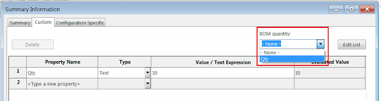
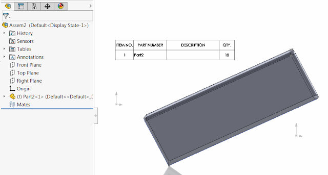

 本示例演示了如何使用SOLIDWORKS API修改属性对话框中的BOM数量字段。
image: bom-quantity-property.png
labels: [BOM数量, 示例, 数量, 单位]
redirect-from:
  - /2018/03/set-bom-quantity-unit-of-measure.html
---

本示例演示了如何使用SOLIDWORKS API修改属性对话框中的BOM数量字段。

{ width=640 height=170 }

此选项允许覆盖BOM表中组件的数量值。

{ width=640 }

要更改此属性，需要通过[SOLIDWORKS API接口ICustomPropertyManager](https://help.solidworks.com/2018/english/api/sldworksapi/solidworks.interop.sldworks~solidworks.interop.sldworks.icustompropertymanager.html)设置隐藏的*UNIT_OF_MEASURE*自定义属性。

~~~ vb
Dim swApp As SldWorks.SldWorks
Dim swModel As SldWorks.ModelDoc2

Const BOM_QTY_PRP_NAME As String = "UNIT_OF_MEASURE"
Const QTY_PRP_NAME As String = "Qty"

Sub main()

    Set swApp = Application.SldWorks
    
    Set swModel = swApp.ActiveDoc
    
    If Not swModel Is Nothing Then
    
        Dim swCustPrpMgr As SldWorks.CustomPropertyManager
        
        Set swCustPrpMgr = swModel.Extension.CustomPropertyManager("")
            
        Dim bomQtyPrp As String
        swCustPrpMgr.Get3 BOM_QTY_PRP_NAME, False, "", bomQtyPrp
        
        Debug.Print bomQtyPrp
        
        swCustPrpMgr.Add2 BOM_QTY_PRP_NAME, swCustomInfoType_e.swCustomInfoText, QTY_PRP_NAME
        swCustPrpMgr.Set2 BOM_QTY_PRP_NAME, QTY_PRP_NAME
    
    Else
        
        MsgBox "请打开模型"
        
    End If
    
End Sub
~~~