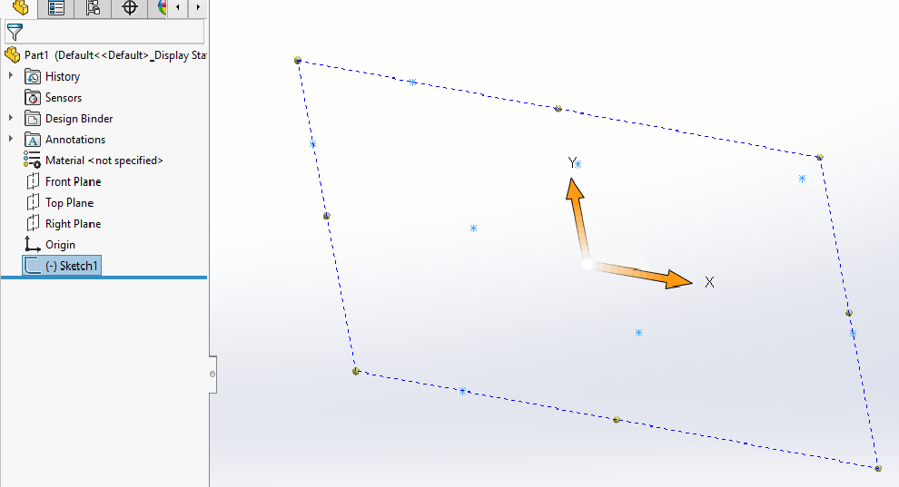

{ width=500 }

这个VBA宏允许将所选草图中的所有点的坐标导出到CSV文件中。

CSV文件可以在Excel中打开。

该宏有一个选项，可以将坐标导出到草图空间（2D草图的XY坐标）或模型空间（XYZ坐标）。该宏还有一个选项，可以将点的坐标转换为系统单位（米）或当前分配给模型的用户单位。

通过更改下面的常量来配置宏。

~~~ vb jagged-bottom
Const CONVERT_TO_USER_UNIT As Boolean = True 'True表示使用当前模型单位，False表示使用系统单位（米）
Const CONVERT_TO_MODEL_SPACE As Boolean = True '对于2D草图，True表示将坐标导出到草图空间，False表示将坐标转换到模型空间
Const OUT_PATH As String = "D:\points.csv" '输出文件的完整路径
~~~

~~~ vb
Const CONVERT_TO_USER_UNIT As Boolean = True
Const CONVERT_TO_MODEL_SPACE As Boolean = True
Const OUT_PATH As String = "D:\points.csv"

Dim swApp As SldWorks.SldWorks

Sub main()

    Set swApp = Application.SldWorks
    
    Dim swModel As SldWorks.ModelDoc2
    
try_:
    On Error GoTo catch_
    
    Set swModel = swApp.ActiveDoc
    
    If swModel Is Nothing Then
        Err.Raise vbError, "", "请打开模型"
    End If
    
    Dim swSelMgr As SldWorks.SelectionMgr
    
    Set swSelMgr = swModel.SelectionManager
    
    Dim swSketchFeat As SldWorks.Feature
    
    Set swSketchFeat = swSelMgr.GetSelectedObject6(1, -1)
    
    Dim swSketch As SldWorks.sketch
    
    If Not swSketchFeat Is Nothing Then
        Set swSketch = swSketchFeat.GetSpecificFeature2
    End If
    
    If swSketch Is Nothing Then
        Err.Raise vbError, "", "请选择草图"
    End If
    
    Dim vPts As Variant
    vPts = ExtractPoints(swModel, swSketch, CONVERT_TO_MODEL_SPACE, CONVERT_TO_USER_UNIT)
    
    WritePointsToCsvFile OUT_PATH, vPts
    
    GoTo finally_
        
catch_:
    swApp.SendMsgToUser2 Err.Description, swMessageBoxIcon_e.swMbStop, swMessageBoxBtn_e.swMbOk
finally_:

End Sub

Function ExtractPoints(model As SldWorks.ModelDoc2, sketch As SldWorks.sketch, convertCoordsToModelSpace As Boolean, convertCoordsToUserUnits As Boolean) As Variant
    
    Dim vSkPts As Variant
    vSkPts = sketch.GetSketchPoints2()
    
    Dim i As Integer
    
    If IsEmpty(vSkPts) Then
        Err.Raise vbError, "", "草图中没有点"
    End If
    
    Dim vPts() As Variant
    ReDim vPts(UBound(vSkPts))
    
    For i = 0 To UBound(vSkPts)
        
        Dim swSkPt As SldWorks.SketchPoint
        Set swSkPt = vSkPts(i)
        
        Dim dPt(2) As Double
        dPt(0) = swSkPt.X: dPt(1) = swSkPt.Y: dPt(2) = swSkPt.Z
        
        Dim vPt As Variant
        vPt = dPt
        
        If convertCoordsToModelSpace Then
            vPt = ConvertPointLocation(vPt, sketch.ModelToSketchTransform.Inverse())
        End If
        
        If convertCoordsToUserUnits Then
            vPt = ConvertToUserUnits(vPt, model)
        End If
        
        vPts(i) = vPt
        
    Next
    
    ExtractPoints = vPts
    
End Function

Function ConvertPointLocation(pt As Variant, transform As SldWorks.MathTransform) As Variant
    
    Dim swMathUtils As SldWorks.MathUtility
    Set swMathUtils = swApp.GetMathUtility
    
    Dim swMathPt As SldWorks.MathPoint
    Set swMathPt = swMathUtils.CreatePoint(pt)
    
    Set swMathPt = swMathPt.MultiplyTransform(transform)
    
    ConvertPointLocation = swMathPt.ArrayData
    
End Function

Function ConvertToUserUnits(pt As Variant, model As SldWorks.ModelDoc2) As Variant
    
    Dim swUserUnits As SldWorks.UserUnit
    Set swUserUnits = model.GetUserUnit(swUserUnitsType_e.swLengthUnit)
    
    Dim convFactor As Double
    convFactor = swUserUnits.GetConversionFactor
     
    Dim dPt(2) As Double
    
    dPt(0) = pt(0) * convFactor
    dPt(1) = pt(1) * convFactor
    dPt(2) = pt(2) * convFactor
    
    ConvertToUserUnits = dPt
    
End Function

Sub WritePointsToCsvFile(filePath As String, vPts As Variant)
    
    Dim fileNmb As Integer
    fileNmb = FreeFile
    
    Open filePath For Output As #fileNmb
    
    Dim i As Integer
    
    For i = 0 To UBound(vPts)
        
        Print #fileNmb, vPts(i)(0) & "," & vPts(i)(1) & "," & vPts(i)(2)
        
    Next
    
    Close #fileNmb
    
End Sub
~~~