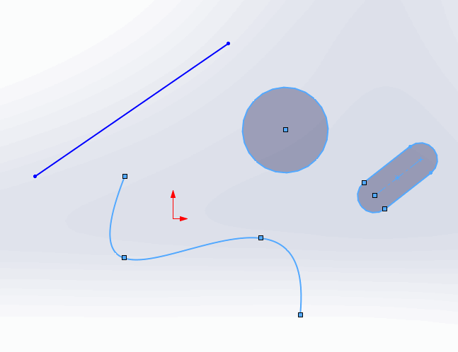

 使用SOLIDWORKS API获取选定的草图段（线段、弧线、抛物线、样条等）的特定信息的VBA宏
image: selected-sketch-segments.png
labels: [草图段,选定]
---
{ width=450 }

这个VBA宏演示了如何使用SOLIDWORKS API从选定的草图段中提取特定的草图段信息。

宏将遍历所有选定的对象并过滤草图段。宏将识别段的类型并将指针转换为特定的子类型（例如线段、样条、弧线、抛物线、文本等）。

信息将输出到VBA编辑器的即时窗口。

{ width=350 }

~~~ vb
Dim swApp As SldWorks.SldWorks

Sub main()

    Set swApp = Application.SldWorks
    
    Dim swModel As SldWorks.ModelDoc2
    
    Set swModel = swApp.ActiveDoc
    
    If Not swModel Is Nothing Then
    
        Dim swSelMgr As SldWorks.SelectionMgr
        
        Set swSelMgr = swModel.SelectionManager
        
        Dim i As Integer
        
        For i = 1 To swSelMgr.GetSelectedObjectCount2(-1)
            If swSelMgr.GetSelectedObjectType3(i, -1) = swSelectType_e.swSelSKETCHSEGS Or _
                swSelMgr.GetSelectedObjectType3(i, -1) = swSelectType_e.swSelEXTSKETCHSEGS Then
                
                Dim swSkSeg As SldWorks.SketchSegment
                Set swSkSeg = swSelMgr.GetSelectedObject6(i, -1)
                
                Debug.Print "索引为 " & i & " 的草图段"
                
                PrintSketchSegmentInfo swSkSeg
                
                Debug.Print ""
                
            End If
        Next
        
    Else
        MsgBox "请打开模型"
    End If
    
End Sub

Function PrintSketchSegmentInfo(skSeg As SldWorks.SketchSegment)

    Select Case skSeg.GetType()
        Case swSketchSegments_e.swSketchARC
            Dim swSkArc As SldWorks.SketchArc
            Set swSkArc = skSeg
            Debug.Print "弧线"
            Debug.Print "半径: " & swSkArc.GetRadius()
        
        Case swSketchSegments_e.swSketchELLIPSE
            Dim swSkEllipse As SldWorks.SketchEllipse
            Set swSkEllipse = skSeg
            Dim swMajPoint As SldWorks.SketchPoint
            Set swMajPoint = swSkEllipse.GetMajorPoint2()
            Debug.Print "椭圆"
            Debug.Print "主点: " & swMajPoint.X & "," & swMajPoint.Y & "," & swMajPoint.Z
        
        Case swSketchSegments_e.swSketchLINE
            Dim swSkLine As SldWorks.SketchLine
            Set swSkLine = skSeg
            Debug.Print "线段"
            Debug.Print "角度: " & swSkLine.Angle
            
        Case swSketchSegments_e.swSketchPARABOLA
            Dim swSkParabola As SldWorks.SketchParabola
            Set swSkParabola = skSeg
            Dim swApexPoint As SldWorks.SketchPoint
            Set swApexPoint = swSkParabola.GetApexPoint2
            Debug.Print "抛物线"
            Debug.Print "顶点: " & swApexPoint.X & "," & swApexPoint.Y & "," & swApexPoint.Z
        
        Case swSketchSegments_e.swSketchSPLINE
            Dim swSkSpline As SldWorks.SketchSpline
            Set swSkSpline = skSeg
            Dim vSplinePts As Variant
            vSplinePts = swSkSpline.GetPoints2()
            Debug.Print "样条曲线"
            Debug.Print "点数: " & UBound(vSplinePts) + 1
        
        Case swSketchSegments_e.swSketchTEXT
            Dim swSkText As SldWorks.SketchText
            Set swSkText = skSeg
            Debug.Print "文本"
            Debug.Print swSkText.Text
        Case Else
            Err.Raise vbError, "", "不支持的草图段"
    End Select
    
End Function
~~~