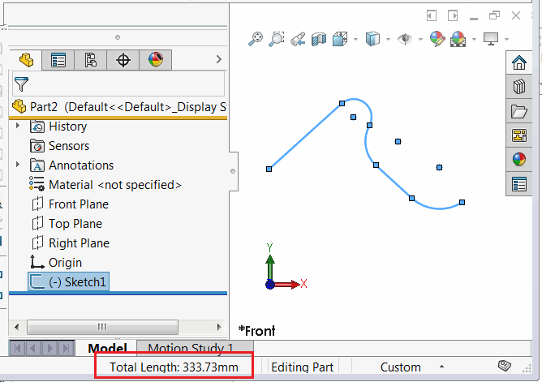

{ width=450 }

这是一个使用SOLIDWORKS API计算所选草图中所有线段的总长度的C#示例。计算时会排除构造几何线段。

~~~ cs
using SolidWorks.Interop.sldworks;
using SolidWorks.Interop.swconst;
using System;
using System.Linq;

namespace CodeStack
{
    class Program
    {
        static void Main(string[] args)
        {
            var app = Activator.CreateInstance(Type.GetTypeFromProgID("SldWorks.Application")) as ISldWorks;
            app.Visible = true;

            if (app.IActiveDoc2 != null)
            {
                var feat = app.IActiveDoc2.ISelectionManager.GetSelectedObject6(1, -1) as IFeature;

                var sketch = feat?.GetSpecificFeature2() as ISketch;

                if (sketch != null)
                {
                    var segs = (sketch.GetSketchSegments() as object[])?.Cast<ISketchSegment>();

                    if (segs != null)
                    {
                        var totalLength = segs.Where(s => !s.ConstructionGeometry).Sum(s => s.GetLength());

                        app.SendMsgToUser2($"线段的总长度为：{totalLength} 米", (int)swMessageBoxIcon_e.swMbInformation, (int)swMessageBoxBtn_e.swMbOk);
                    }
                    else
                    {
                        throw new NullReferenceException("草图中没有线段");
                    }
                }
                else
                {
                    throw new NullReferenceException("请选择草图");
                }
            }
            else
            {
                throw new NullReferenceException("请打开文档");
            }
        }
    }
}

~~~