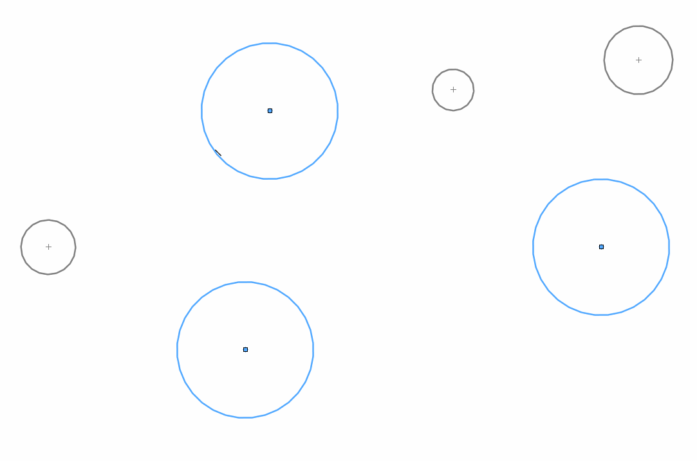

 使用SOLIDWORKS API查找并选择所有直径与输入弧相等的弧的VBA宏
image: selected-equal-arcs.png
labels: [sketch,arc,circle,equal]
group: Sketch
---
{ width=350 }

这个VBA宏选择与预选输入草图弧相等大小的草图弧。只有原始输入弧草图中的弧会被选择。该宏适用于活动和非活动草图。

## 选项

可以通过更改宏开头的常量的值来配置宏

~~~ vb
Const EPS As Double = 0.0000000001 '弧半径比较容差
~~~

~~~ vb
Const EPS As Double = 0.0000000001

Dim swApp As SldWorks.SldWorks

Sub main()

    Set swApp = Application.SldWorks
    
    On Error GoTo catch
    
try:
    Dim swModel As SldWorks.ModelDoc2
    
    Set swModel = swApp.ActiveDoc
    
    If Not swModel Is Nothing Then
        
        Dim swSkSrcArc As SldWorks.SketchArc
        Set swSkSrcArc = swModel.SelectionManager.GetSelectedObject6(1, -1)
        
        If Not swSkSrcArc Is Nothing Then
            
            Dim radius As Double
            radius = swSkSrcArc.GetRadius()
            
            Dim swSketch As SldWorks.Sketch
            Set swSketch = swSkSrcArc.GetSketch
            
            Dim vSegs As Variant
            vSegs = swSketch.GetSketchSegments()
            
            Dim i As Integer
            
            For i = 0 To UBound(vSegs)
                
                Dim swSkSeg As SldWorks.SketchSegment
                Set swSkSeg = vSegs(i)
                
                If swSkSeg.GetType() = swSketchSegments_e.swSketchARC Then
                
                    If Not swSkSrcArc Is swSkSeg Then
                    
                        Dim swSkArc As SldWorks.SketchArc
                        Set swSkArc = swSkSeg
                        
                        If Abs(swSkArc.GetRadius() - radius) < EPS Then
                            swSkSeg.Select4 True, Nothing
                        End If
                        
                    End If
                End If
                
            Next
            
        Else
            Err.Raise vbError, "", "请选择草图弧"
        End If
        
    Else
        Err.Raise vbError, "", "打开模型"
    End If
    
    GoTo finally
catch:
    swApp.SendMsgToUser2 Err.Description, swMessageBoxIcon_e.swMbStop, swMessageBoxBtn_e.swMbOk
finally:
    
End Sub

~~~