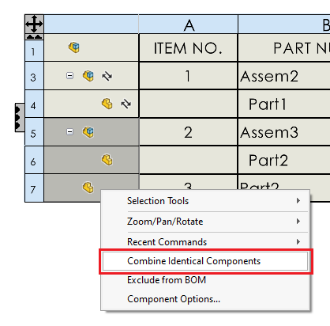

这个VBA宏演示了如何模拟SOLIDWORKS API中缺失的“合并相同组件”命令。

选择BOM表以合并相同的组件。默认情况下，所有组件都会被合并，但可以通过更改宏中的**CombineIdenticalComponents**函数的参数来指定要合并的行。

~~~ vb
#If VBA7 Then
     Private Declare PtrSafe Function SendMessage Lib "User32" Alias "SendMessageA" (ByVal hWnd As Long, ByVal wMsg As Long, ByVal wParam As Long, lParam As Any) As Long
#Else
     Private Declare Function SendMessage Lib "User32" Alias "SendMessageA" (ByVal hWnd As Long, ByVal wMsg As Long, ByVal wParam As Long, lParam As Any) As Long
#End If

Dim swApp As SldWorks.SldWorks

Sub main()

    Set swApp = Application.SldWorks

    Dim swModel As SldWorks.ModelDoc2
    Set swModel = swApp.ActiveDoc
    
    Dim swBomTable As SldWorks.TableAnnotation
    Set swBomTable = swModel.SelectionManager.GetSelectedObject6(1, -1)
    
    CombineIdenticalComponents swModel, swBomTable, 1, swBomTable.RowCount - 1
    
End Sub

Sub CombineIdenticalComponents(model As SldWorks.ModelDoc2, table As SldWorks.BomTableAnnotation, startRowIndex As Integer, entRowIndex As Integer)
    
    Dim swSelMgr As SldWorks.SelectionMgr
    Set swSelMgr = model.SelectionManager
    
    Dim swSelData As SldWorks.SelectData
    Set swSelData = swSelMgr.CreateSelectData
    
    Dim swTableAnnotation As SldWorks.TableAnnotation
    Set swTableAnnotation = table
    
    Dim swAnn As SldWorks.Annotation
    Set swAnn = swTableAnnotation.GetAnnotation()
    
    swSelData.SetCellRange startRowIndex, entRowIndex, 0, 0
    
    swAnn.Select3 False, swSelData
    
    RunCombineIdenticalComponentsCommand
    
End Sub

Sub RunCombineIdenticalComponentsCommand(Optional dummy = Empty)
    
    Const WM_COMMAND As Long = &H111
        
    Dim swFrame As SldWorks.Frame
        
    Set swFrame = swApp.Frame
        
    Const CMD_COMBINE_IDENTICAL_COMPONENTS As Long = 24378
        
    SendMessage swFrame.GetHWnd(), WM_COMMAND, CMD_COMBINE_IDENTICAL_COMPONENTS, 0
    
End Sub
~~~