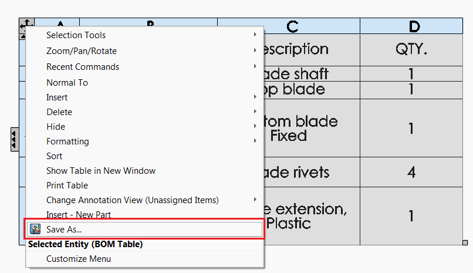
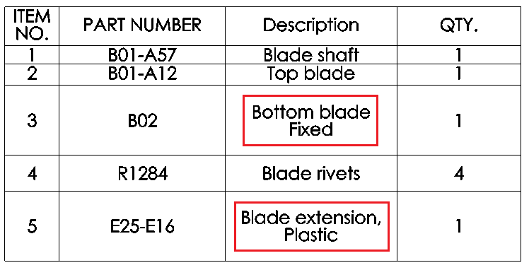

 该宏使用SOLIDWORKS API将选定的表格（或指定类型的表格）导出为CSV（逗号分隔值）文件。此功能类似于内置的“另存为”选项，用于表格：
image: export-table-csv.svg
labels: [table,csv,export]
group: Model
---

该宏使用SOLIDWORKS API将选定的表格（或指定类型的表格）导出为CSV（逗号分隔值）文件。此功能类似于内置的“另存为”选项，用于表格：

{ width=350 }

但是，该宏保留了逗号、引号或换行符等特殊符号，并根据CSV规范进行了正确的转义：

{ width=350 }

因此，可以使用CSV读取器（如MS Excel）正确读取该文件；

{ width=350 }

对于上述BOM表格示例，该宏将生成以下输出：

~~~ csv
ITEM NO.,PART NUMBER,Description,QTY.
1,B01-A57,Blade shaft,1
2,B01-A12,Top blade,1
3,B02,"Bottom blade
Fixed",1
4,R1284,Blade rivets,4
5,E25-E16,"Blade extension, Plastic",1
~~~

## 配置

可以通过修改常量的值来配置宏

~~~ vb
Const OUT_FILE_PATH_TEMPLATE As String = "<_FileName_>-<_TableName_>.csv" '空字符串以保存在模型文件夹中
Const INCLUDE_HEADER As Boolean = True 'True包含表头，False仅包含数据
Const TABLE_TYPE As Integer = swTableAnnotationType_e.swTableAnnotation_BillOfMaterials  '-1使用所选表格或在swTableAnnotationType_e中定义的表格类型（例如swTableAnnotationType_e.swTableAnnotation_BillOfMaterials导出所有BOM表格）
Const ALL_SHEETS As Boolean = False 'False仅从活动工作表导出

Const MERGE As Boolean = False 'True将所有表格合并到单个文件中
~~~

*OUT_FILE_PATH_TEMPLATE*可以是相对路径或绝对路径。如果指定了相对路径，则文件将保存在与源文件相同的目录中

支持以下占位符：

* <\_FileName\_> - 源文件的名称
* <\_TableName\_> - 表格的名称
* <\_SheetName\_> - 表格所在的工作表的名称（仅适用于绘图）

如果使用了**MERGE**选项，则所有表格数据将输出到单个CSV文件中，并且每个表格之间将用空行分隔。如果文件名模板使用了表格特定的占位符，则将使用第一个表格作为模板。

## CAD+

该宏与[Toolbar+](https://cadplus.xarial.com/toolbar/)和[Batch+](https://cadplus.xarial.com/batch/)工具兼容，因此可以将按钮添加到工具栏并分配快捷键以便更轻松地访问或批处理运行。

要启用[宏参数](https://cadplus.xarial.com/toolbar/configuration/arguments/)，请将**ARGS**常量设置为true

~~~ vb
#Const ARGS = True
~~~

在这种情况下，不需要复制宏以设置单独的[隐藏和显示选项](#configuration)。

而是使用**-bom**，**-general**，**-revision**，**-cutlist**作为第一个参数来指定要导出的表格类型，并使用可选的输出文件模板作为第二个参数

例如，以下参数将将BOM表格导出为CSV格式，名称为源表格，并保存在D驱动器的**Tables**文件夹中。

~~~
> -bom "D:\Tables\<_TableName_>.csv"
~~~

~~~ vb
#Const ARGS = False 'True使用Toolbar+或Batch+中的参数，而不是常量

Const OUT_FILE_PATH_TEMPLATE As String = "<_FileName_>-<_TableName_>.csv" '输出文件路径模板
Const INCLUDE_HEADER As Boolean = True
Const TABLE_TYPE As Integer = -1  '-1使用所选表格或在swTableAnnotationType_e中定义的表格类型
Const ALL_SHEETS As Boolean = True 'True从所有工作表导出（如果TABLE_TYPE不是-1），False仅从活动工作表导出

Const MERGE As Boolean = False

Dim swApp As SldWorks.SldWorks

Sub main()

    Set swApp = Application.SldWorks

try_:
    On Error GoTo catch_
    
    Dim tableType As swTableAnnotationType_e
    Dim outFilePathTemplate As String
    
    #If ARGS Then
                
        Dim macroRunner As Object
        Set macroRunner = CreateObject("CadPlus.MacroRunner.Sw")
        
        Dim param As Object
        Set param = macroRunner.PopParameter(swApp)
        
        Dim vArgs As Variant
        vArgs = param.Get("Args")
        
        Dim operation As String
        operation = CStr(vArgs(0))
        
        Select Case LCase(operation)
            Case "-bom"
                tableType = swTableAnnotation_BillOfMaterials
            Case "-general"
                tableType = swTableAnnotation_General
            Case "-revision"
                tableType = swTableAnnotation_RevisionBlock
            Case "-cutlist"
                tableType = swTableAnnotation_WeldmentCutList
            Case Else
                Err.Raise vbError, "", "Invalid argument. Valid arguments -bom -general -revision -cutlist"
        End Select
        
        If UBound(vArgs) = 1 Then
            outFilePathTemplate = CStr(vArgs(1))
        Else
            outFilePathTemplate = OUT_FILE_PATH_TEMPLATE
        End If
    #Else
        tableType = TABLE_TYPE
        outFilePathTemplate = OUT_FILE_PATH_TEMPLATE
    #End If
    
    Dim swModel As SldWorks.ModelDoc2
    
    Set swModel = swApp.ActiveDoc
    
    If Not swModel Is Nothing Then
        
        Dim vTables As Variant
        
        If tableType = -1 Then
            vTables = GetSelectedTables(swModel)
        Else
            
            If swModel.GetType() <> swDocumentTypes_e.swDocDRAWING Then
                Err.Raise vbError, "", "Only drawing document is supported"
            End If
            
            Dim swDraw As SldWorks.DrawingDoc
            Set swDraw = swModel
            
            Dim sheetName As String
            
            If ALL_SHEETS Then
                sheetName = ""
            Else
                sheetName = swDraw.GetCurrentSheet().GetName
            End If
            
            vTables = FindTables(swDraw, tableType, sheetName)
            
        End If
        
        If Not IsEmpty(vTables) Then
            
            Dim i As Integer
            
            Dim outFilePath As String
            
            For i = 0 To UBound(vTables)
                    
                Dim swTableAnn As SldWorks.TableAnnotation
                Set swTableAnn = vTables(i)
                
                If i = 0 Or Not MERGE Then
                    outFilePath = GetExportFilePath(outFilePathTemplate, swModel, swTableAnn)
                End If
                
                Dim vTableData As Variant
                
                Dim includeHeader As Boolean
                includeHeader = INCLUDE_HEADER And (Not MERGE Or i = 0)
                
                vTableData = GetTableData(swTableAnn, includeHeader)
                
                Dim append As Boolean
                append = IIf(MERGE, i > 0, False)
                
                If MERGE And i > 0 Then
                    Dim separatorRow() As String
                    ReDim separatorRow(0, UBound(vTableData, 2))
                    WriteCsvFile outFilePath, separatorRow, True
                End If
                
                WriteCsvFile outFilePath, vTableData, append
            
            Next
            
            GoTo finally_
            
        Else
            Err.Raise vbError, "", "Tables are not found"
        End If
        
    Else
        Err.Raise vbError, "", "Document is not open"
    End If

catch_:
    swApp.SendMsgToUser2 Err.Description, swMessageBoxIcon_e.swMbStop, swMessageBoxBtn_e.swMbOk
finally_:

End Sub

Function GetExportFilePath(pathTemplate As String, model As SldWorks.ModelDoc2, tableAnn As SldWorks.TableAnnotation) As String
    
    Const FILE_NAME_TOKEN As String = "<_FileName_>"
    Const TABLE_NAME_TOKEN As String = "<_TableName_>"
    Const SHEET_NAME_TOKEN As String = "<_SheetName_>"
        
    Dim path As String
    
    path = pathTemplate
    
    If InStr(path, FILE_NAME_TOKEN) > 0 Then
        path = Replace(pathTemplate, FILE_NAME_TOKEN, GetFileNameWithoutExtension(model.GetPathName()))
    End If
    
    If InStr(path, SHEET_NAME_TOKEN) > 0 Then
        Dim swSheet As SldWorks.Sheet
        Set swSheet = GetSheetFromTableAnnotation(model, tableAnn)
        path = Replace(path, SHEET_NAME_TOKEN, swSheet.GetName())
    End If
    
    If InStr(path, TABLE_NAME_TOKEN) > 0 Then
        Dim swTableFeat As SldWorks.Feature
        Set swTableFeat = GetFeatureFromTableAnnotation(tableAnn)
        path = Replace(path, TABLE_NAME_TOKEN, swTableFeat.Name)
    End If
    
    GetExportFilePath = GetFullPath(model, path)
    
End Function

Function GetTableData(tableAnn As SldWorks.TableAnnotation, includeHeader As Boolean) As Variant
    
    Dim tableData() As String
        
    Dim i As Integer
    Dim j As Integer
    
    Dim offset As Integer
    offset = IIf(includeHeader, 0, 1)
    
    For i = 0 + offset To tableAnn.RowCount - 1
        
        ReDim Preserve tableData(tableAnn.RowCount - 1 - offset, tableAnn.ColumnCount - 1)
        
        For j = 0 To tableAnn.ColumnCount - 1
            tableData(i - offset, j) = tableAnn.Text(i, j)
        Next
            
    Next
        
    GetTableData = tableData
    
End Function

Function FindTables(draw As SldWorks.DrawingDoc, filter As swTableAnnotationType_e, sheetName As String) As Variant
    
    Dim swTables() As SldWorks.TableAnnotation
    Dim isInit As Boolean
    isInit = False
    
    Dim vSheets As Variant
    
    vSheets = draw.GetViews()
    
    Dim i As Integer
    
    For i = 0 To UBound(vSheets)
        
        Dim vViews As Variant
        vViews = vSheets(i)
        
        Dim swSheetView As SldWorks.View
        Set swSheetView = vViews(0)
        
        If sheetName = "" Or LCase(sheetName) = LCase(swSheetView.Name) Then
        
            Dim vTableAnns As Variant
            vTableAnns = swSheetView.GetTableAnnotations
            
            If Not IsEmpty(vTableAnns) Then
                
                Dim j As Integer
                
                For j = 0 To UBound(vTableAnns)
                    
                    Dim swTableAnn As SldWorks.TableAnnotation
                    Set swTableAnn = vTableAnns(j)
                    
                    If swTableAnn.Type = filter Then
                        
                        If isInit Then
                            ReDim Preserve swTables(UBound(swTables) + 1)
                        Else
                            ReDim swTables(0)
                            isInit = True
                        End If
                        
                        Set swTables(UBound(swTables)) = swTableAnn
                        
                    End If
                    
                Next
                
            End If
        
        End If
        
    Next
    
    If isInit Then
        FindTables = swTables
    Else
        FindTables = Empty
    End If
    
End Function

Function GetSelectedTables(model As SldWorks.ModelDoc2) As Variant

    Dim swTables() As SldWorks.TableAnnotation
    Dim isInit As Boolean
    isInit = False

    Dim i As Integer
    
    Dim swSelMgr As SldWorks.SelectionMgr
    Set swSelMgr = model.SelectionManager
    
    For i = 1 To swSelMgr.GetSelectedObjectCount2(-1)
        
        Dim swSelType As Long
        swSelType = swSelMgr.GetSelectedObjectType3(i, -1)
        
        If swSelType = swSelectType_e.swSelANNOTATIONTABLES Or swSelType = swSelectType_e.swSelREVISIONTABLE Then
        
            If isInit Then
                ReDim Preserve swTables(UBound(swTables) + 1)
            Else
                ReDim swTables(0)
                isInit = True
            End If
                    
            Set swTables(UBound(swTables)) = swSelMgr.GetSelectedObject6(i, -1)
        End If
    
    Next
    
    If isInit Then
        GetSelectedTables = swTables
    Else
        GetSelectedTables = Empty
    End If
    
End Function

Sub WriteCsvFile(filePath As String, table As Variant, append As Boolean)
    
    Dim fileNmb As Integer
    fileNmb = FreeFile
    
    If append Then
        Open filePath For Append As #fileNmb
    Else
        Open filePath For Output As #fileNmb
    End If
    
    Dim i As Integer
    Dim j As Integer
    
    For i = 0 To UBound(table, 1)
        
        Dim rowContent As String
        rowContent = ""
        
        For j = 0 To UBound(table, 2)
            Dim cell As String
            cell = table(i, j)
            If HasSpecialSymbols(cell) Then
                cell = """" & ReplaceSpecialSymbols(cell) & """"
            End If
            rowContent = rowContent & IIf(j = 0, "", ",") & cell
        Next
        
        Print #fileNmb, rowContent
        
    Next
    
    Close #fileNmb
    
End Sub

Function GetFullPath(model As SldWorks.ModelDoc2, path As String)
    
    GetFullPath = path
        
    If IsPathRelative(path) Then
        
        If Left(path, 1) <> "\" Then
            path = "\" & path
        End If
        
        Dim modelPath As String
        Dim modelDir As String
        
        modelPath = model.GetPathName
        
        modelDir = Left(modelPath, InStrRev(modelPath, "\") - 1)
                
        GetFullPath = modelDir & path
    Else
        GetFullPath = path
    End If
    
End Function

Function GetFileNameWithoutExtension(path As String) As String
    GetFileNameWithoutExtension = Mid(path, InStrRev(path, "\") + 1, InStrRev(path, ".") - InStrRev(path, "\") - 1)
End Function

Function IsPathRelative(path As String)
    IsPathRelative = Mid(path, 2, 1) <> ":" And Not IsPathUnc(path)
End Function

Function IsPathUnc(path As String)
    IsPathUnc = Left(path, 2) = "\\"
End Function

Function GetFeatureFromTableAnnotation(tableAnn As SldWorks.TableAnnotation) As SldWorks.Feature
    
    Dim swTableFeat As SldWorks.Feature
    
    Select Case tableAnn.Type
                
        Case swTableAnnotationType_e.swTableAnnotation_BillOfMaterials
            
            Dim swBomTableAnn As SldWorks.BomTableAnnotation
            Set swBomTableAnn = tableAnn
            Set swTableFeat = swBomTableAnn.BomFeature.GetFeature()
            
        Case swTableAnnotationType_e.swTableAnnotation_General
            
            Dim swGenTableAnn As SldWorks.GeneralTableAnnotation
            Set swGenTableAnn = tableAnn
            Set swTableFeat = swGenTableAnn.GeneralTable.GetFeature()
        
        Case swTableAnnotationType_e.swTableAnnotation_WeldmentCutList
            
            Dim swWeldCutListTableAnn As SldWorks.WeldmentCutListAnnotation
            Set swWeldCutListTableAnn = tableAnn
            Set swTableFeat = swWeldCutListTableAnn.WeldmentCutListFeature.GetFeature()
            
        Case swTableAnnotationType_e.swTableAnnotation_BendTable
            
            Dim swBendTableAnn As SldWorks.BendTableAnnotation
            Set swBendTableAnn = tableAnn
            Set swTableFeat = swBendTableAnn.BendTable.GetFeature()
            
        Case swTableAnnotationType_e.swTableAnnotation_GeneralTolerance
            
            Dim swGeneralToleranceTableAnn As SldWorks.GeneralToleranceTableAnnotation
            Set swGeneralToleranceTableAnn = tableAnn
            Set swTableFeat = swGeneralToleranceTableAnn.GeneralToleranceTableFeature.GetFeature()
            
        Case swTableAnnotationType_e.swTableAnnotation_HoleChart
            
            Dim swHoleTableAnn As SldWorks.HoleTableAnnotation
            Set swHoleTableAnn = tableAnn
            Set swTableFeat = swHoleTableAnn.HoleTable.GetFeature()
            
        Case swTableAnnotationType_e.swTableAnnotation_PunchTable
        
            Dim swPunchTableAnn As SldWorks.PunchTableAnnotation
            Set swPunchTableAnn = tableAnn
            Set swTableFeat = swPunchTableAnn.PunchTable.GetFeature()
            
        Case swTableAnnotationType_e.swTableAnnotation_RevisionBlock
            
            Dim swRevisionTableAnn As SldWorks.RevisionTableAnnotation
            Set swRevisionTableAnn = tableAnn
            Set swTableFeat = swRevisionTableAnn.RevisionTableFeature.GetFeature()
            
        Case swTableAnnotationType_e.swTableAnnotation_TitleBlock
        
            Dim swTitleBlockTableAnn As SldWorks.TitleBlockTableAnnotation
            Set swTitleBlockTableAnn = tableAnn
            Set swTableFeat = swTitleBlockTableAnn.TitleBlockTableFeature.GetFeature()
            
        Case swTableAnnotationType_e.swTableAnnotation_WeldTable
        
            Dim swWeldTableAnn As SldWorks.WeldmentCutListAnnotation
            Set swWeldTableAnn = tableAnn
            Set swTableFeat = swWeldTableAnn.WeldmentCutListFeature.GetFeature()
        
    End Select
    
    Set GetFeatureFromTableAnnotation = swTableFeat
    
End Function

Function GetSheetFromTableAnnotation(draw As SldWorks.DrawingDoc, tableAnn As SldWorks.TableAnnotation) As SldWorks.Sheet


```vba
Dim vSheets As Variant

vSheets = draw.GetViews()

Dim i As Integer

For i = 0 To UBound(vSheets)
    
    Dim vViews As Variant
    vViews = vSheets(i)
    
    Dim swSheetView As SldWorks.View
    Set swSheetView = vViews(0)
    
    Dim vTableAnns As Variant
    vTableAnns = swSheetView.GetTableAnnotations
    
    If Not IsEmpty(vTableAnns) Then
        
        Dim j As Integer
        
        For j = 0 To UBound(vTableAnns)
            
            Dim swTableAnn As SldWorks.TableAnnotation
            Set swTableAnn = vTableAnns(j)
            
            If swTableAnn Is tableAnn Then
                
                Dim swSheet As SldWorks.Sheet
                Set swSheet = draw.Sheet(swSheetView.GetName2())
                Set GetSheetFromTableAnnotation = swSheet
                Exit Function
                
            End If
            
        Next
        
    End If
    
Next

Err.Raise vbError, "", "Table does not belong to sheet"

End Function

Function HasSpecialSymbols(cell As String) As Boolean
    HasSpecialSymbols = InStr(cell, ",") > 0 Or InStr(cell, vbLf) > 0 Or InStr(cell, vbNewLine) > 0 Or InStr(cell, """") > 0
End Function

Function ReplaceSpecialSymbols(cell As String) As String
    cell = Replace(cell, """", """""")
    ReplaceSpecialSymbols = cell
End Function
```

