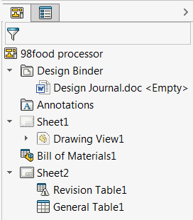

 使用SOLIDWORKS API从图纸中查找所有表格（BOM、通用、修订）。
image: drawing-view-tables.png
labels: [表格,图纸]
---
{ width=250 }

此示例使用SOLIDWORKS API从活动图纸中按指定类型查找所有表格。

需要使用Array函数指定类型数组，其中每个值表示表格的类型（BOM、通用、切割列表、修订、标题块等），这些类型在[swTableAnnotationType_e](https://help.solidworks.com/2017/english/api/swconst/solidworks.interop.swconst~solidworks.interop.swconst.swtableannotationtype_e.html)枚举中定义。

作为结果，返回指向[ITableAnnotation](https://help.solidworks.com/2017/english/api/sldworksapi/SolidWorks.Interop.sldworks~SolidWorks.Interop.sldworks.ITableAnnotation.html) SOLIDWORKS API接口的指针数组，并将每个表格的标题输出到VBA编辑器的即时窗口。

~~~ vb
Dim swApp As SldWorks.SldWorks

Sub main()

    Set swApp = Application.SldWorks
    
    Dim swDraw As SldWorks.DrawingDoc
    
    Set swDraw = swApp.ActiveDoc
    
    If Not swDraw Is Nothing Then
        
        Dim vTables As Variant
        vTables = FindTables(swDraw, Array(swTableAnnotationType_e.swTableAnnotation_BillOfMaterials, swTableAnnotationType_e.swTableAnnotation_RevisionBlock))
        
        If Not IsEmpty(vTables) Then
            
            Dim i As Integer
            
            For i = 0 To UBound(vTables)
                
                Dim swTable As SldWorks.TableAnnotation
                Set swTable = vTables(i)
                
                Debug.Print swTable.Title
                
            Next
            
        End If
        
    Else
        MsgBox "请打开图纸"
    End If
    
End Sub

Function FindTables(draw As SldWorks.DrawingDoc, filter As Variant) As Variant
    
    Dim swTables() As SldWorks.TableAnnotation
    Dim isInit As Boolean
    isInit = False
    
    Dim vSheets As Variant
    
    vSheets = draw.GetViews()
    
    Dim i As Integer
    
    For i = 0 To UBound(vSheets)
        
        Dim vViews As Variant
        vViews = vSheets(i)
        
        Dim swSheetView As SldWorks.View
        Set swSheetView = vViews(0)
        
        Dim vTableAnns As Variant
        vTableAnns = swSheetView.GetTableAnnotations
        
        If Not IsEmpty(vTableAnns) Then
            
            Dim j As Integer
            
            For j = 0 To UBound(vTableAnns)
                
                Dim swTableAnn As SldWorks.TableAnnotation
                Set swTableAnn = vTableAnns(j)
                
                If FilterContains(swTableAnn.Type, filter) Then

                    If isInit Then
                        ReDim Preserve swTables(UBound(swTables) + 1)
                    Else
                        ReDim swTables(0)
                        isInit = True
                    End If

                    Set swTables(UBound(swTables)) = swTableAnn

                End If
                
            Next
            
        End If
        
    Next
    
    FindTables = swTables
    
End Function

Function FilterContains(val As swTableAnnotationType_e, filter As Variant) As Boolean
    
    Dim i As Integer
    
    For i = 0 To UBound(filter)
        If val = filter(i) Then
            FilterContains = True
            Exit Function
        End If
    Next
    
    FilterContains = False
    
End Function
~~~