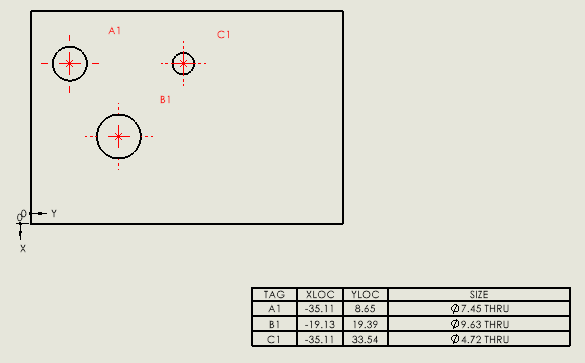

---
标题：插入孔表
描述：VBA宏演示了如何使用SOLIDWORKS API插入指定实体的孔表
图片：holes-table.png
---
{ width=300 }

此宏演示了如何将孔表插入到现有图纸中。

在运行宏之前，需要按照以下顺序预先选择输入对象。

1. 对应于原点的顶点
2. 对应于X轴的边
3. 对应于Y轴的边
4. 包含孔的面

宏将清除选择并重新选择实体。

表格将使用默认模板插入到0,0坐标处。

> 注意，在您的情况下，您可能正在使用不同的方法来检索实体的指针。

```vb
Dim swApp As SldWorks.SldWorks

Sub main()

    Set swApp = Application.SldWorks

    Dim swModel As SldWorks.ModelDoc2
    
    Set swModel = swApp.ActiveDoc
    
    Dim swSelMgr As SldWorks.SelectionMgr
    
    Set swSelMgr = swModel.SelectionManager
    
    Dim swVertexOrigin As SldWorks.Entity
    Dim swEdgeX As SldWorks.Entity
    Dim swEdgeY As SldWorks.Entity
    Dim swHolesFace As SldWorks.Entity
    
    Set swVertexOrigin = swSelMgr.GetSelectedObject6(2, -1)
    Set swEdgeX = swSelMgr.GetSelectedObject6(3, -1)
    Set swEdgeY = swSelMgr.GetSelectedObject6(4, -1)
    Set swHolesFace = swSelMgr.GetSelectedObject6(5, -1)
    
    Dim swView As SldWorks.View
    Set swView = swModel.SelectionManager.GetSelectedObjectsDrawingView(1)
    
    swModel.ClearSelection2 True
    
    swVertexOrigin.SelectByMark False, 1
    swEdgeX.SelectByMark True, 4
    swEdgeY.SelectByMark True, 8
    swHolesFace.SelectByMark True, 2
    
    Dim swHoleTable As SldWorks.TableAnnotation
    Set swHoleTable = swView.InsertHoleTable2(False, 0, 0, 1, "", "")
    
End Sub
```
