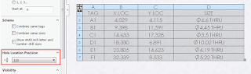

本示例演示了如何使用SOLIDWORKS API更改所选孔表中孔的位置精度。

{ width=320 height=95 }

``` vb
Dim swApp As SldWorks.SldWorks
Dim swModel As SldWorks.ModelDoc2
Dim swSelMgr As SldWorks.SelectionMgr

Sub main()
    
    On Error Resume Next
    
    Set swApp = Application.SldWorks
    
    Set swModel = swApp.ActiveDoc
    
    If Not swModel Is Nothing Then
    
        Set swSelMgr = swModel.SelectionManager
        
        Dim swHoleTableAnn As SldWorks.HoleTableAnnotation

        Set swHoleTableAnn = swSelMgr.GetSelectedObject6(1, -1)
        
        If Not swHoleTableAnn Is Nothing Then
                        
            Dim swHoleTable As SldWorks.HoleTable
            
            Set swHoleTable = swHoleTableAnn.HoleTable
                
            swHoleTable.SetHoleLocationPrecision False, 3
                
        Else
            MsgBox "请选择孔表"
        End If
        
    Else
        MsgBox "请打开模型"
    End If
    
End Sub
```

