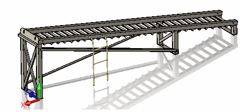
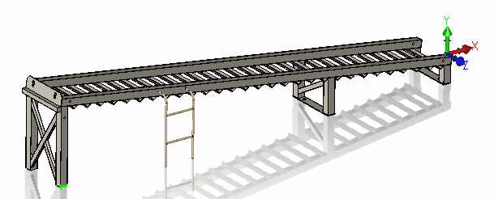
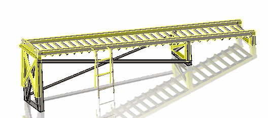

此宏允许通过其几何形状比较两个零件。

使用[SOLIDWORKS API的IBody2::GetCoincidenceTransform2](https://help.solidworks.com/2018/english/api/sldworksapi/solidworks.interop.sldworks~solidworks.interop.sldworks.ibody2~getcoincidencetransform2.html)来比较零件，如果相等，则找到它们之间的变换。

### 注意事项

* 宏支持多体零件
* 即使可比较的零件位于不同的位置（即移动或旋转），宏也会比较它们的几何体。
* 可比较的零件可能具有不同数量的几何体
* 宏将尝试找到两个零件之间最合适的变换

### 示例

要比较的原始零件：

{ width=250 }

要比较的零件：

{ width=250 }

第二个零件具有修改后的几何形状，并在空间中重新定位。第二个零件中的一些几何体已被删除。

宏计算出以下结果：

{ width=250 }

### 指令

* 打开原始零件文件
* 运行宏。
* 指定要与之比较的零件文件的完整路径
* 结果将在原始零件中显示第二个零件
* 继续宏（F5）以清除预览

~~~ vb
Dim swApp As SldWorks.SldWorks

Sub main()

    Set swApp = Application.SldWorks
    
    Dim swPart As SldWorks.PartDoc
    
    Set swPart = swApp.ActiveDoc
    
    If Not swPart Is Nothing Then
        
        Dim otherFilePath As String
        otherFilePath = InputBox("请指定要比较的零件路径")
        
        If otherFilePath <> "" Then
            
            Dim swOtherPart As SldWorks.PartDoc
            Set swOtherPart = swApp.OpenDoc6(otherFilePath, swDocumentTypes_e.swDocPART, swOpenDocOptions_e.swOpenDocOptions_Silent, "", 0, 0)
            
            If Not swOtherPart Is Nothing Then
                Dim swXform As SldWorks.MathTransform
                Set swXform = GetClosestTransform(swPart, swOtherPart)
                PreviewPart swOtherPart, swXform, swPart
            Else
                MsgBox "无法打开要比较的零件"
            End If
            
        End If
        
    Else
        MsgBox "请打开零件"
    End If
        
End Sub

Sub PreviewPart(part As SldWorks.PartDoc, transform As SldWorks.MathTransform, context As PartDoc)
    
    Dim vBodies As Variant
    
    vBodies = part.GetBodies2(swBodyType_e.swSolidBody, True)
    
    Dim i As Integer
    
    For i = 0 To UBound(vBodies)
        
        Dim swBody As SldWorks.Body2
        Set swBody = vBodies(i)
        Set swBody = swBody.Copy
        
        If Not transform Is Nothing Then
            Debug.Print swBody.ApplyTransform(transform)
        End If
        
        Set vBodies(i) = swBody
        swBody.Display3 context, RGB(255, 255, 0), swTempBodySelectOptions_e.swTempBodySelectOptionNone
        
    Next
    
    Stop '继续宏以隐藏预览
    
End Sub

Function GetClosestTransform(thisPart As SldWorks.PartDoc, otherPart As SldWorks.PartDoc) As SldWorks.MathTransform

    Dim vThisBodies As Variant
    Dim vOtherBodies As Variant
    
    vThisBodies = thisPart.GetBodies2(swBodyType_e.swSolidBody, True)
    vOtherBodies = otherPart.GetBodies2(swBodyType_e.swSolidBody, True)
    
    Dim transformsHits As Object
    Set transformsHits = CreateObject("Scripting.Dictionary") '由于某些原因，有时在创建时会添加第一个空元素
        
    If Not IsEmpty(vThisBodies) And Not IsEmpty(vOtherBodies) Then
        
        Dim i As Integer
        Dim j As Integer
        
        For i = 0 To UBound(vOtherBodies)
            
            Dim swOtherBody As SldWorks.Body2
                        
            Set swOtherBody = vOtherBodies(i)
            
            For j = 0 To UBound(vThisBodies)
                
                Dim swThisBody As SldWorks.Body2
                Set swThisBody = vThisBodies(j)
                Dim swTransform As SldWorks.MathTransform
                
                If swThisBody.GetCoincidenceTransform2(swOtherBody, swTransform) Then
                    
                    If Not swTransform Is Nothing Then
                        
                        Dim contains As Boolean
                        contains = False
                        For Each key In transformsHits.Keys
                            If Not key Is Nothing Then
                                Dim tx As SldWorks.MathTransform
                                Set tx = key
                                If CompareTransforms(swTransform, tx) Then
                                    transformsHits(tx) = transformsHits(tx) + 1
                                    contains = True
                                    Exit For
                                End If
                            End If
                        Next
                        
                        If Not contains Then
                            transformsHits.Add swTransform, 1
                        End If
                        
                    End If
                    
                End If
                
            Next
            
        Next
        
    End If
    
    Dim curMaxHit As Integer
    curMaxHit = 0
    
    For Each key In transformsHits.Keys
        If Not key Is Nothing Then
            Dim curTx As SldWorks.MathTransform
            Set curTx = key
            If transformsHits(curTx) > curMaxHit Then
                curMaxHit = transformsHits(curTx)
                Set GetClosestTransform = curTx
            End If
        End If
    Next

End Function

Function CompareTransforms(firstTransform As SldWorks.MathTransform, secondTransform As SldWorks.MathTransform) As Boolean
    
    Dim vFirstArrayData As Variant
    vFirstArrayData = firstTransform.ArrayData
    
    Dim vSecondArrayData As Variant
    vSecondArrayData = secondTransform.ArrayData
    
    Dim i As Integer
    
    For i = 0 To UBound(vFirstArrayData)
        If Not CompareValues(CDbl(vFirstArrayData(i)), CDbl(vSecondArrayData(i))) Then
            CompareTransforms = False
            Exit Function
        End If
    Next
    
    CompareTransforms = True
    
End Function

Function CompareValues(firstValue As Double, secondValue As Double, Optional tol As Double = 0.00000001) As Boolean
        
    CompareValues = Abs(secondValue - firstValue) <= tol
    
End Function
~~~