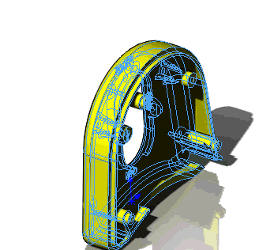

 使用SOLIDWORKS API和临时物体创建一个围绕Y轴旋转的选定物体的旋转动画的VBA示例
image: body-rotate.gif
labels: [动画, 旋转, 临时物体]
---

这个VBA示例演示了如何使用SOLIDWORKS API在零件文档中创建一个选定物体的旋转动画。

在特征管理器树中不会创建额外的特征。此宏**不使用**SOLIDWORKS运动研究。物体围绕原点的Y轴旋转。动画使用临时物体创建，原始物体或特征管理器树不受影响。

从特征管理器树中选择物体，然后运行宏。

{ width=250 }

创建并旋转预览物体，直到取消选择。当宏停止时，原始物体将恢复到原始状态。

~~~ vb
Const PI As Double = 3.14159265359

Dim swApp As SldWorks.SldWorks

Sub main()

    Set swApp = Application.SldWorks
    
    Dim swModel As SldWorks.ModelDoc2
    
    Set swModel = swApp.ActiveDoc
    
    If Not swModel Is Nothing Then
    
        Dim swSelMgr As SldWorks.SelectionMgr
        
        Set swSelMgr = swModel.SelectionManager
        
        Dim swBody As SldWorks.Body2
        Set swBody = swSelMgr.GetSelectedObject6(1, -1)
        
        If Not swBody Is Nothing Then
            RunRotationAnimation swModel, swBody
        Else
            MsgBox "请选择物体"
        End If
        
    Else
        MsgBox "请打开零件文档"
    End If
    
End Sub

Sub RunRotationAnimation(part As SldWorks.PartDoc, body As SldWorks.Body2, Optional speed As Double = 1)
    
    body.HideBody True
    
    Dim rotStep As Double
    rotStep = PI * 2 / 360 * speed
    
    Dim curAng As Double
    
    Dim swModelView As SldWorks.ModelView
    Set swModelView = part.ActiveView
    
    Dim swTempBody As SldWorks.Body2
    
    Dim swSelMgr As SldWorks.SelectionMgr
    Set swSelMgr = part.SelectionManager
    
    While swSelMgr.GetSelectedObjectCount2(-1) <> 0
        For curAng = 0 To PI * 2 Step rotStep
            Dim animStep As MathTransform
            Set animStep = GetTransform(curAng)
            Set swTempBody = Nothing
            Set swTempBody = body.Copy()
            swTempBody.ApplyTransform animStep
            swTempBody.Display3 part, RGB(255, 255, 0), swTempBodySelectOptions_e.swTempBodySelectOptionNone
            swModelView.GraphicsRedraw Nothing
            DoEvents
        Next
    Wend
    
    Set swTempBody = Nothing
    body.HideBody False
    
End Sub

Function GetTransform(angle As Double) As MathTransform
    
    Dim swMathUtils As SldWorks.MathUtility
    
    Set swMathUtils = swApp.GetMathUtility
    
    Dim swOrigPt As SldWorks.MathPoint
    Dim dPt(2) As Double
    dPt(0) = 0: dPt(1) = 0: dPt(2) = 0
    
    Set swOrigPt = swMathUtils.CreatePoint(dPt)
    
    Dim swAxisVec As SldWorks.MathVector
    Dim dVec(2) As Double
    dVec(0) = 0: dVec(1) = 1: dVec(2) = 0
    
    Set swAxisVec = swMathUtils.CreateVector(dVec)
    
    Set GetTransform = swMathUtils.CreateTransformRotateAxis(swOrigPt, swAxisVec, angle)
    
End Function
~~~