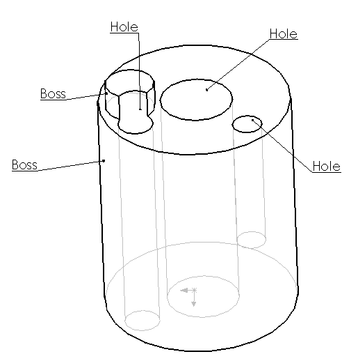

{ width=250 }

该示例演示了如何使用SOLIDWORKS API来确定所选圆柱面是内部（即孔）还是外部（即凸台）。

选择圆柱面并运行宏。将显示一个消息框，其中包含所选面的类型。该宏适用于任何面（面不需要具有平面相邻面）。

### 算法

该宏根据面的法线方向来确定面是孔还是凸台。孔的法线始终指向圆柱轴，而凸台的法线始终指向圆柱轴的外部。

宏在面上找到一个随机点（在本示例中，这是面的U和V参数的中间点），并计算该点的法线。然后计算该点与圆柱体原点之间的向量。如果该向量与法线之间的角度小于90度（PI / 2），则法线指向圆柱轴，这意味着该面是孔；否则（如果角度大于90度（PI / 2）），该面是外部（凸台）。

请参见下图：

{ width=400 }

~~~vba

Const PI As Double = 3.14159265359

Dim swApp As SldWorks.SldWorks
Dim swMathUtils As SldWorks.MathUtility

Sub main()

    Set swApp = Application.SldWorks
        
    Set swMathUtils = swApp.GetMathUtility
        
    Dim swModel As SldWorks.ModelDoc2
    
    Set swModel = swApp.ActiveDoc
    
    If Not swModel Is Nothing Then
    
        Dim swSelMgr As SldWorks.SelectionMgr
        
        Set swSelMgr = swModel.SelectionManager
        
        Set swSelMgr = swModel.SelectionManager

        Dim swFace As SldWorks.Face2
        Set swFace = swSelMgr.GetSelectedObject6(1, -1)
        
        If Not swFace Is Nothing Then
            
            If IsHole(swFace) Then
                MsgBox "所选面是孔"
            Else
                MsgBox "所选面是凸台"
            End If
            
        Else
            MsgBox "请选择面"
        End If
        
    Else
        MsgBox "请打开模型"
    End If
    
End Sub

Function IsHole(face As SldWorks.Face2) As Boolean
    
    Dim swSurf As SldWorks.Surface
    Set swSurf = face.GetSurface
    
    If swSurf.IsCylinder() Then
    
        Dim uvBounds As Variant
        uvBounds = face.GetUVBounds
        
        Dim vEvalData As Variant
        vEvalData = swSurf.Evaluate((uvBounds(1) - uvBounds(0)) / 2, (uvBounds(3) - uvBounds(2)) / 2, 1, 1)
        
        Dim dPt(2) As Double
        dPt(0) = vEvalData(0): dPt(1) = vEvalData(1): dPt(2) = vEvalData(2)
        
        Dim sense As Integer
        If False = face.FaceInSurfaceSense() Then
            sense = -1
        Else
            sense = 1
        End If
        
        Dim dNormVec(2) As Double
        dNormVec(0) = vEvalData(UBound(vEvalData) - 2) * sense: dNormVec(1) = vEvalData(UBound(vEvalData) - 1) * sense: dNormVec(2) = vEvalData(UBound(vEvalData)) * sense
        
        Dim vCylParams As Variant
        vCylParams = swSurf.CylinderParams
        Dim dOrig(2) As Double
        dOrig(0) = vCylParams(0): dOrig(1) = vCylParams(1): dOrig(2) = vCylParams(2)
        
        Dim dDirVec(2) As Double
        dDirVec(0) = dPt(0) - dOrig(0): dDirVec(1) = dPt(1) - dOrig(1): dDirVec(2) = dPt(2) - dOrig(2)
        Dim swDirVec As MathVector
        
        Set swDirVec = swMathUtils.CreateVector(dDirVec)
        
        Dim swNormVec As SldWorks.MathVector
        Set swNormVec = swMathUtils.CreateVector(dNormVec)
        
        IsHole = GetAngle(swDirVec, swNormVec) < PI / 2
        
    Else
        Err.Raise vbError, , "所选面不是圆柱面"
    End If
    
End Function

Function GetAngle(vec1 As MathVector, vec2 As MathVector) As Double
    
    'cos a= a*b/(|a|*|b|)
    GetAngle = ACos(vec1.Dot(vec2) / (vec1.GetLength() * vec2.GetLength()))
    
End Function

Function ACos(val As Double) As Double
    
    If val = 1 Then
        ACos = 0
    ElseIf val = -1 Then
        ACos = 4 * Atn(1)
    Else
        ACos = Atn(-val / Sqr(-val * val + 1)) + 2 * Atn(1)
    End If
    
End Function
~~~

~~~cs
using SolidWorks.Interop.sldworks;
using SolidWorks.Interop.swconst;
using System.Runtime.InteropServices;
using System;

namespace HoleOrBoss.csproj
{
    public partial class SolidWorksMacro
    {
        public void Main()
        {
            IModelDoc2 doc = swApp.IActiveDoc2;

            if (doc != null)
            {
                IFace2 face = doc.ISelectionManager.GetSelectedObject6(1, -1) as IFace2;

                if (face != null)
                {
                    if (IsHole(face))
                    {
                        swApp.SendMsgToUser("所选面是孔");
                    }
                    else
                    {
                        swApp.SendMsgToUser("所选面是凸台");
                    }
                }
                else
                {
                    throw new Exception("未选择面");
                }
            }
            else
            {
                throw new Exception("未打开文档");
            }
        }

        private bool IsHole(IFace2 face)
        {
            ISurface surf = face.IGetSurface();

            if (surf.IsCylinder())
            {
                double[] uvBounds = face.GetUVBounds() as double[];

                double[] evalData = surf.Evaluate((uvBounds[1] - uvBounds[0]) / 2, (uvBounds[3] - uvBounds[2]) / 2, 1, 1) as double[];

                double[] pt = new double[] { evalData[0], evalData[1], evalData[2] };

                int sense = face.FaceInSurfaceSense() ? 1 : -1;

                double[] norm = new double[] { evalData[evalData.Length - 3] * sense, evalData[evalData.Length - 2] * sense, evalData[evalData.Length - 1] * sense };

                double[] cylParams = surf.CylinderParams as double[];

                double[] orig = new double[] { cylParams[0], cylParams[1], cylParams[2] };

                double[] dir = new double[] { pt[0] - orig[0], pt[1] - orig[1], pt[2] - orig[2] };

                IMathUtility mathUtils = swApp.IGetMathUtility();

                IMathVector dirVec = mathUtils.CreateVector(dir) as IMathVector;
                IMathVector normVec = mathUtils.CreateVector(norm) as IMathVector;

                return GetAngle(dirVec, normVec) < Math.PI / 2;
            }
            else
            {
                throw new NotSupportedException("仅支持圆柱面");
            }
        }

        private double GetAngle(IMathVector vec1, IMathVector vec2)
        {
            return Math.Acos(vec1.Dot(vec2) / (vec1.GetLength() * vec2.GetLength()));
        }

        public SldWorks swApp;
    }
}
~~~