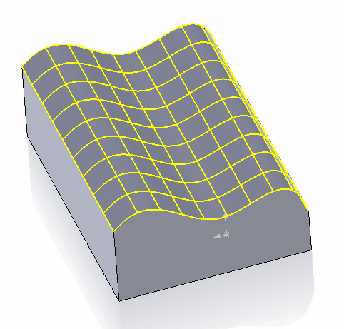

 该示例演示了如何使用SOLIDWORKS API在所选面的u和v边界中找到指定数量的ISO曲线。
image: iso-curves-wire-body.png
labels: [curve, evaluate, geometry, macro, iso, uv, trimmed curve, vba]
---
{ width=300 }

该示例演示了如何使用SOLIDWORKS API在所选面的u和v边界中找到指定数量的ISO曲线。

* 选择面并运行宏
* ISO曲线将被预览，宏执行停止
* 继续执行宏以清除预览

可以在以下代码段中更改u和v方向上的ISO曲线数量：

~~~ vb
Dim vCurves As Variant
vCurves = GetIsoCurves(swFace, <u方向上的曲线数量>, <v方向上的曲线数量>)
~~~

该宏还可选择在3D草图中创建曲线。

{ width=300 }

可以通过在宏的开头将*CREATE_SKETCH*常量设置为*True*来启用此选项：

~~~ vb
Const CREATE_SKETCH As Boolean = True
~~~

**宏：**

~~~ vb
Const CREATE_SKETCH As Boolean = False

Dim swApp As SldWorks.SldWorks

Sub main()

    Set swApp = Application.SldWorks
    
    Dim swModel As SldWorks.ModelDoc2
    
    Set swModel = swApp.ActiveDoc
    
    If Not swModel Is Nothing Then
    
        Dim swSelMgr As SldWorks.SelectionMgr
        
        Set swSelMgr = swModel.SelectionManager
        
        Dim swFace As SldWorks.Face2
        Set swFace = swSelMgr.GetSelectedObject6(1, -1)
        
        If Not swFace Is Nothing Then
            
            Dim vCurves As Variant
            vCurves = GetIsoCurves(swFace, 10, 10)
            
            If True = CREATE_SKETCH Then
                DrawCurves swModel, vCurves, 0.001, 0.001
            Else
                PreviewCurves swModel, vCurves
            End If
            
        Else
            MsgBox "请选择面"
        End If
    
    Else
        MsgBox "请打开模型"
    End If
    
End Sub

Function GetIsoCurves(face As SldWorks.Face2, uCount As Integer, vCount As Integer) As Variant
    
    Dim swCurves() As SldWorks.curve
    ReDim swCurves(uCount + vCount - 1)
    
    Dim uCurves As Variant
    Dim vCurves As Variant
    
    uCurves = SplitFaceOnIsoCurves(face, True, uCount)
    vCurves = SplitFaceOnIsoCurves(face, False, vCount)
    
    Dim i As Integer
    
    For i = 0 To UBound(uCurves)
        Set swCurves(i) = uCurves(i)
    Next
    
    For i = 0 To UBound(vCurves)
        Set swCurves(UBound(uCurves) + 1 + i) = vCurves(i)
    Next
    
    GetIsoCurves = swCurves
    
End Function

Function SplitFaceOnIsoCurves(face As SldWorks.Face2, UorV As Boolean, count As Integer) As Variant

    Dim swCurves() As SldWorks.curve
    ReDim swCurves(count - 1)
    
    Dim swSurf As SldWorks.Surface
    Set swSurf = face.GetSurface
    
    Dim thisParamMin As Double
    Dim thisParamMax As Double
    Dim otherParamMin As Double
    Dim otherParamMax As Double
    
    Dim vUvBounds As Variant
    vUvBounds = face.GetUVBounds
    
    If True = UorV Then
        thisParamMin = vUvBounds(0)
        thisParamMax = vUvBounds(1)
        otherParamMin = vUvBounds(2)
        otherParamMax = vUvBounds(3)
    Else
        thisParamMin = vUvBounds(2)
        thisParamMax = vUvBounds(3)
        otherParamMin = vUvBounds(0)
        otherParamMax = vUvBounds(1)
    End If
    
    Dim i As Integer
    
    Dim paramStep As Double
    paramStep = (thisParamMax - thisParamMin) / (count - 1)
    
    For i = 0 To count - 1
        
        Dim param As Double
        param = thisParamMin + i * paramStep
        
        Dim swCurve As SldWorks.curve
        Set swCurve = swSurf.MakeIsoCurve2(Not UorV, param)
        
        Dim u As Double
        Dim v As Double
        
        Dim vStartPt As Variant
        Dim vEndPt As Variant
        
        If True = UorV Then
            u = param
            v = otherParamMin
        Else
            v = param
            u = otherParamMin
        End If
        
        vStartPt = swSurf.Evaluate(u, v, 0, 0)
        
        If True = UorV Then
            u = param
            v = otherParamMax
        Else
            v = param
            u = otherParamMax
        End If
        
        vEndPt = swSurf.Evaluate(u, v, 0, 0)
        
        Set swCurve = swCurve.CreateTrimmedCurve2(vStartPt(0), vStartPt(1), vStartPt(2), vEndPt(0), vEndPt(1), vEndPt(2))
        Set swCurves(i) = swCurve
    Next
    
    SplitFaceOnIsoCurves = swCurves
    
End Function

Sub PreviewCurves(model As SldWorks.ModelDoc2, curves As Variant)
    
    Dim swModeler As SldWorks.Modeler
    Set swModeler = swApp.GetModeler
    
    Dim swCurvesBody() As SldWorks.Body2
    
    ReDim swCurvesBody(UBound(curves))
    
    Dim i As Integer
        
    For i = 0 To UBound(curves)
        Dim swCurve As SldWorks.curve
        Set swCurve = curves(i).MakeBsplineCurve2()
        Set swCurvesBody(i) = swCurve.CreateWireBody
        swCurvesBody(i).Display3 model, RGB(255, 255, 0), swTempBodySelectOptions_e.swTempBodySelectOptionNone
    Next
    
    Stop
    
    '清除预览
    For i = 0 To UBound(swCurvesBody)
        Set swCurvesBody(i) = Nothing
    Next
        
    model.GraphicsRedraw2
    
End Sub

Sub DrawCurves(model As SldWorks.ModelDoc2, curves As Variant, chordTol As Double, lengthTol As Double)
    
    Dim swSketchMgr As SldWorks.SketchManager
    Set swSketchMgr = model.SketchManager
    
    model.ClearSelection2 True
    swSketchMgr.Insert3DSketch False
    model.SetAddToDB True
        
    For i = 0 To UBound(curves)
        Dim swCurve As SldWorks.curve
        Set swCurve = curves(i)
        DrawCurve swCurve, model, chordTol, lengthTol
    Next
    
    model.SetAddToDB False
    swSketchMgr.Insert3DSketch True
        
End Sub

Sub DrawCurve(curve As SldWorks.curve, model As SldWorks.ModelDoc2, chordTol As Double, lengthTol As Double)

    Dim vStartPt As Variant
    Dim vEndPt As Variant
    Dim vTessPts As Variant
    
    Dim startParam As Double
    Dim endParam As Double
    
    curve.GetEndParams startParam, endParam, False, False
    
    vStartPt = curve.Evaluate2(startParam, 0)
    vEndPt = curve.Evaluate2(endParam, 0)

    vTessPts = curve.GetTessPts(chordTol, lengthTol, (vStartPt), (vEndPt))

    For i = 0 To UBound(vTessPts) - 3 Step 3
        model.CreateLine2 vTessPts(i + 0), vTessPts(i + 1), vTessPts(i + 2), vTessPts(i + 3), vTessPts(i + 4), vTessPts(i + 5)
    Next i

End Sub
~~~