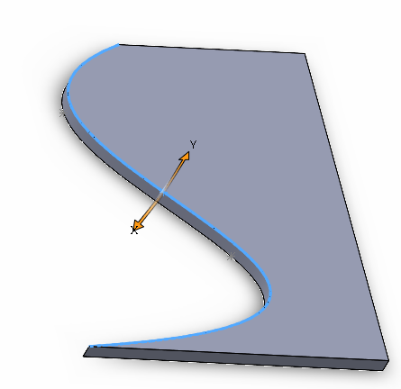

 Use SOLIDWORKS API to extract parameters (dimension, order, periodicity, control points, and knots) of a B-Spline curve from a selected edge in the graphics view.
image: selected-bspline-edge.png
labels: [bspline, parameters, modeler, edge]
---
{ width=250 }

This VBA example extracts parameters (dimension, order, periodicity, control points, and knots) from a selected B-Spline type edge (e.g., derived from a spline segment). The extracted data can be used in the [IModeler::CreateBsplineCurve](https://help.solidworks.com/2012/English/api/sldworksapi/SolidWorks.Interop.sldworks~SolidWorks.Interop.sldworks.IModeler~CreateBsplineCurve.html) SOLIDWORKS API method to construct a curve with the same geometry.

The data is output to the Immediate window in the VBA editor in the following format:

~~~
Properties:
 Dimension Value
 Order Value
 Control Points Count Value
 Periodic Value
Knots:
 Value 1
 ...
 Value N
Control Points:
 Value 1
 ...
 Value N
~~~

```vb
Dim swApp As SldWorks.SldWorks
Dim swModel As SldWorks.ModelDoc2
Dim swSelMgr As SldWorks.SelectionMgr

Sub main()

    Set swApp = Application.SldWorks
    
    Set swModel = swApp.ActiveDoc
    
    Set swSelMgr = swModel.SelectionManager
    
    Dim swEdge As SldWorks.Edge
    
    Set swEdge = swSelMgr.GetSelectedObject6(1, -1)
    
    Dim swCurve As SldWorks.Curve
    
    Set swCurve = swEdge.GetCurve
    
    Dim swSplineData As SldWorks.SplineParamData
    Set swSplineData = swCurve.GetBCurveParams5(False, False, False, False)
    
    Dim i As Integer
    
    Debug.Print "Properties:"
    Debug.Print swSplineData.Dimension
    Debug.Print swSplineData.Order
    Debug.Print swSplineData.ControlPointsCount
    Debug.Print swSplineData.Periodic
    
    Debug.Print "Knots:"
    Dim vKnotPts As Variant
    swSplineData.GetKnotPoints vKnotPts
    
    For i = 0 To UBound(vKnotPts)
        Debug.Print vKnotPts(i)
    Next
    
    Debug.Print "Control Points:"
    Dim vCtrlPts As Variant
    swSplineData.GetControlPoints vCtrlPts
    For i = 0 To UBound(vCtrlPts)
        Debug.Print vCtrlPts(i)
    Next
    
End Sub
```