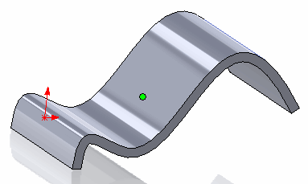

 该示例演示了如何使用SOLIDWORKS API在面的质心处找到参数（坐标和法线）
image: face-center.png
labels: [center, uv, normal]
---
{ width=250 }

该示例演示了如何使用SOLIDWORKS API在面的质心处找到参数（坐标和法线）。该宏适用于任何类型的面（平面、圆柱面、环面等）。

质心是使用[SOLIDWORKS API的ISurface::Evaluate](https://help.solidworks.com/2018/english/api/sldworksapi/solidworks.interop.sldworks~solidworks.interop.sldworks.isurface~evaluate.html)方法，通过U和V参数的最小值和最大值的平均值来计算的。

``` vb
Dim swApp As SldWorks.SldWorks
Dim swModel As SldWorks.ModelDoc2

Sub main()

    Set swApp = Application.SldWorks
    
    Set swModel = swApp.ActiveDoc
    
    If Not swModel Is Nothing Then
        
        Dim swFace As SldWorks.Face2
        Set swFace = swModel.SelectionManager.GetSelectedObject6(1, -1)
        
        If Not swFace Is Nothing Then
            
            Dim vPt As Variant
            Dim vNorm As Variant
            
            GetFaceCenterParameters swFace, vPt, vNorm
            
            Debug.Print "面的质心坐标为: " & vPt(0) * 1000 & ", " & vPt(1) * 1000 & ", " & vPt(2) * 1000
            Debug.Print "面的质心法线为: " & vNorm(0) & ", " & vNorm(1) & ", " & vNorm(2)
        
        Else
            MsgBox "请选择面"
        End If
        
    Else
        MsgBox "请打开模型"
    End If
    
End Sub

Sub GetFaceCenterParameters(face As SldWorks.Face2, ByRef point As Variant, ByRef normal As Variant)
    
    Dim vUvBounds As Variant
    vUvBounds = face.GetUVBounds
    
    Dim centerU As Double
    Dim centerV As Double
        
    centerU = (vUvBounds(0) + vUvBounds(1)) / 2
    centerV = (vUvBounds(2) + vUvBounds(3)) / 2
    
    Dim swSurf As SldWorks.Surface
    Set swSurf = face.GetSurface
    
    Dim vEvalRes As Variant
    vEvalRes = swSurf.Evaluate(centerU, centerV, 0, 0)
    
    Dim dPoint(2) As Double
    Dim dNormal(2) As Double
    
    dPoint(0) = vEvalRes(0)
    dPoint(1) = vEvalRes(1)
    dPoint(2) = vEvalRes(2)
    
    dNormal(0) = vEvalRes(3)
    dNormal(1) = vEvalRes(4)
    dNormal(2) = vEvalRes(5)
    
    point = dPoint
    normal = dNormal
    
End Sub
```