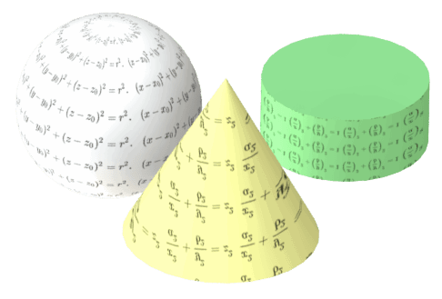

 包含与SOLIDWORKS模型几何拓扑相关的示例和文章的集合。
image: solidworks-geometry-api.png
sidebar_position: 0
---
{ width=250 }

SOLIDWORKS API通过[IModeler](https://help.solidworks.com/2018/english/api/sldworksapi/SolidWorks.Interop.sldworks~SolidWorks.Interop.sldworks.IModeler.html)接口提供了对几何生成和处理的低级访问。

该接口允许在内核级别上操作几何图形：

* 从边界表示（BREP）数据创建曲面
* 创建曲线
* 修剪曲线和曲面

几何API最常用于在[宏特征](/docs/codestack/solidworks-api/document/macro-feature/)中生成和修改实体。

本节包含使用SOLIDWORKS API处理几何图形（添加、编辑）的示例。

## 预览临时几何图形

临时几何图形是不可见的，驻留在内存中。但是，预览几何图形可以非常有用，用于故障排除。下面是一些代码片段，可以用于预览不同类型的临时几何图形。

### 预览曲线

通过将曲线转换为可以在图形区域中显示的临时线体，可以预览曲线。

~~~ vb
PreviewCurves swModel, swCurve1, swCurve2, swCurve3
...
Sub PreviewCurves(model As SldWorks.ModelDoc2, ParamArray curves() As Variant)
    
    Dim i As Integer
    Dim swPreviewBody() As SldWorks.Body2
    
    If Not IsEmpty(curves) Then
        
        ReDim swPreviewBody(UBound(curves))
        
        For i = 0 To UBound(curves)
            Dim swCurve As SldWorks.Curve
            Set swCurve = curves(i)
            Set swPreviewBody(i) = swCurve.CreateWireBody()
            swPreviewBody(i).Display3 model, RGB(255, 255, 0), swTempBodySelectOptions_e.swTempBodySelectOptionNone
        Next
        
    End If
    
    Stop
    
    If Not IsEmpty(curves) Then
        For i = 0 To UBound(curves)
            Set swPreviewBody(i) = Nothing
        Next
    End If
    
End Sub
~~~