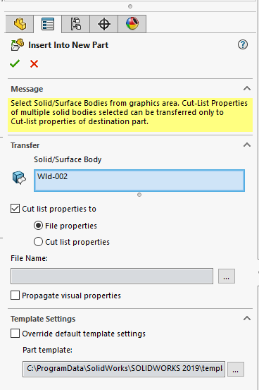

{ width=250 }

This macro saves all selected bodies bodies (or all bodies if none selected) from the active part document into individual part documents.

## Configuration

Specify the option to handle the transfer of custom properties by modifying the **CUT_LIST_PRPS_TRANSFER** constant

Specify the output directory in the **OUT_DIR**. If this variable is empty then bodies will be saved in the same directory as source part document.

~~~ vb
Const CUT_LIST_PRPS_TRANSFER As Long = swCutListTransferOptions_e.swCutListTransferOptions_CutListProperties 'move properties to cut-lists
Const OUT_DIR As String = "D:\Parts" 'Export bodies to the Parts directory
~~~

## Notes

* Bodies remain linked to the original part
* Output files will be named after the bodies
* Special symbols which cannot be used in the file name (e.g. ?, \*, : etc) will be replaced with _
* Macro will not create an output folder if it does not exist and will fail

~~~ vb
Const CUT_LIST_PRPS_TRANSFER As Long = swCutListTransferOptions_e.swCutListTransferOptions_FileProperties
Const OUT_DIR As String = ""

Dim swApp As SldWorks.SldWorks

Sub main()

    Set swApp = Application.SldWorks
    
    Dim swPart As SldWorks.PartDoc
    
    Set swPart = swApp.ActiveDoc
    
    Dim vBodies As Variant
    vBodies = GetSelectedBodies(swPart.SelectionManager)
    
    If IsEmpty(vBodies) Then
        vBodies = swPart.GetBodies2(swBodyType_e.swSolidBody, True)
    End If
    
    Dim i As Integer
    
    For i = 0 To UBound(vBodies)
        
        Dim swBody As SldWorks.Body2
        Set swBody = vBodies(i)
        
        If False <> swBody.Select2(False, Nothing) Then
            
            Dim outFilePath As String
            outFilePath = GetOutFilePath(swPart, swBody, OUT_DIR)
            
            Dim errs As Long
            Dim warns As Long
            
            If False <> swPart.SaveToFile3(outFilePath, swSaveAsOptions_e.swSaveAsOptions_Silent, CUT_LIST_PRPS_TRANSFER, False, "", errs, warns) Then
                swApp.CloseDoc outFilePath
            Else
                Err.Raise vbError, "", "Failed to save body " & swBody.Name & " to file " & outFilePath & ". Error code: " & errs
            End If
            
        Else
            Err.Raise vbError, "", "Failed to select body " & swBody.Name
        End If
    Next
    
End Sub

Function GetSelectedBodies(selMgr As SldWorks.SelectionMgr) As Variant

    Dim isInit As Boolean
    isInit = False
    
    Dim swBodies() As SldWorks.Body2

    Dim i As Integer
    
    For i = 1 To selMgr.GetSelectedObjectCount2(-1)
                
        Dim swBody As SldWorks.Body2
    
        Set swBody = GetSelectedObjectBody(selMgr, i)
        
        If Not swBody Is Nothing Then
            
            If Not isInit Then
                ReDim swBodies(0)
                Set swBodies(0) = swBody
                isInit = True
            Else
                If Not Contains(swBodies, swBody) Then
                    ReDim Preserve swBodies(UBound(swBodies) + 1)
                    Set swBodies(UBound(swBodies)) = swBody
                End If
            End If
                        
        End If
    
    Next

    If isInit Then
        GetSelectedBodies = swBodies
    Else
        GetSelectedBodies = Empty
    End If

End Function

Function GetSelectedObjectBody(selMgr As SldWorks.SelectionMgr, index As Integer) As SldWorks.Body2
    
    Dim swBody As SldWorks.Body2
    
    Dim selObj As Object
    Set selObj = selMgr.GetSelectedObject6(index, -1)
    
    If Not selObj Is Nothing Then
        If TypeOf selObj Is SldWorks.Body2 Then
            Set swBody = selObj
        ElseIf TypeOf selObj Is SldWorks.Face2 Then
            Dim swFace As SldWorks.Face2
            Set swFace = selObj
            Set swBody = swFace.GetBody
        ElseIf TypeOf selObj Is SldWorks.Edge Then
            Dim swEdge As SldWorks.Edge
            Set swEdge = selObj
            Set swBody = swEdge.GetBody
        ElseIf TypeOf selObj Is SldWorks.Vertex Then
            Dim swVertex As SldWorks.Vertex
            Set swVertex = selObj
            Set swBody = swVertex.GetBody
        End If
    End If

    Set GetSelectedObjectBody = swBody
    
End Function

Function Contains(vArr As Variant, item As Object) As Boolean
    
    Dim i As Integer
    
    For i = 0 To UBound(vArr)
        If vArr(i) Is item Then
            Contains = True
            Exit Function
        End If
    Next
    
    Contains = False
    
End Function

Function GetOutFilePath(model As SldWorks.ModelDoc2, body As SldWorks.Body2, outDir As String) As String
    
    If outDir = "" Then
        outDir = model.GetPathName()
        If outDir = "" Then
            Err.Raise vbError, "", "Output directory cannot be composed as file was never saved"
        End If
        
        outDir = Left(outDir, InStrRev(outDir, "\") - 1)
    End If
    
    If Right(outDir, 1) = "\" Then
        outDir = Left(outDir, Len(outDir) - 1)
    End If
    
    GetOutFilePath = ReplaceInvalidPathSymbols(outDir & "\" & body.Name & ".sldprt")
    
End Function

Function ReplaceInvalidPathSymbols(path As String) As String
    
    Const REPLACE_SYMB As String = "_"
    
    Dim res As String
    res = Right(path, Len(path) - Len("X:\"))
    
    Dim drive As String
    drive = Left(path, Len("X:\"))
    
    Dim invalidSymbols As Variant
    invalidSymbols = Array("/", ":", "*", "?", """", "<", ">", "|")
    
    Dim i As Integer
    For i = 0 To UBound(invalidSymbols)
        Dim invalidSymb As String
        invalidSymb = CStr(invalidSymbols(i))
        res = Replace(res, invalidSymb, REPLACE_SYMB)
    Next
    
    ReplaceInvalidPathSymbols = drive + res
    
End Function
~~~

