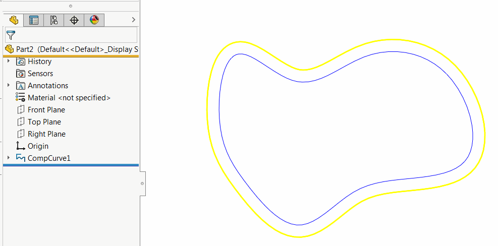

This VBA example demonstrates how to offset the wire body of a SOLIDWORKS curve using the SOLIDWORKS API and display a preview.

A wire body is a type of entity that corresponds to edges and curves.

Wire bodies are used in features such as composite curves, through XYZ curves, and are also used to generate previews for certain types of features, such as fillet features.

{ width=350 }

To run this example:

* Create a composite curve (or any other type of curve) on the front plane with a normal of {0, 0, 1}.
* Run the macro. The macro extracts the entity from the selected curve. The entity will be a wire body. The macro offsets the entity by 10 millimeters and displays the offset preview.
* The macro stops executing. Afterward, the temporary entity will be destroyed.

{ width=450 }

```vb
Dim swApp As SldWorks.SldWorks

Sub main()

    Set swApp = Application.SldWorks
    
    Dim swModel As SldWorks.ModelDoc2
    
    Set swModel = swApp.ActiveDoc
    
    If Not swModel Is Nothing Then
        
        Dim swSelMgr As SldWorks.SelectionMgr
        Set swSelMgr = swModel.SelectionManager
        
        Dim swEdge As SldWorks.Edge
        Set swEdge = swSelMgr.GetSelectedObject6(1, -1)
        
        If Not swEdge Is Nothing Then
        
            Dim swBody As SldWorks.Body2
            Set swBody = swEdge.GetBody()
            
            If swBody.GetType() = swBodyType_e.swWireBody Then
                
                Dim swOffsetBody As SldWorks.Body2
                Dim swNormVec As SldWorks.MathVector
                
                Dim swMathUtils As SldWorks.MathUtility
                Set swMathUtils = swApp.GetMathUtility
                
                Dim dVec(2) As Double
                dVec(0) = 0: dVec(1) = 0: dVec(2) = 1
                
                Set swNormVec = swMathUtils.CreateVector(dVec)
                
                Set swOffsetBody = swBody.OffsetPlanarWireBody(0.01, swNormVec, swOffsetPlanarWireBodyOptions_e.swOffsetPlanarWireBodyOptions_GapFillExtend)
                
                If swOffsetBody Is Nothing Then
                    Err.Raise vbError, "", "Failed to create offset body. Make sure the selected edge lies on the same plane as specified in the dVec variable."
                End If
                
                swOffsetBody.Display3 swModel, RGB(255, 255, 0), swTempBodySelectOptions_e.swTempBodySelectOptionNone
                
                Stop
                
                Set swOffsetBody = Nothing
                
            Else
                Err.Raise vbError, "", "The selected edge is not a wire body."
            End If
        
        Else
            Err.Raise "No edge selected."
        End If
        
    Else
        Err.Raise "No document open."
    End If
    
End Sub
```
