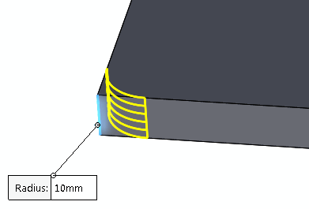

这个VBA示例演示了如何使用SOLIDWORKS API偏移SOLIDWORKS曲线的线体并显示预览。

线体是与边和曲线对应的一种类型的实体。

线体用于生成复合曲线、通过XYZ曲线等特征。这些实体也用于生成某些类型的预览，例如倒角特征的预览。

{ width=350 }

要运行此示例：

* 在正面平面上创建一个复合曲线（或其他类型的曲线），即法线为{0, 0, 1}。
* 运行宏。宏从所选曲线中提取实体。该实体将是一个线体。宏将该实体偏移10毫米并显示偏移的预览。
* 宏停止执行。继续后，临时实体将被销毁。

{ width=450 }

~~~ vb
Dim swApp As SldWorks.SldWorks

Sub main()

    Set swApp = Application.SldWorks
    
    Dim swModel As SldWorks.ModelDoc2
    
    Set swModel = swApp.ActiveDoc
    
    If Not swModel Is Nothing Then
        
        Dim swSelMgr As SldWorks.SelectionMgr
        Set swSelMgr = swModel.SelectionManager
        
        Dim swEdge As SldWorks.Edge
        Set swEdge = swSelMgr.GetSelectedObject6(1, -1)
        
        If Not swEdge Is Nothing Then
        
            Dim swBody As SldWorks.Body2
            Set swBody = swEdge.GetBody()
            
            If swBody.GetType() = swBodyType_e.swWireBody Then
                
                Dim swOffsetBody As SldWorks.Body2
                Dim swNormVec As SldWorks.MathVector
                
                Dim swMathUtils As SldWorks.MathUtility
                Set swMathUtils = swApp.GetMathUtility
                
                Dim dVec(2) As Double
                dVec(0) = 0: dVec(1) = 0: dVec(2) = 1
                
                Set swNormVec = swMathUtils.CreateVector(dVec)
                
                Set swOffsetBody = swBody.OffsetPlanarWireBody(0.01, swNormVec, swOffsetPlanarWireBodyOptions_e.swOffsetPlanarWireBodyOptions_GapFillExtend)
                
                If swOffsetBody Is Nothing Then
                    Err.Raise vbError, "", "无法创建偏移实体。请确保所选边位于与dVec变量中指定的法线相同的平面上"
                End If
                
                swOffsetBody.Display3 swModel, RGB(255, 255, 0), swTempBodySelectOptions_e.swTempBodySelectOptionNone
                
                Stop
                
                Set swOffsetBody = Nothing
                
            Else
                Err.Raise vbError, "", "所选边不是线体"
            End If
        
        Else
            Err.Raise "未选择边"
        End If
        
    Else
        Err.Raise "文档未打开"
    End If
    
End Sub
~~~