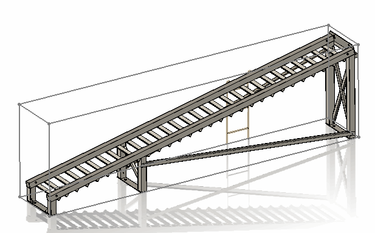
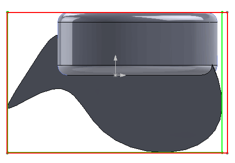
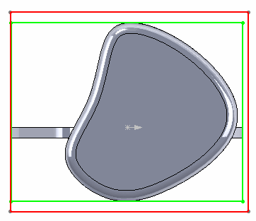
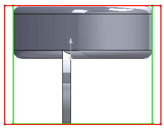

{ width=250 }

As per *Remarks* section of [IPartDoc::GetPartBox](https://help.solidworks.com/2016/english/api/sldworksapi/solidworks.interop.sldworks~solidworks.interop.sldworks.ipartdoc~getpartbox.html) method (or other BoundingBox APIs) in SOLIDWORKS API Help Documentation

> The values returned are approximate and should not be used for comparison or calculation purposes. Furthermore, the bounding box may vary after rebuilding the model

To calculate the precise bounding box it is required to find the extreme points of each body in XYZ directions via [IBody2::GetExtremePoint](https://help.solidworks.com/2016/english/api/sldworksapi/solidworks.interop.sldworks~solidworks.interop.sldworks.ibody2~getextremepoint.html)

The following macros will calculate the bounding box, width, height and length of the active part document using both approaches of SOLIDWORKS API.

As the result 3D Sketch with bounding box is created.

### Precision

Bounding boxes calculated approximately might be more than 10% inaccurate. For the following [example part](bbox-precision.SLDPRT) the difference between the bounding boxes volumes equal to 14%. The following images show the differences (green box is a precise calculation and red box is an approximate calculation):

{ width=250 }

{ width=250 }

{ width=250 }

> The precise bounding box calculated by extreme points is exactly equal to the bounding box created by [bounding box feature](https://help.solidworks.com/2018/English/WhatsNew/t_bounding_box_for_part_assem.htm) added in SOLIDWORKS 2018

### Performance

Extraction of approximate box is more than 300 times quicker. For a single body part approximate calculation of bounding box took 0.016ms, while it took 5.57 ms for precise calculation of the same part. For multi-body part of 63 bodies it took 0.018ms for approximate calculations and 16.68 ms for precise calculations.

As a summary on avarage it would be possible to calculate more than 60000 approximate bounding boxes per second and only about 50 precise bounding boxes per second (more than 1000 times difference)

### Calculating precise bounding box via extreme points

~~~ vb
Dim swApp As SldWorks.SldWorks

Sub main()

    Set swApp = Application.SldWorks
    Dim swPart As SldWorks.PartDoc
    
    Set swPart = swApp.ActiveDoc
    
    If Not swPart Is Nothing Then
            
        Dim vBBox As Variant
    
        vBBox = GetPreciseBoundingBox(swPart)
     
        DrawBox swPart, CDbl(vBBox(0)), CDbl(vBBox(1)), CDbl(vBBox(2)), CDbl(vBBox(3)), CDbl(vBBox(4)), CDbl(vBBox(5))
        
        Debug.Print "Width: " & CDbl(vBBox(3)) - CDbl(vBBox(0))
        Debug.Print "Length: " & CDbl(vBBox(5)) - CDbl(vBBox(2))
        Debug.Print "Height: " & CDbl(vBBox(4)) - CDbl(vBBox(1))
        
    Else
        
        MsgBox "Please open part"
        
    End If
    
End Sub

Function GetPreciseBoundingBox(part As SldWorks.PartDoc) As Variant
    
    Dim dBox(5) As Double
    
    Dim vBodies As Variant
    vBodies = part.GetBodies2(swBodyType_e.swSolidBody, True)
        
    Dim minX As Double
    Dim minY As Double
    Dim minZ As Double
    Dim maxX As Double
    Dim maxY As Double
    Dim maxZ As Double
        
    If Not IsEmpty(vBodies) Then
    
        Dim i As Integer
        
        For i = 0 To UBound(vBodies)
        
            Dim swBody As SldWorks.Body2
    
            Set swBody = vBodies(i)
            
            Dim x As Double
            Dim y As Double
            Dim z As Double
            
            swBody.GetExtremePoint 1, 0, 0, x, y, z
            
            If i = 0 Or x > maxX Then
                maxX = x
            End If
            
            swBody.GetExtremePoint -1, 0, 0, x, y, z
            
            If i = 0 Or x < minX Then
                minX = x
            End If
            
            swBody.GetExtremePoint 0, 1, 0, x, y, z
            
            If i = 0 Or y > maxY Then
                maxY = y
            End If
            
            swBody.GetExtremePoint 0, -1, 0, x, y, z
            
            If i = 0 Or y < minY Then
                minY = y
            End If
            
            swBody.GetExtremePoint 0, 0, 1, x, y, z
            
            If i = 0 Or z > maxZ Then
                maxZ = z
            End If
            
            swBody.GetExtremePoint 0, 0, -1, x, y, z
            
            If i = 0 Or z < minZ Then
                minZ = z
            End If
            
        Next
    
    End If
    
    dBox(0) = minX: dBox(1) = minY: dBox(2) = minZ
    dBox(3) = maxX: dBox(4) = maxY: dBox(5) = maxZ
    
    GetPreciseBoundingBox = dBox
    
End Function

Sub DrawBox(model As SldWorks.ModelDoc2, minX As Double, minY As Double, minZ As Double, maxX As Double, maxY As Double, maxZ As Double)

    model.ClearSelection2 True
            
    model.SketchManager.Insert3DSketch True
    model.SketchManager.AddToDB = True
    
    model.SketchManager.CreateLine maxX, minY, minZ, maxX, minY, maxZ
    model.SketchManager.CreateLine maxX, minY, maxZ, minX, minY, maxZ
    model.SketchManager.CreateLine minX, minY, maxZ, minX, minY, minZ
    model.SketchManager.CreateLine minX, minY, minZ, maxX, minY, minZ

    model.SketchManager.CreateLine maxX, maxY, minZ, maxX, maxY, maxZ
    model.SketchManager.CreateLine maxX, maxY, maxZ, minX, maxY, maxZ
    model.SketchManager.CreateLine minX, maxY, maxZ, minX, maxY, minZ
    model.SketchManager.CreateLine minX, maxY, minZ, maxX, maxY, minZ
    
    model.SketchManager.CreateLine minX, minY, minZ, minX, maxY, minZ
    model.SketchManager.CreateLine minX, minY, maxZ, minX, maxY, maxZ
    
    model.SketchManager.CreateLine maxX, minY, minZ, maxX, maxY, minZ
    model.SketchManager.CreateLine maxX, minY, maxZ, maxX, maxY, maxZ
    
    model.SketchManager.AddToDB = False
    model.SketchManager.Insert3DSketch True
    
End Sub

~~~

### Calculating approximate bounding box

~~~ vb
Dim swApp As SldWorks.SldWorks

Sub main()

    Set swApp = Application.SldWorks
    
    Dim swPart As SldWorks.PartDoc
    
    Set swPart = swApp.ActiveDoc
    
    If Not swPart Is Nothing Then
                
        Dim vBBox As Variant
        
        vBBox = swPart.GetPartBox(True)
         
        DrawBox swPart, CDbl(vBBox(0)), CDbl(vBBox(1)), CDbl(vBBox(2)), CDbl(vBBox(3)), CDbl(vBBox(4)), CDbl(vBBox(5))
        
        Debug.Print "Width: " & vBBox(3) - vBBox(0)
        Debug.Print "Length: " & vBBox(5) - vBBox(2)
        Debug.Print "Height: " & vBBox(4) - vBBox(1)
        
    Else
        
        MsgBox "Please open part"
        
    End If
    
End Sub

Sub DrawBox(model As SldWorks.ModelDoc2, minX As Double, minY As Double, minZ As Double, maxX As Double, maxY As Double, maxZ As Double)

    model.ClearSelection2 True
            
    model.SketchManager.Insert3DSketch True
    model.SketchManager.AddToDB = True
    
    model.SketchManager.CreateLine maxX, minY, minZ, maxX, minY, maxZ
    model.SketchManager.CreateLine maxX, minY, maxZ, minX, minY, maxZ
    model.SketchManager.CreateLine minX, minY, maxZ, minX, minY, minZ
    model.SketchManager.CreateLine minX, minY, minZ, maxX, minY, minZ

    model.SketchManager.CreateLine maxX, maxY, minZ, maxX, maxY, maxZ
    model.SketchManager.CreateLine maxX, maxY, maxZ, minX, maxY, maxZ
    model.SketchManager.CreateLine minX, maxY, maxZ, minX, maxY, minZ
    model.SketchManager.CreateLine minX, maxY, minZ, maxX, maxY, minZ
    
    model.SketchManager.CreateLine minX, minY, minZ, minX, maxY, minZ
    model.SketchManager.CreateLine minX, minY, maxZ, minX, maxY, maxZ
    
    model.SketchManager.CreateLine maxX, minY, minZ, maxX, maxY, minZ
    model.SketchManager.CreateLine maxX, minY, maxZ, maxX, maxY, maxZ
    
    model.SketchManager.AddToDB = False
    model.SketchManager.Insert3DSketch True
    
End Sub

~~~

