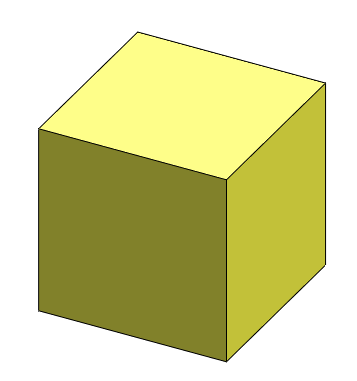

 使用 SOLIDWORKS API 和 IModeler 接口，通过提供基准面中心点、方向和尺寸来创建临时实体盒子的 VBA 示例
image: box-body.png
labels: [primitive,box,temp body,modeler]
---
{ width=250 }

此 VBA 示例演示了如何使用 SOLIDWORKS API 创建并显示临时实体盒子，通过提供基准面中心点的坐标、方向、宽度、长度和高度。

宏停止执行并显示实体。继续执行宏以销毁临时实体。

~~~ vb
Const WIDTH As Double = 0.01
Const LENGTH As Double = 0.01
Const HEIGHT As Double = 0.01

Dim swApp As SldWorks.SldWorks

Sub main()

    Set swApp = Application.SldWorks
    
    Dim swPart As SldWorks.PartDoc
    
    Set swPart = swApp.ActiveDoc
    
    If Not swPart Is Nothing Then
    
        Dim swModeler As SldWorks.Modeler
        Set swModeler = swApp.GetModeler
        
        Dim dCenter(2) As Double
        dCenter(0) = 0: dCenter(1) = 0: dCenter(2) = 0
        
        Dim dAxis(2) As Double
        dAxis(0) = 0: dAxis(1) = 0: dAxis(2) = 1
                        
        Dim dBoxData(8) As Double
        dBoxData(0) = dCenter(0): dBoxData(1) = dCenter(1): dBoxData(2) = dCenter(2)
        dBoxData(3) = dAxis(0): dBoxData(4) = dAxis(1): dBoxData(5) = dAxis(2)
        dBoxData(6) = WIDTH: dBoxData(7) = LENGTH: dBoxData(8) = HEIGHT
        
        Dim swBody As SldWorks.Body2
        
        Set swBody = swModeler.CreateBodyFromBox3(dBoxData)
        
        swBody.Display3 swPart, RGB(255, 255, 0), swTempBodySelectOptions_e.swTempBodySelectable
        
        Stop '继续隐藏实体
        
        Set swBody = Nothing
    Else
        MsgBox "请打开零件文档"
    End If
    
End Sub
~~~