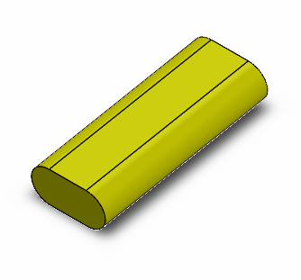
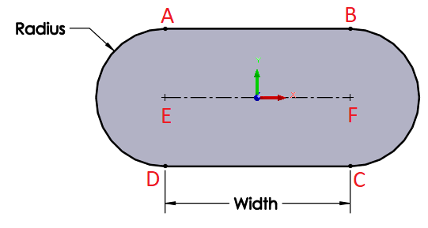

{ width=250 }

这个VBA示例演示了如何通过挤出槽轮廓创建临时体。

宏将停止执行并在图形区域中显示槽的预览。继续执行宏以隐藏预览并销毁临时体。

槽轮廓是根据以下参数在*GetSlotProfileBody*函数中构建的：

{ width=250 }

```vb
Dim swApp As SldWorks.SldWorks
Dim swModeler As SldWorks.Modeler
    
Sub main()

    Set swApp = Application.SldWorks
    
    Set swModeler = swApp.GetModeler
    
    Dim swModel As SldWorks.ModelDoc2
    
    Set swModel = swApp.ActiveDoc
    
    If Not swModel Is Nothing Then
                
        Dim swSlotBody As SldWorks.Body2
        
        Dim swProfileBody As SldWorks.Body2
        Set swProfileBody = GetSlotProfileBody(0.02, 0.01)
                
        Dim dVec(2) As Double
        dVec(0) = 0: dVec(1) = 0: dVec(2) = 1
        Dim swDirVec As SldWorks.MathVector
        Set swDirVec = swApp.GetMathUtility().CreateVector((dVec))
        
        Set swSlotBody = swModeler.CreateExtrudedBody(swProfileBody, swDirVec, 0.1)
    
        swSlotBody.Display3 swModel, RGB(255, 255, 0), swTempBodySelectOptions_e.swTempBodySelectOptionNone
        
        Stop
        Set swSweptBody = Nothing
        
    Else
        MsgBox "请打开模型"
    End If

End Sub

Function GetSlotProfileBody(width As Double, radius As Double) As SldWorks.Body2
    
    Dim dAxis(2) As Double
    dAxis(0) = 0: dAxis(1) = 0: dAxis(2) = 1
    
    Dim a(2) As Double
    a(0) = -width / 2: a(1) = radius: a(2) = 0
    
    Dim b(2) As Double
    b(0) = width / 2: b(1) = radius: b(2) = 0
    
    Dim c(2) As Double
    c(0) = width / 2: c(1) = -radius: c(2) = 0
    
    Dim d(2) As Double
    d(0) = -width / 2: d(1) = -radius: d(2) = 0
    
    Dim e(2) As Double
    e(0) = -width / 2: e(1) = 0: e(2) = 0
    
    Dim f(2) As Double
    f(0) = width / 2: f(1) = 0: f(2) = 0
    
    Dim swCurves(3) As SldWorks.Curve

    Set swCurves(0) = CreateTrimmedArc(e, a, d, dAxis, radius)
    Set swCurves(1) = CreateTrimmedLine(a, b)
    Set swCurves(2) = CreateTrimmedArc(f, c, b, dAxis, radius)
    Set swCurves(3) = CreateTrimmedLine(c, d)
    
    Dim swSurf As SldWorks.Surface
    Dim swBody As SldWorks.Body2
    Dim dRefAxis(2) As Double
    dRefAxis(0) = 1: dAxis(1) = 0: dRefAxis(2) = 0
    
    Set swSurf = swModeler.CreatePlanarSurface2(a, dAxis, dRefAxis)
    Set swBody = swSurf.CreateTrimmedSheet4(swCurves, False)
        
    Set GetSlotProfileBody = swBody
    
End Function

Function CreateTrimmedLine(vStartPt As Variant, vEndPt As Variant) As SldWorks.Curve
    
    Dim startX As Double, startY As Double, startZ As Double, endX As Double, endY As Double, endZ As Double
    
    startX = vStartPt(0): startY = vStartPt(1): startZ = vStartPt(2)
    endX = vEndPt(0): endY = vEndPt(1): endZ = vEndPt(2)
    
    Dim swModeler As SldWorks.Modeler
    Set swModeler = swApp.GetModeler

    Dim dCenter(2) As Double
    dCenter(0) = startX: dCenter(1) = startY: dCenter(2) = startZ
    
    Dim dDir(2) As Double
    dDir(0) = endX - startX: dDir(1) = endY - startY: dDir(2) = endZ - startZ
    
    Dim swCurve As SldWorks.Curve
    Set swCurve = swModeler.CreateLine(dCenter, dDir)
    
    Set swCurve = swCurve.CreateTrimmedCurve2(startX, startY, startZ, endX, endY, endZ)
    
    Set CreateTrimmedLine = swCurve
    
End Function

Function CreateTrimmedArc(vCenterPt As Variant, vStartPt As Variant, vEndPt As Variant, vAxis As Variant, radius As Double)
    
    Dim swCurve As SldWorks.Curve
    
    Set swCurve = swModeler.CreateArc(vCenterPt, vAxis, radius, vStartPt, vEndPt)
    Set swCurve = swCurve.CreateTrimmedCurve2(vStartPt(0), vStartPt(1), vStartPt(2), vEndPt(0), vEndPt(1), vEndPt(2))
    
    Set CreateTrimmedArc = swCurve
    
End Function
```

