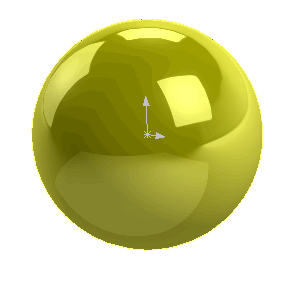

# 使用SOLIDWORKS模型API创建临时球面片体



本示例演示了如何使用SOLIDWORKS API从球面创建一个片体。

几何图形是使用[SOLIDWORKS API方法IModeler::CreateSphericalSurface2](https://help.solidworks.com/2018/english/api/sldworksapi/solidworks.interop.sldworks~solidworks.interop.sldworks.imodeler~createsphericalsurface2.html)创建的。

运行宏，将显示临时片体。可以旋转和选择该片体，但它不会出现在特征树中。继续执行宏以销毁该片体。

```vb
Const RADIUS As Double = 0.01

Dim swApp As SldWorks.SldWorks

Sub main()

    Set swApp = Application.SldWorks
    
    Dim swPart As SldWorks.PartDoc
    
    Set swPart = swApp.ActiveDoc
    
    If Not swPart Is Nothing Then
    
        Dim swModeler As SldWorks.Modeler
        Set swModeler = swApp.GetModeler
        
        Dim dCenter(2) As Double
        dCenter(0) = 0: dCenter(1) = 0: dCenter(2) = 0
        
        Dim dAxis(2) As Double
        dAxis(0) = 0: dAxis(1) = 0: dAxis(2) = 1
        
        Dim dRef(2) As Double
        dRef(0) = 1: dRef(1) = 0: dRef(2) = 0
        
        Dim swSurf As SldWorks.Surface
        
        Set swSurf = swModeler.CreateSphericalSurface2(dCenter, dAxis, dRef, RADIUS)
                
        Dim swBody As SldWorks.Body2
        
        'Full sphere
        Set swBody = swSurf.CreateTrimmedSheet4(Empty, True)
        
        swBody.Display3 swPart, RGB(255, 255, 0), swTempBodySelectOptions_e.swTempBodySelectable
        
        Stop 'continue to hide the body
        
        Set swBody = Nothing
    Else
        MsgBox "Please open part document"
    End If
	
End Sub
```

