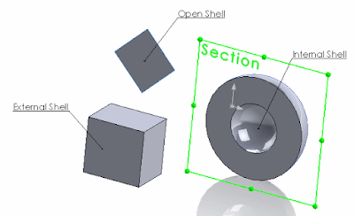

# 使用SOLIDWORKS API获取图纸体几何类型

获取图纸体几何类型

该示例演示了如何使用SOLIDWORKS API来识别所选图纸体的类型（开放壳体、内部壳体、外部壳体）。

{ width=400 height=243 }

在SOLIDWORKS体中有3种类型的面：

- **开放壳体**。与相连面一起的图纸体不形成封闭几何体（例如平面面，而壳体立方体或球体的面不会被视为开放）。
- **内部壳体**。属于实体体的空腔中的面。
- **外部壳体**。不属于前两组的任何其他面。

下面的示例使用SOLIDWORKS API来识别所选图纸体的类型。如果图纸体是开放几何体（包含开放壳体面）或封闭几何体（没有开放壳体面），则可以将封闭几何体图纸体转换为实体体。

```cs
using System;
using SolidWorks.Interop.sldworks;
using SolidWorks.Interop.swconst;

namespace CodeStack
{
    public partial class SolidWorksMacro
    {
        public enum FaceShellType_e
        {
            Open = 0,
            Internal = 1,
            External = 2
        }

        public void Main()
        {
            IModelDoc2 model = swApp.IActiveDoc2;

            if (model != null)
            {
                SelectionMgr selMgr = model.ISelectionManager;

                IBody2 body = selMgr.GetSelectedObject6(1, -1) as IBody2;

                if (body != null)
                {
                    if (body.GetType() == (int)swBodyType_e.swSheetBody)
                    {
                        if (IsOpenGeometry(body))
                        {
                            swApp.SendMsgToUser("所选图纸体是开放几何体");
                        }
                        else
                        {
                            swApp.SendMsgToUser("所选图纸体不是开放几何体");
                        }
                    }
                    else
                    {
                        swApp.SendMsgToUser("所选图纸体不是图纸体");
                    }
                }
                else
                {
                    swApp.SendMsgToUser("请选择图纸体");
                }
            }
            else
            {
                swApp.SendMsgToUser("请打开模型");
            }

            return;
        }

        private static bool IsOpenGeometry(IBody2 body)
        {
            object[] faces = body.GetFaces() as object[];

            if (faces != null)
            {
                foreach (IFace2 face in faces)
                {
                    FaceShellType_e shellType = (FaceShellType_e)face.GetShellType();

                    if (shellType == FaceShellType_e.Open)
                    {
                        return true;
                    }
                }
            }

            return false;
        }

        public SldWorks swApp;
    }
}
```