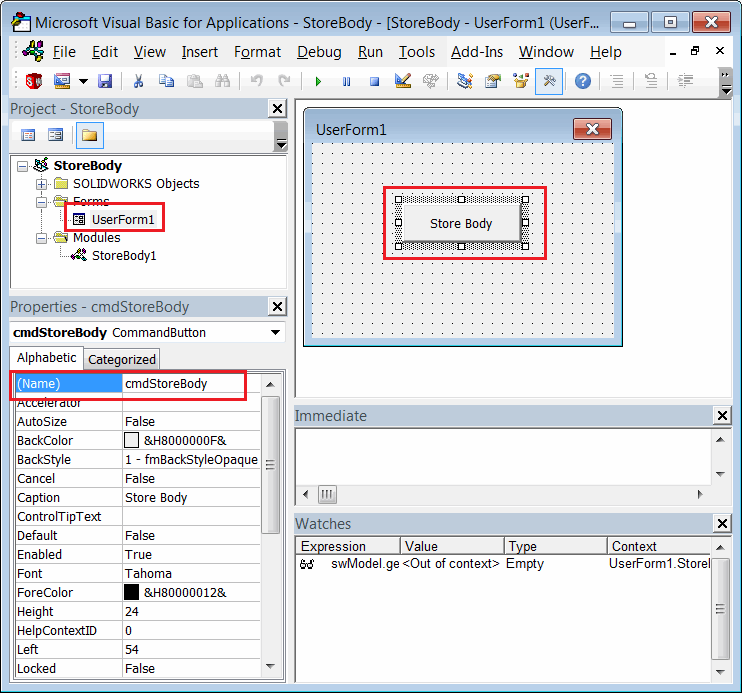

This VBA example demonstrates how to store copies of selected bodies in the stream of a new document and restore and display the bodies when the model is opened.

The bodies are serialized and deserialized using [third-party storage](/docs/codestack/solidworks-api/data-storage/third-party/).

* Create a new macro and add a new user form. Name it *UserForm1* (default name).
* Add a button. Specify the caption as *Store Body* and the name as *cmdStoreBody* as shown below:

{ width=450 }

* Paste the following code after the code in the user form:

```vb
Const BODY_STREAM_NAME = "_CodeStackBody_"

Dim WithEvents swApp As SldWorks.SldWorks
Dim swModeler As SldWorks.Modeler
Dim WithEvents swCurPart As SldWorks.PartDoc
Dim swCurBody As SldWorks.Body2

Private Sub UserForm_Initialize()
    
    Set swApp = Application.SldWorks
    Set swModeler = swApp.GetModeler
    
End Sub

Private Function swApp_DocumentLoadNotify(ByVal docTitle As String, ByVal docPath As String) As Long
    
    If docPath <> "" Then
    
        Dim swModel As SldWorks.ModelDoc2
        Set swModel = swApp.GetOpenDocumentByName(docPath)
        
        If TypeOf swModel Is SldWorks.PartDoc Then
            Set swCurPart = swModel
        End If
        
    End If
    
End Function

Private Function swCurPart_LoadFromStorageNotify() As Long
    DisplayBodyFromStream
    swCurPart_LoadFromStorageNotify = 0
End Function

Private Function swCurPart_SaveToStorageNotify() As Long

    If Not swCurBody Is Nothing Then
        StoreBodyToStream
        MsgBox "Body is stored to the model stream. Close and reopen the model to restore the body"
    End If
    
    swCurPart_SaveToStorageNotify = 0
    
End Function

Private Sub cmdStoreBody_Click()
    
    Dim swModel As SldWorks.ModelDoc2
    Set swModel = swApp.ActiveDoc
    
    Dim swSelMgr As SldWorks.SelectionMgr
    Set swSelMgr = swModel.SelectionManager
    
    Set swCurBody = swSelMgr.GetSelectedObject6(1, -1)
    
    If Not swCurBody Is Nothing Then
        Set swCurBody = swCurBody.Copy
        Dim partTemplate As String
        partTemplate = swApp.GetUserPreferenceStringValue(swUserPreferenceStringValue_e.swDefaultTemplatePart)
        Set swCurPart = swApp.NewDocument(partTemplate, swDwgPaperSizes_e.swDwgPapersUserDefined, 0, 0)
        MsgBox "Save this document to store the body in its stream"
    Else
        MsgBox "Please select body"
    End If
    
End Sub

Sub DisplayBodyFromStream()
    
    Dim swModel As SldWorks.ModelDoc2
    Set swModel = swCurPart
    
    Dim swStream As Variant
    Set swStream = swModel.IGet3rdPartyStorage(BODY_STREAM_NAME, False)
    
    If Not swStream Is Nothing Then
        
        Set swCurBody = swModeler.Restore(swStream)
        swModel.IRelease3rdPartyStorage BODY_STREAM_NAME
        swCurBody.Display3 swModel, RGB(255, 255, 0), swTempBodySelectOptions_e.swTempBodySelectable
        
    End If
    
End Sub

Sub StoreBodyToStream()
    
    Dim swModel As SldWorks.ModelDoc2
    Set swModel = swCurPart
    Dim swStream As Variant
    Set swStream = swModel.IGet3rdPartyStorage(BODY_STREAM_NAME, True)
    swCurBody.Save swStream
    swModel.IRelease3rdPartyStorage BODY_STREAM_NAME
    
End Sub
```


* Insert the following code into the main module of the macro:

```vb
Sub main()

    UserForm1.Show vbModeless
    
End Sub
```


## Run the Macro

* Start the macro from the main module. Note that if you run the macro with the form activated in the macro editor, the form will appear as a modal window and prevent selection and saving.
* Open any part document with some bodies.
* Select a body from the tree and click *Store Body* in the user form.
* Create a new part document and display the following message: *Save this document to store the body in its stream*.
* Save this file. When the file is saved, the bodies from different parts are serialized into the stream of the new document and are no longer associated with the original bodies.
* After completion, display the following message: *Body is stored to the model stream. Close and reopen the model to restore the body*.
* Now, close all documents and reopen the last saved file. The bodies are deserialized and displayed. Note that there is no feature tree in the model.

{ width=350 }

* You can close the SOLIDWORKS session and reopen the model. The bodies will still be loaded. Note that you need to run the macro before opening the model.