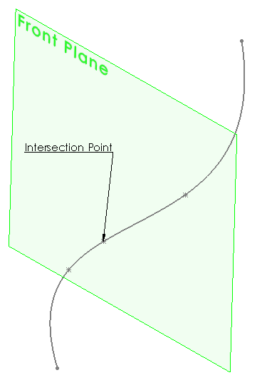

{ width=300 }

该示例演示了如何使用SOLIDWORKS API查找所选曲面（平面或面）与曲线（边缘或草图段）之间的交点。

* 打开零件文档
* 选择平面或任何面作为第一个选择对象
* 选择曲线（线、样条或弧）作为第二个选择对象
* 运行宏。结果是创建了一个包含所选对象之间交点的3D草图

使用[SOLIDWORKS API方法ISurface::IntersectCurve2](https://help.solidworks.com/2018/english/api/sldworksapi/solidworks.interop.sldworks~solidworks.interop.sldworks.isurface~intersectcurve2.html)来查找曲线和曲面之间指定边界内的交点。

```vb
Dim swApp As SldWorks.SldWorks

Sub main()

    Set swApp = Application.SldWorks
    
    Dim swModel As SldWorks.ModelDoc2
    
    Set swModel = swApp.ActiveDoc
    
    If Not swModel Is Nothing Then
        
        Dim swSelMgr As SldWorks.SelectionMgr
        Set swSelMgr = swModel.SelectionManager
        
        Dim swSurf As SldWorks.Surface
        Dim swCurve As SldWorks.curve
        
        Set swSurf = GetSurface(swSelMgr.GetSelectedObject6(1, -1))
        Set swCurve = GetCurve(swSelMgr.GetSelectedObject6(2, -1))
        
        If Not swSurf Is Nothing And Not swCurve Is Nothing Then
            
            Dim vStartPt As Variant
            Dim vEndPt As Variant
            
            GetCurveEndPoints swCurve, vStartPt, vEndPt
            
            Dim dBounds(5) As Double
            dBounds(0) = vStartPt(0): dBounds(1) = vStartPt(1): dBounds(2) = vStartPt(2)
            dBounds(3) = vEndPt(0): dBounds(4) = vEndPt(1): dBounds(5) = vEndPt(2)
            
            Dim vPoints As Variant
            Dim curveParams As Variant
            Dim uvParams As Variant
            swSurf.IntersectCurve2 swCurve, dBounds, vPoints, curveParams, uvParams
            
            DrawPoints swModel, vPoints
            
        Else
            MsgBox "请先选择曲面（平面或面）和曲线（边缘或草图段）以查找交点"
        End If
        
    Else
        MsgBox "请打开模型"
    End If
    
End Sub

Function GetSurface(swObj As Object) As SldWorks.Surface
        
    Dim swSurf As SldWorks.Surface
    
    If TypeOf swObj Is SldWorks.Face2 Then
        
        Dim swFace As SldWorks.Face2
        Set swFace = swObj
        Set swSurf = swFace.GetSurface
        
    ElseIf TypeOf swObj Is SldWorks.Feature Then
        
        Dim swFeat As SldWorks.Feature
        Set swFeat = swObj
        
        If swFeat.GetTypeName2() = "RefPlane" Then
            Dim swRefPlane As SldWorks.refPlane
            Set swRefPlane = swFeat.GetSpecificFeature2()
            Set swSurf = CreateSurfaceFromRefPlane(swRefPlane)
        End If
    
    End If
    
    Set GetSurface = swSurf
    
End Function

Function CreateSurfaceFromRefPlane(refPlane As SldWorks.refPlane) As SldWorks.Surface
    
    Dim swModeler As SldWorks.Modeler
    Dim swMathUtils As SldWorks.MathUtility
    
    Set swModeler = swApp.GetModeler()
    
    Set swMathUtils = swApp.GetMathUtility
    
    Dim dRoot(2) As Double
    dRoot(0) = 0: dRoot(1) = 0: dRoot(2) = 0
    
    Dim dNorm(2) As Double
    dNorm(0) = 0: dNorm(1) = 0: dNorm(2) = 1
    
    Dim dRef(2) As Double
    dRef(0) = 1: dRef(1) = 0: dRef(2) = 0
    
    Dim swRootPt As SldWorks.MathPoint
    Dim swNormVec As SldWorks.MathVector
    Dim swRefVec As SldWorks.MathVector
    
    Set swRootPt = swMathUtils.CreatePoint(dRoot)
    Set swNormVec = swMathUtils.CreateVector(dNorm)
    Set swRefVec = swMathUtils.CreateVector(dRef)
    
    Dim swXForm As SldWorks.MathTransform
    Set swXForm = refPlane.Transform
    
    Set swRootPt = swRootPt.MultiplyTransform(swXForm)
    Set swNormVec = swNormVec.MultiplyTransform(swXForm)
    Set swRefVec = swRefVec.MultiplyTransform(swXForm)
    
    Set CreateSurfaceFromRefPlane = swModeler.CreatePlanarSurface2(swRootPt.ArrayData, swNormVec.ArrayData, swRefVec.ArrayData)
    
End Function

Function GetCurve(swObj As Object) As SldWorks.curve
    
    Dim swCurve As SldWorks.curve
    
    If TypeOf swObj Is SldWorks.Edge Then
    
        Dim swEdge As SldWorks.Edge
        Set swEdge = swObj
        Set swCurve = swEdge.GetCurve
        
    ElseIf TypeOf swObj Is SldWorks.SketchSegment Then
        
        Dim swSkSeg As SldWorks.SketchSegment
        Set swSkSeg = swObj
        
        Set swCurve = GetTrimmedCurveFromSketchSegment(swSkSeg)
        
    End If
    
    Set GetCurve = swCurve
    
End Function

Function GetTrimmedCurveFromSketchSegment(skSeg As SldWorks.SketchSegment) As SldWorks.curve
    
    Dim swCurve As SldWorks.curve
    Set swCurve = skSeg.GetCurve
    
    Dim swStartPt As SldWorks.SketchPoint
    Dim swEndPt As SldWorks.SketchPoint
    
    If TypeOf skSeg Is SldWorks.SketchLine Then
        
        Dim swSkLine As SldWorks.SketchLine
        Set swSkLine = skSeg
        Set swStartPt = swSkLine.GetStartPoint2()
        Set swEndPt = swSkLine.GetEndPoint2()
        
    ElseIf TypeOf skSeg Is SldWorks.SketchSpline Then
        
        Dim swSkSpline As SldWorks.SketchSpline
        Set swSkSpline = skSeg
        Dim vSplinePts As Variant
        vSplinePts = swSkSpline.GetPoints2()
        Set swStartPt = vSplinePts(0)
        Set swEndPt = vSplinePts(UBound(vSplinePts))
        
    ElseIf TypeOf skSeg Is SldWorks.SketchArc Then
        
        Dim swSkArc As SldWorks.SketchArc
        Set swSkArc = skSeg
        Set swStartPt = swSkArc.GetStartPoint2()
        Set swEndPt = swSkArc.GetStartPoint2()
        
    End If
    
    Set swCurve = swCurve.CreateTrimmedCurve2(swStartPt.X, swStartPt.Y, swStartPt.Z, swEndPt.X, swEndPt.Y, swEndPt.Z)
    
    Dim swXForm As SldWorks.MathTransform
    Set swXForm = skSeg.GetSketch().ModelToSketchTransform.Inverse
    
    swCurve.ApplyTransform swXForm
    
    Set GetTrimmedCurveFromSketchSegment = swCurve
    
End Function

Function GetCurveEndPoints(curve As SldWorks.curve, ByRef startPt As Variant, ByRef endPt As Variant)
    
    Dim startParam As Double
    Dim endParam As Double
    
    curve.GetEndParams startParam, endParam, False, False
    
    Dim dStartPt(2) As Double
    Dim dEndPt(2) As Double
     
    Dim evalRes As Variant
    evalRes = curve.Evaluate2(startParam, 1)
    
    dStartPt(0) = evalRes(0): dStartPt(1) = evalRes(1): dStartPt(2) = evalRes(2)
    
    evalRes = curve.Evaluate2(endParam, 1)
    
    dEndPt(0) = evalRes(0): dEndPt(1) = evalRes(1): dEndPt(2) = evalRes(2)
    
    startPt = dStartPt
    endPt = dEndPt
    
End Function

Function DrawPoints(model As SldWorks.ModelDoc2, points As Variant)
    
    model.ClearSelection2 True
    
    model.SketchManager.Insert3DSketch True
    model.SketchManager.AddToDB = True
    
    Dim i As Integer
    
    For i = 0 To UBound(points) Step 3
        model.SketchManager.CreatePoint points(i), points(i + 1), points(i + 2)
    Next
    
    model.SketchManager.AddToDB = False
    model.SketchManager.Insert3DSketch True
    
End Function
```