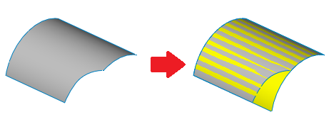

此VBA示例通过执行取消修剪操作来恢复所选面的曲面。

此命令类似于特征管理器中的*取消修剪曲面*功能，但它使用临时实体而不是特征来执行操作。

在操作中使用的复制曲面是无限的，需要修剪才能形成面。通过评估输入面的UV的最大和最小值来计算所需边界。

{ width=450 }

使用等值曲线提取面的指定边界UV处的曲线。计算得到的曲线是无限的，需要在角落修剪成闭合环路，然后才能修剪曲面并将其转换为实体。

选择任何面并运行宏。结果曲面将显示在图形区域中，并且宏停止执行。继续后，预览将被隐藏。

{ width=450 }

``` vb
Dim swApp As SldWorks.SldWorks

Sub main()

    Set swApp = Application.SldWorks
    
    Dim swModel As SldWorks.ModelDoc2
    
    Set swModel = swApp.ActiveDoc
    
    If Not swModel Is Nothing Then
        
        Dim swFace As SldWorks.Face2
        
        Set swFace = swModel.SelectionManager.GetSelectedObject6(1, -1)
        
        If Not swFace Is Nothing Then
            
            Dim swSurf As SldWorks.Surface
            Set swSurf = swFace.GetSurface
              
            Set swSurf = swSurf.Copy
            
            Dim vUvBounds As Variant
            vUvBounds = swFace.GetUVBounds()
            
            Dim swCurves(3) As SldWorks.Curve
            
            Dim uMin As Double
            Dim uMax As Double
            Dim vMin As Double
            Dim vMax As Double
            
            uMin = CDbl(vUvBounds(0))
            uMax = CDbl(vUvBounds(1))
            vMin = CDbl(vUvBounds(2))
            vMax = CDbl(vUvBounds(3))
            
            Dim uMinvMinPt As Variant
            Dim uMinvMaxPt As Variant
            Dim uMaxvMinPt As Variant
            Dim uMaxvMaxPt As Variant
            
            uMinvMinPt = swSurf.Evaluate(uMin, vMin, 0, 0)
            uMinvMaxPt = swSurf.Evaluate(uMin, vMax, 0, 0)
            uMaxvMinPt = swSurf.Evaluate(uMax, vMin, 0, 0)
            uMaxvMaxPt = swSurf.Evaluate(uMax, vMax, 0, 0)
            
            Const V As Boolean = True
            Const U As Boolean = False
            
            Set swCurves(0) = swSurf.MakeIsoCurve2(U, uMin)
            Set swCurves(0) = swCurves(0).CreateTrimmedCurve2(uMinvMinPt(0), uMinvMinPt(1), uMinvMinPt(2), uMinvMaxPt(0), uMinvMaxPt(1), uMinvMaxPt(2))
            
            Set swCurves(1) = swSurf.MakeIsoCurve2(V, vMin)
            Set swCurves(1) = swCurves(1).CreateTrimmedCurve2(uMinvMinPt(0), uMinvMinPt(1), uMinvMinPt(2), uMaxvMinPt(0), uMaxvMinPt(1), uMaxvMinPt(2))
            
            Set swCurves(2) = swSurf.MakeIsoCurve2(U, uMax)
            Set swCurves(2) = swCurves(2).CreateTrimmedCurve2(uMaxvMinPt(0), uMaxvMinPt(1), uMaxvMinPt(2), uMaxvMaxPt(0), uMaxvMaxPt(1), uMaxvMaxPt(2))
                        
            Set swCurves(3) = swSurf.MakeIsoCurve2(V, vMax)
            Set swCurves(3) = swCurves(3).CreateTrimmedCurve2(uMinvMaxPt(0), uMinvMaxPt(1), uMinvMaxPt(2), uMaxvMaxPt(0), uMaxvMaxPt(1), uMaxvMaxPt(2))
            
            Dim swUntimSurfBody As SldWorks.Body2

            Set swUntimSurfBody = swSurf.CreateTrimmedSheet5(swCurves, False, 0.00001)
            
            swUntimSurfBody.Display3 swModel, RGB(255, 255, 0), swTempBodySelectOptions_e.swTempBodySelectOptionNone
            
            Stop
            
            Set swUntimSurfBody = Nothing
            
        Else
            Err.Raise vbError, , "选择面"
        End If
        
    Else
        Err.Raise vbError, , "打开模型"
    End If
    
End Sub

```