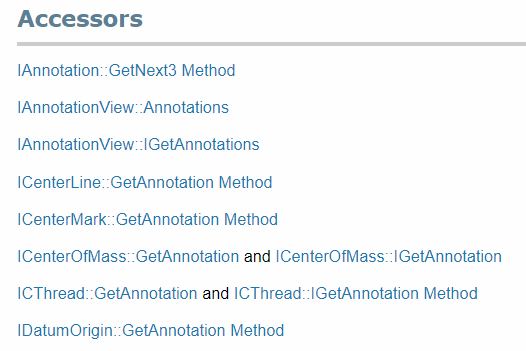

 解释了API帮助文档中访问器部分的含义，该部分帮助找到在SOLIDWORKS API中访问特定对象的方法
image: accessors.png
labels: [访问,转换]
---

在SOLIDWORKS API帮助文档中，可以在特定接口的*访问器*部分找到某些接口的可访问性信息。

例如，下面的快照是[IAnnotation接口](https://help.solidworks.com/2018/english/api/sldworksapi/SolidWorks.Interop.sldworks~SolidWorks.Interop.sldworks.IAnnotation.html)的*访问器*部分。

{ width=250 }

这意味着可以通过[IAnnotation::GetNext3方法](https://help.solidworks.com/2018/english/api/sldworksapi/SOLIDWORKS.Interop.sldworks~SOLIDWORKS.Interop.sldworks.IAnnotation~GetNext3.html)、[IAnnotationView::Annotations属性](https://help.solidworks.com/2018/english/api/sldworksapi/SolidWorks.Interop.sldworks~SolidWorks.Interop.sldworks.IAnnotationView~Annotations.html)或此列表中的其他属性或方法来获取[IAnnotation接口](https://help.solidworks.com/2018/english/api/sldworksapi/SolidWorks.Interop.sldworks~SolidWorks.Interop.sldworks.IAnnotation.html)的指针。

某些接口可以显式或隐式地从一个接口转换为另一个接口。例如，[IModelDoc2](https://help.solidworks.com/2018/english/api/sldworksapi/SolidWorks.Interop.sldworks~SolidWorks.Interop.sldworks.IModelDoc2.html)表示父接口（尽管没有直接继承），
对于[IPartDoc](https://help.solidworks.com/2018/english/api/sldworksapi/SolidWorks.Interop.sldworks~SolidWorks.Interop.sldworks.IPartDoc.html)、[IAssemblyDoc](https://help.solidworks.com/2018/english/api/sldworksapi/SolidWorks.Interop.sldworks~SolidWorks.Interop.sldworks.IAssemblyDoc.html)、[IDrawingDoc](https://help.solidworks.com/2018/english/api/sldworksapi/SolidWorks.Interop.sldworks~SolidWorks.Interop.sldworks.IDrawingDoc.html)接口来说，它们都是特定接口。

这意味着父对象和特定对象将指向同一个内存中的对象。

**VBA**
~~~ vb
Dim swModel As SldWorks.ModelDoc2
...
Dim swPart As SldWorks.PartDoc
Set swPart = swModel
~~~

**VB.NET**
~~~ vb
Dim swModel As IModelDoc2
...
Dim swPart As IPartDoc = CType(swModel, IPartDoc)
~~~

**C#**
~~~ cs
IModelDoc2 model;
...
IPartDoc part = model as IPartDoc;
~~~

**C++**
~~~ cpp
LPMODELDOC2 pModelDoc;
...
LPPARTDOC pPartDoc = NULL;
hres = pModelDoc->QueryInterface(IID_IPartDoc, (LPVOID*)&pPartDoc);
~~~