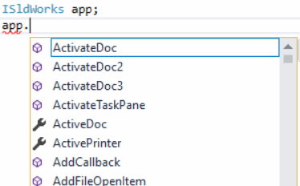

SOLIDWORKS API中的方法、属性和对象（接口）有两个版本可供选择：

* 带有**I**开头（例如ISldWorks、IModelDoc2、IAnnotation、ISldWorks::IActiveDoc）
* 不带**I**开头（例如SldWorks、ModelDoc2、Annotation、SldWorks::ActiveDoc）

这两个版本对应的是同一个对象或方法。主要区别如下：

* I版本的方法不会公开事件

下面是以*SldWorks*声明的变量的可用成员的快照。这些成员包含事件。

{ width=250 }

下面是以*ISldWorks*声明的变量的可用成员的快照。这些成员不包含事件。

{ width=250 }

* I版本的方法通常返回类型安全的接口版本，而不是对象或IDispatch。这意味着在编译时强制执行类型安全的语言（如C#）中不需要显式转换：

~~~ cs
ISldWorks app;
...
IModelDoc2 model = app.IActiveDoc; //正确
IModelDoc2 model = app.ActiveDoc; //编译错误
IModelDoc2 model = app.ActiveDoc as IModelDoc2; //正确
~~~