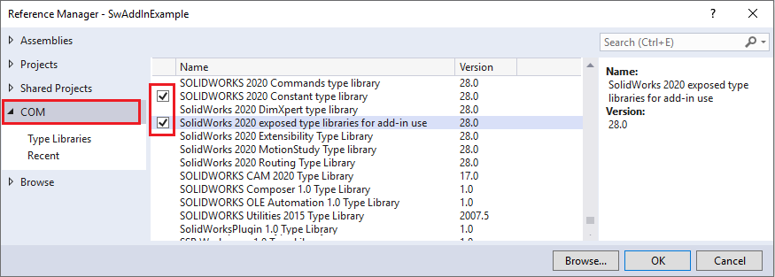
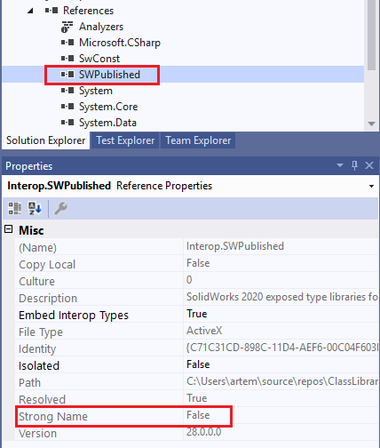
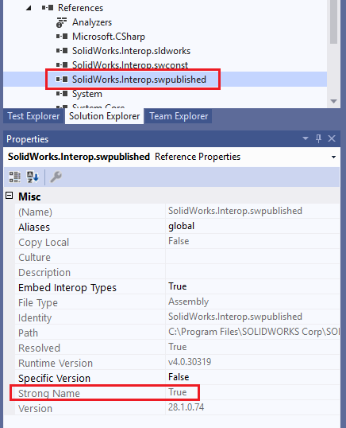

 通过API详细指南开始开发SOLIDWORKS应用程序的指南
image: solidworks-api-getting-started.png
sidebar_position: 0
---
{ width=400 }

SOLIDWORKS API可以在任何兼容COM的语言中使用（例如C++、C#、VB.NET和Visual Basic）。可以使用SOLIDWORKS API开发不同类型的应用程序。请参考下面的比较表，选择适合要求的应用程序类型。

|方法|VBA宏|插件|VSTA宏|独立应用|脚本|备注|
|------|:--------:|:-----:|:---------:|:----------:|:-----:|--------|
|易于入门|是|否|是|是|是|对于没有经验的用户开始解决方案所需的平均时间|
|易于部署|是|否|否（理论上应该简单，但实际上通常会遇到很多问题）|是|是|使软件在其他计算机上正常工作所需的时间|
|代码保护|否（仅密码保护）|是（二进制文件）|是（二进制文件）|是（二进制文件）|否|保护代码的方法|
|可用的实用库范围|否（仅过时的VB6库）|是|是|是|否|可用于处理数据库、文件、XML等的实用函数的可用性|
|可用的SolidWorks函数范围|有限|完整|有限|有限|有限|某些接口仅在插件内部操作，例如SWPublished库中的接口|
|可靠性|否（通常存在缺失库等问题）|是|是|是|否|解决方案在不同的SolidWorks版本和PC工作站上的可靠性程度|
|调试|简单（进程外）|复杂（进程内）。由于需要重新启动插件/SolidWorks，因此重新启动速度较慢|复杂（进程内）|简单（进程外）|否|对于进程内应用程序，无法从UI中查看和更改SolidWorks的运行时。|
|需要额外软件|否|需要开发IDE|否（对于SW 2018是是）|需要开发IDE|否|开发IDE通常包括代码文本编辑器和编译器（例如Visual Studio、Eclipse、CBuilder等）|
|对初学者友好|是|否|否|否|否||
|性能|正常|良好|良好|正常|正常|操作性能|

## .NET项目的参考资料

SOLIDWORKS是基于COM的应用程序，因此在从.NET应用程序中使用SOLIDWORKS API时，需要添加组件互操作以启用与COM的通信。

有两种常见的生成所需类型库的方法

### COM类型库

通过直接将类型库（*.tlb）文件的引用添加到.NET项目中（sldworks.tlb、swconst.tlb、swpublished.tlb）。可以通过浏览相应的类型库文件或在COM选项卡中找到已注册的引用来完成此操作。这些步骤相当于使用[tlbimp](https://docs.microsoft.com/en-us/dotnet/framework/tools/tlbimp-exe-type-library-importer)实用程序，因为Visual Studio会在后台将类型库转换为互操作。

结果是在项目中使用转换后的.NET互操作等效项

### 主互操作程序集（PIA）

通过添加随SOLIDWORKS安装提供的互操作程序集（SolidWorks.Interop.sldworks.dll、SolidWorks.Interop.swconst.dll、SolidWorks.Interop.swpublished.dll）。这些类型的互操作程序集称为主互操作程序集（PIA）。互操作库位于**SOLIDWORKS安装文件夹**\api\redist（针对Framework 4.0及更高版本的项目）和**SOLIDWORKS安装文件夹**\api\redist\CLR2（针对Framework 2.0和3.5的项目）。

对于针对Framework 4.0的项目，建议将**[嵌入互操作类型](https://docs.microsoft.com/en-us/dotnet/framework/interop/type-equivalence-and-embedded-interop-types)**选项设置为*False*。
否则，在调用SOLIDWORKS API时可能会出现类型转换问题，导致应用程序的行为不可预测，尽管这种情况很少发生。

### 差异

其中一个差异是不同的名称和命名空间。从类型库生成的互操作程序的默认命名空间是*SldWorks*、*SWPublished*等（可以使用[tlbimp](https://docs.microsoft.com/en-us/dotnet/framework/tools/tlbimp-exe-type-library-importer)实用程序更改默认命名空间），而其他情况下使用的命名空间名称中带有*SldWorks.Interop*前缀。

但还有另一个主要区别。

从COM类型库生成的互操作程序不是[强命名](https://docs.microsoft.com/en-us/dotnet/standard/assembly/create-use-strong-named)的。

而随SOLIDWORKS安装提供的互操作程序（PIA）是[强命名](https://docs.microsoft.com/en-us/dotnet/standard/assembly/create-use-strong-named)的。

如果您正在构建[独立的进程外应用程序](stand-alone)（除非您的*.exe支持插件机制并且可以加载引用SOLIDWORKS互操作的库），几乎没有区别，但是对于[进程内插件](add-ins)应用程序，如果多个插件引用不同版本的未签名（无强名称）互操作程序，可能会导致严重问题。类似的问题在[此YouTube视频](https://www.youtube.com/watch?v=ZeWDoJ5TC7o)中有所展示。

### 最佳实践

* 使用随安装提供的主互操作程序集（PIA），避免使用COM类型库
* 不要直接从安装文件夹引用互操作程序。这将阻止在其他计算机上编译项目，因为互操作程序未放置在相同的目录中，也未添加到GAC中。特别是这将阻止实施[持续集成/持续交付（CI/CD）](https://blog.xarial.com/ci-cd/)
  * 可以将互操作程序放置在[NuGet服务器](https://www.nuget.org/)上，并将其添加为包。可以使用内部托管服务器或使用公共服务器。
  * 如果上述选项不可行，则将库添加到与项目相同的文件夹中（例如，在解决方案*.sln文件旁边创建一个名为*thirdpty*的文件夹，并将互操作程序复制到其中），然后从该文件夹浏览互操作程序以添加相对路径引用。