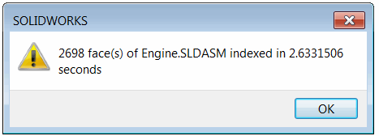

One of the main limitations of standalone automation COM-based application (including SOLIDWORKS) is performance.

When hundreds of API calls need to be made from an external process, the performance can degrade hundreds or even thousands of times compared to internal invocation.

The same limitation applies to any method of calling the add-in API such as [via add-in object](/docs/codestack/solidworks-api/getting-started/inter-process-communication/invoke-add-in-functions/via-add-in-object/), [via Running Object Table](/docs/codestack/solidworks-api/getting-started/inter-process-communication/invoke-add-in-functions/via-rot/), etc.

It can be mistakenly assumed that all SOLIDWORKS API calls within the add-in are made as internal invocations since there is only one API function called from the standalone application. But in reality, all SOLIDWORKS API calls within the SOLIDWORKS add-in are made as external invocations. This means that calling the add-in API will result in the same performance loss as calling the standalone application.

However, there is a way to maximize performance and achieve the same results as internal invocation by calling this method from an external process application.

The following add-in example implements a function that indexes all faces of the active assembly document.

The add-in is developed using the [SwEx.AddIn framework](/docs/codestack/labs/solidworks/swex/add-in/), but the same technique is applicable to add-ins built using different approaches.

It traverses all components, all bodies, and all faces and outputs some information about the faces in the trace window.

The add-in has a menu command that allows calling its function within the process.

{ width=350 }

Upon completion, a message box with the results is displayed.

{ width=300 }

## FaceIndexer Add-in
This is the main project that implements the SOLIDWORKS add-in and API object interfaces.

### FaceIndexerAddIn.cs

The add-in class

```cs
using CodeStack.SwEx.AddIn;
using CodeStack.SwEx.AddIn.Attributes;
using SolidWorks.Interop.sldworks;
using SolidWorks.Interop.swconst;
using System;
using System.Collections.Generic;
using System.Diagnostics;
using System.Runtime.InteropServices;

namespace CodeStack.FaceIndexer
{
    [AutoRegister("FaceIndexer")]
    [ComVisible(true)]
    [Guid("D85E0EEB-87AA-48BE-8C8A-DFD71CF12525")]
    [ProgId("CodeStack.FaceIndexer")]
    public class FaceIndexerAddIn : SwAddInEx, IFaceIndexerAddIn
    {
        private readonly List<KeyValuePair<IAssemblyDoc, IFaceIndexerCallback>> m_ProcessingQueue
            = new List<KeyValuePair<IAssemblyDoc, IFaceIndexerCallback>>();

        [SwEx.Common.Attributes.Title("Face Indexer")]
        public enum Commands_e
        {
            [CommandItemInfo(SwEx.AddIn.Enums.swWorkspaceTypes_e.Assembly)]
            IndexFaces
        }
        
        public override bool OnConnect()
        {
            AddCommandGroup<Commands_e>(OnButtonClick);
            (App as SldWorks).OnIdleNotify += OnIdleNotify;
            return true;
        }

        public void BeginIndexFaces(IAssemblyDoc assm, IFaceIndexerCallback callback)
        {
            m_ProcessingQueue.Add(new KeyValuePair<IAssemblyDoc, IFaceIndexerCallback>(assm, callback));
        }

        private void OnButtonClick(Commands_e cmd)
        {
            switch (cmd)
            {
                case Commands_e.IndexFaces:        
                    IndexFaces(App.IActiveDoc2 as IAssemblyDoc);
                    break;
            }
        }

        public int IndexFaces(IAssemblyDoc assm)
        {
            var count = 0;

            var start = DateTime.Now;
            {
                var comps = assm.GetComponents(false) as object[];

                if (comps != null)
                {
                    foreach (IComponent2 comp in comps)
                    {
                        object bodyInfo;
                        var bodies = comp.GetBodies3((int)swBodyType_e.swAllBodies, out bodyInfo) as object[];

                        if (bodies != null)
                        {
                            foreach (IBody2 body in bodies)
                            {
                                var faces = body.GetFaces() as object[];

                                if (faces != null)
                                {
                                    foreach (IFace2 face in faces)
                                    {
                                        var surf = face.IGetSurface();
                                        var type = (swSurfaceTypes_e)surf.Identity();
                                        count++;

                                        Trace.WriteLine($"Area: {face.GetArea()}. Type: {type}");
                                    }
                                }
                            }
                        }
                    }
                }
            }
            App.SendMsgToUser($"{count} face(s) of {(assm as IModelDoc2).GetTitle()} indexed in {DateTime.Now.Subtract(start).TotalSeconds} seconds");

            return count;
        }

        private int OnIdleNotify()
        {
            const int S_OK = 0;

            foreach (var assmInQueue in m_ProcessingQueue)
            {
                var count = IndexFaces(assmInQueue.Key);

                assmInQueue.Value?.IndexFacesCompleted(assmInQueue.Key, count);
            }

            m_ProcessingQueue.Clear();

            return S_OK;
        }
    }
}

```


### FaceIndexerAddInApi.cs

API object definition.

```cs
using SolidWorks.Interop.sldworks;
using System.Runtime.InteropServices;

namespace CodeStack.FaceIndexer
{
    [ComVisible(true)]
    public interface IFaceIndexerCallback
    {
        void IndexFacesCompleted(IAssemblyDoc assm, int count);
    }

    [ComVisible(true)]
    public interface IFaceIndexerAddIn
    {
        void BeginIndexFaces(IAssemblyDoc assm, IFaceIndexerCallback callback);
        int IndexFaces(IAssemblyDoc assm);
    }
}

```


This add-in exposes an API to third-party. The *IndexFaces* method is an API call from an external process and can be used with the following code snippet:

```cs
var count = addIn.IndexFaces(assm);
Console.WriteLine($"Indexed {count} faces");
```

The result performance is almost a hundred times slower:

{ width=300 }

Using the [ISldWorks::CommandInProgress](https://help.solidworks.com/2016/English/api/sldworksapi/SolidWorks.Interop.sldworks~SolidWorks.Interop.sldworks.ISldWorks~CommandInProgress.html) SOLIDWORKS API property can slightly improve the performance, but it still degrades performance by over 10 times compared to the baseline result.

```cs
app.CommandInProgress = true;
var count = addIn.IndexFaces(assm);
app.CommandInProgress = false;
Console.WriteLine($"Indexed {count} faces");
```

Below is the comparison table of the results. The results may vary depending on the size of the assembly and the API calls used.

| Environment                           | Result (seconds) | Ratio (%) |
|---------------------------------------|-----------------|-----------|
| Internal Invocation in Add-in         | 2.63            | 1         |
| Standalone Application                 | 241.95          | 92        |
| Standalone Application with Command In Progress | 36.14           | 13.74     |
| VBA Macro                             | 2.57            | 0.98      |
| Internal Invocation in VBA Macro      | 2.20            | 0.84      |
| Internal Invocation in Standalone Application | 1.77            | 0.67      |

The best performance is achieved by calling the add-in API as an internal invocation from a standalone application. This can be achieved by providing a deferred call to index the faces. This call puts the request into a queue and immediately returns control. Then, the request is processed within the add-in. The queue can be processed using the [OnIdle](https://help.solidworks.com/2018/english/api/sldworksapi/solidworks.interop.sldworks~solidworks.interop.sldworks.dsldworksevents_onidlenotifyeventhandler.html) SOLIDWORKS API notification. Since this event is processed within the process, the actual API calls will also be processed within the process.

Registering a callback function is also important, so that the add-in can call it to notify the standalone application that the operation has been completed.

Below is an example of calling the add-in API from a standalone application.

## Standalone Application

A C# application that calls the add-in function.

### FaceIndexerCallback.cs

The callback function that notifies the standalone application when the internal invocation is completed. This must be registered as a COM object.

```cs
using CodeStack.FaceIndexer;
using SolidWorks.Interop.sldworks;
using System;
using System.Runtime.InteropServices;

namespace StandAlone
{
    [ComVisible(true)]
    public class FaceIndexerCallback : IFaceIndexerCallback
    {
        public void IndexFacesCompleted(IAssemblyDoc assm, int count)
        {
            Console.WriteLine($"Indexing of '{(assm as IModelDoc2).GetTitle()}' completed in the standalone application, {count} faces in total");
        }
    }
}

```


### Program.cs

A console application that calls the internal invocation of the add-in API and waits for the result in the callback.

```cs
using CodeStack.FaceIndexer;
using SolidWorks.Interop.sldworks;
using System;
using System.Diagnostics;
using System.Linq;
using System.Runtime.InteropServices;
using System.Runtime.InteropServices.ComTypes;

namespace StandAlone
{
    class Program
    {
        [DllImport("ole32.dll")]
        private static extern int CreateBindCtx(uint reserved, out IBindCtx ppbc);
        
        static void Main(string[] args)
        {
            var app = GetSwAppFromProcess(Process.GetProcessesByName("SLDWORKS").First().Id);

            var addIn = app.GetAddInObject("CodeStack.FaceIndexer") as IFaceIndexerAddIn;

            var assm = app.IActiveDoc2 as IAssemblyDoc;
            
            addIn.BeginIndexFaces(app.IActiveDoc2 as IAssemblyDoc, new FaceIndexerCallback());
            
            Console.ReadLine();
        }

        private static ISldWorks GetSwAppFromProcess(int processId)
        {
            var monikerName = "SolidWorks_PID_" + processId.ToString();

            IBindCtx context = null;
            IRunningObjectTable rot = null;
            IEnumMoniker monikers = null;

            try
            {
                CreateBindCtx(0, out context);

                context.GetRunningObjectTable(out rot);
                rot.EnumRunning(out monikers);

                var moniker = new IMoniker[1];

                while (monikers.Next(1, moniker, IntPtr.Zero) == 0)
                {
                    var curMoniker = moniker.First();

                    string name = null;

                    if (curMoniker != null)
                    {
                        try
                        {
                            curMoniker.GetDisplayName(context, null, out name);
                        }
                        catch (UnauthorizedAccessException)
                        {
                        }
                    }

                    if (string.Equals(monikerName,
                        name, StringComparison.CurrentCultureIgnoreCase))
                    {
                        object app;
                        rot.GetObject(curMoniker, out app);
                        return app as ISldWorks;
                    }
                }
            }
            finally
            {
                if (monikers != null)
                {
                    Marshal.ReleaseComObject(monikers);
                }

                if (rot != null)
                {
                    Marshal.ReleaseComObject(rot);
                }

                if (context != null)
                {
                    Marshal.ReleaseComObject(context);
                }
            }

            return null;
        }
    }
}

```


It can also be called from a macro or any other type of application.

## VBA Macro

A VBA macro that calls the add-in API. In this example, a user form is used to keep the macro running until the callback function is called.

{ width=250 }

### Macro Module

The main module that launches the user form.

```vb
Sub main()

    UserForm1.Show vbModeless
    
End Sub

```


### FaceIndexerCallback Class Module

Implements the callback class to receive the completion notification.

```vb
Implements IFaceIndexerCallback

Private Sub IFaceIndexerCallback_IndexFacesCompleted(ByVal assm As SldWorks.IAssemblyDoc, ByVal count As Long)
    Debug.Print "Indexing of " & count & " faces completed"
End Sub
```


### Form1 User Form

The user form to connect to the add-in and call its API.

```vb
Dim swFaceIndexer As IFaceIndexerAddIn

Private Sub UserForm_Initialize()
    
    Dim swApp As SldWorks.SldWorks
    
    Set swApp = Application.SldWorks
    Set swFaceIndexer = swApp.GetAddInObject("CodeStack.FaceIndexer")
    
    Dim swAssy As SldWorks.AssemblyDoc
    Set swAssy = swApp.ActiveDoc
    
    swFaceIndexer.BeginIndexFaces swAssy, New FaceIndexerCallback
    
End Sub
```


The source code can be downloaded from [GitHub](https://github.com/codestackdev/solidworks-api-examples/tree/master/swex/add-in/face-indexer)