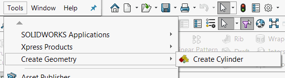
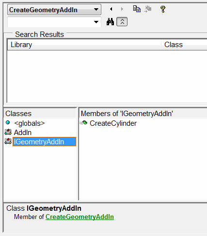

本文介绍如何通过使用SOLIDWORKS API从独立应用程序或宏调用SOLIDWORKS插件的函数，以及如何检索插件对象。

这是基于与此视频教程中显示的启用COM通信的相同技术，以便从VBA宏中重用.NET函数：



## 在插件中启用API

要在插件中启用API，需要遵循以下几个规则：

* 插件必须实现COM可见接口，该接口公开COM可见函数。
* 所有这些函数的参数和返回值也必须是COM可见的。
* 插件必须生成包含这些API函数定义的类型库（TLB）。

在开发C#应用程序时，需要创建COM可见接口并在插件中实现它。

~~~ cs
[ComVisible(true)]
public interface IMyAddInApi
{
    void FooApiMethod();
} 

[ComVisible(true), Guid("799A191E-A4CF-4622-9E77-EA1A9EF07621")]
public class MyAddIn : ISwAddIn
{
    ...
    public void FooApiMethod()
    {
        //Implement
    }
}
~~~

如果在Visual Studio中选择了“注册COM互操作”选项，则会自动将所有COM可见的函数、类和接口添加到tlb文件中。

{ width=550 }

## 具有API的示例插件

以下插件示例是使用[SwEx.AddIn Framework](/docs/codestack/labs/solidworks/swex/add-in/)构建的，但是相同的技术也适用于使用其他方法构建的插件。

该插件在“工具”菜单下添加了一个菜单命令，允许创建圆柱体特征。

{ width=350 }

当从菜单中调用时，圆柱体将具有硬编码的参数值。

{ width=350 }

同时，插件公开了名为*CreateCylinder*的公共API，允许创建圆柱体。API有两个参数：

* 直径
* 高度

并返回指向[IFeature](https://help.solidworks.com/2018/english/api/sldworksapi/solidworks.interop.sldworks~solidworks.interop.sldworks.ifeature.html)的指针。由于SOLIDWORKS API是COM可见的，插件可以直接在通信中使用此接口。

*CreateCylinder*函数本身由插件的*Create Cylinder*命令使用。

### C#插件源代码

~~~ cs
using CodeStack.SwEx.AddIn;
using CodeStack.SwEx.AddIn.Attributes;
using CodeStack.SwEx.AddIn.Enums;
using SolidWorks.Interop.sldworks;
using SolidWorks.Interop.swconst;
using System;
using System.Diagnostics;
using System.Runtime.InteropServices;

namespace CodeStack.Examples.CreateGeometryAddIn
{
    [SwEx.Common.Attributes.Title("Create Geometry")]
    public enum Commans_e
    {
        [CommandItemInfo(swWorkspaceTypes_e.Part)]
        [SwEx.Common.Attributes.Title("Create Cylinder")]
        CreateCylinder
    }

    [ComVisible(true)]
    public interface IGeometryAddIn
    {
        IFeature CreateCylinder(double diam, double height);
    } 

    [AutoRegister("CreateGeometryAddIn", "Sample add-in for creating geometry", true)]
    [ComVisible(true), Guid("799A191E-A4CF-4622-9E77-EA1A9EF07621")]
    [ProgId("CodeStack.GeometryAddIn")]
    public class AddIn : SwAddInEx, IGeometryAddIn
    {
        public override bool OnConnect()
        {
            this.AddCommandGroup<Commans_e>(OnButtonClick);

            return true;
        }

        private void OnButtonClick(Commans_e cmd)
        {
            try
            {
                switch (cmd)
                {
                    case Commans_e.CreateCylinder:
                        CreateCylinder(0.1, 0.1);
                        break;
                }
            }
            catch(Exception ex)
            {
                Trace.WriteLine(ex.Message);
                App.SendMsgToUser2("Failed to create geometry", 
                    (int)swMessageBoxIcon_e.swMbStop, (int)swMessageBoxBtn_e.swMbOk);
            }
        }
        
        public IFeature CreateCylinder(double diam, double height)
        {
            var part = App.ActiveDoc as IPartDoc;

            if (part == null)
            {
                throw new NotSupportedException("Only part document are supported");
            }

            var modeler = App.IGetModeler();

            var body = modeler.CreateBodyFromCyl(new double[]
            {
                0, 0, 0,
                0, 1, 0,
                diam / 2, height
            });

            if (body != null)
            {
                var feat = part.CreateFeatureFromBody3(body, false,
                    (int)swCreateFeatureBodyOpts_e.swCreateFeatureBodySimplify) as IFeature;

                if (feat != null)
                {
                    return feat;
                }
                else
                {
                    throw new NullReferenceException("Failed to create feature from body");
                }
            }
            else
            {
                throw new NullReferenceException("Failed to create body. Make sure that the parameters are valid");
            }
        }
    }
}

~~~

## 访问插件

要访问插件及其API，需要检索指向插件接口的指针。可以使用[SOLIDWORKS API函数ISldWorks::GetAddInObject](https://help.solidworks.com/2018/english/api/sldworksapi/solidworks.interop.sldworks~solidworks.interop.sldworks.isldworks~getaddinobject.html)通过程序ID（ProgID）或全局唯一标识符（GUID）获取插件的指针。

下面的代码片段通过其GUID从插件中检索指针。这是通过在插件类上使用[Guid](https://docs.microsoft.com/en-us/dotnet/api/system.runtime.interopservices.guidattribute)属性分配的值：

~~~ vb
Set swGeomAddIn = swApp.GetAddInObject("{799A191E-A4CF-4622-9E77-EA1A9EF07621}")
~~~

或者，可以通过其ProgId检索插件。如果未显式指定ProgId，则它等于*Namespace*.*ClassName*

~~~ vb
Set swGeomAddIn = swApp.GetAddInObject("CodeStack.Examples.CreateGeometryAddIn.AddIn")
~~~

建议通过[ProgId](https://docs.microsoft.com/en-us/dotnet/api/system.runtime.interopservices.progidattribute)属性显式指定ProgId。在这种情况下，可以在重构时更改类和命名空间而保持ProgId不变。

~~~ cs
[ComVisible(true), Guid("799A191E-A4CF-4622-9E77-EA1A9EF07621")]
[ProgId("CodeStack.MyAddIn")]
public class AddIn : ISwAddIn
{
}
~~~

### 从宏调用插件API

* 创建新的VBA宏
* 在VBA编辑器的“工具->引用”菜单中添加对插件类型库的引用

{ width=450 }

请注意，该接口将在对象浏览器中可见：

{ width=350 }

#### VBA宏调用插件函数

~~~ vb
Dim swApp As SldWorks.SldWorks

Sub main()

    Set swApp = Application.SldWorks
    
    Dim swGeomAddIn As CreateGeometryAddIn.IGeometryAddIn

    Set swGeomAddIn = swApp.GetAddInObject("CodeStack.GeometryAddIn")
    
    Dim swFeat As SldWorks.Feature
    Set swFeat = swGeomAddIn.CreateCylinder(0.2, 0.5)
    swFeat.Name = "MyCylinder"
    
End Sub
~~~

此宏将使用自定义参数创建圆柱体，并使用返回的特征指针对其进行重命名。

{ width=350 }

请注意，插件错误在宏中正确抛出。例如，当提供无效输入时，将生成以下异常：

{ width=500 }

### 从独立应用程序调用插件

与VBA宏类似，还可以从[独立应用程序](/docs/codestack/solidworks-api/getting-started/stand-alone/)中自动化插件。为了实现类型安全，需要添加对插件dll的引用。请注意，如果插件是.NET插件，则无法将.tlb文件添加为引用，而是需要添加实际的插件dll。

#### VB.NET独立应用程序

~~~ vb
Imports CodeStack.Examples.CreateGeometryAddIn
Imports SolidWorks.Interop.sldworks

Module Module

    Sub Main()

        Dim app As ISldWorks = GetObject("", "SldWorks.Application")
        Dim geomAddIn As IGeometryAddIn = app.GetAddInObject("CodeStack.GeometryAddIn")
        Dim feat As IFeature = geomAddIn.CreateCylinder(0.2, 0.2)
        feat.Name = "MyCylinder"

    End Sub

End Module

~~~

#### C#独立应用程序

~~~ cs
using CodeStack.Examples.CreateGeometryAddIn;
using SolidWorks.Interop.sldworks;
using System;

namespace ConsoleAddIn
{
    class Program
    {
        static void Main(string[] args)
        {
            var app = Activator.CreateInstance(Type.GetTypeFromProgID("SldWorks.Application")) as ISldWorks;
            var geomAddIn = app.GetAddInObject("CodeStack.GeometryAddIn") as IGeometryAddIn;
            var feat = geomAddIn.CreateCylinder(0.2, 0.2);
            feat.Name = "MyCylinder";
        }
    }
}

~~~

异常也可以从独立应用程序中处理

{ width=550 }

> 连接到SOLIDWORKS实例的上述方法（Activator::CreateInstance或GetObject方法）在某些情况下可能会创建新的不可见SOLIDWORKS实例，而不是连接到现有会话。这些实例将作为后台应用程序创建，不加载任何插件，因此代码将失败。要强制连接到SOLIDWORKS的活动会话，请参阅[通过从运行对象表（ROT）查询COM实例进行连接](/docs/codestack/solidworks-api/getting-started/stand-alone/#method-b-connecting-by-querying-the-com-instance-from-the-running-object-table-rot)文章。

#### 注意事项

虽然可以避免声明COM可见接口和对象，并使用*dynamic*从.NET应用程序中检索和调用插件函数，但是不推荐此方法，原因如下：

* 它不是类型安全的
* 性能可能会受到显著影响，因为框架需要在内存中查找和找到适当的对象
* 可能会出现意外行为，因为可能会映射到不正确的对象

在[GitHub](https://github.com/codestackdev/solidworks-api-examples/tree/master/swex/add-in/create-geometry-api)上下载源代码。