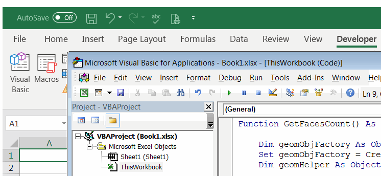
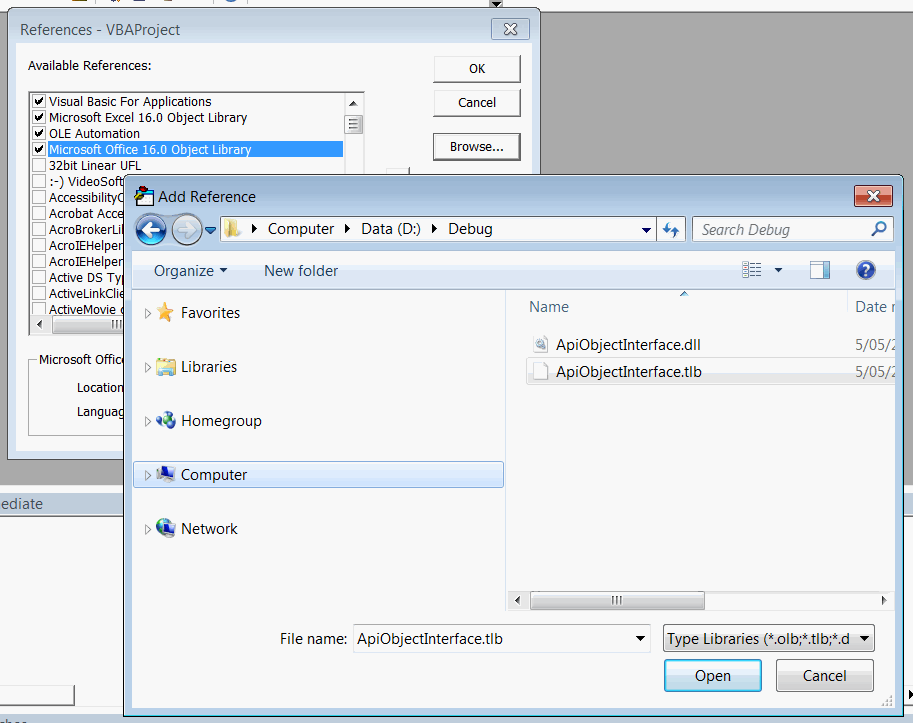
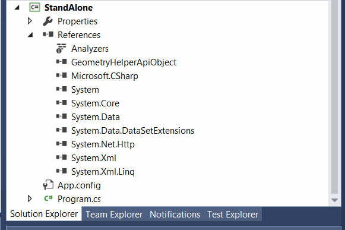

本文提供了详细的逐步说明，介绍了如何通过运行对象表（ROT）从独立应用程序或脚本中调用SOLIDWORKS插件的函数。这可以被视为在插件本身中启用应用程序编程接口（API）。

这种方法允许通过从进程ID提取它来连接到API对象。这种方法的主要好处之一是能够在不直接使用任何SOLIDWORKS API命令甚至添加SOLIDWORKS类型库或互操作的情况下控制插件API。

在此示例中，SOLIDWORKS插件允许计算所选实体的面数。它提供了一个菜单供用户点击。

{ width=350 }

结果显示在消息框中。

{ width=450 }

插件还提供了一个API对象，供第三方调用。API扩展了UI的功能，并允许传递参数以过滤面的最小面积。

API方法和用户界面命令处理程序都调用相同的函数。

这是插件和API对象的解决方案树。GeometryHelperApiObject编译为dll，并包含插件接口的定义。它不包含任何实现，并且不引用任何SOLIDWORKS互操作。此dll在实现API对象的SOLIDWORKS插件项目中被引用，并且还将被所有第三方应用程序引用以访问API。因此，没有第三方应用程序需要引用启用抽象级别的主插件dll。

{ width=450 }

请查看下面的源代码和解释，以了解如何实现此框架的更多详细信息。

## GeometryHelperApiObject项目

该项目包含应该由插件公开的API方法和接口的定义（签名）。

### GeometryHelperApiObjectFactory.cs

这是一个帮助COM对象，它将简化从进程中按其ID检索API对象实例的访问。它负责从进程中检索API对象的实例。

~~~ cs
using System;
using System.Linq;
using System.Runtime.InteropServices;
using System.Runtime.InteropServices.ComTypes;

namespace CodeStack.GeometryHelper
{
    [ComVisible(true)]
    public interface IGeometryHelperApiObjectFactory
    {
        string GetName(int prcId);
        IGeometryHelperApiObject GetInstance(int prcId);
    }

    [ComVisible(true)]
    [ProgId("GeometryHelper.ApiObjectFactory")]
    public class GeometryHelperApiObjectFactory : IGeometryHelperApiObjectFactory
    {
        [DllImport("ole32.dll")]
        private static extern int CreateBindCtx(uint reserved, out IBindCtx ppbc);

        public string GetName(int prcId)
        {
            return $"GeometryHelperApiObjectFactory_PID_{prcId}";
        }

        public IGeometryHelperApiObject GetInstance(int prcId)
        {
            return FindObjectByMonikerName<IGeometryHelperApiObject>($"!{GetName(prcId)}");
        }

        private T FindObjectByMonikerName<T>(string monikerName)
            where T : class
        {
            IBindCtx context = null;
            IRunningObjectTable rot = null;
            IEnumMoniker monikers = null;

            try
            {
                CreateBindCtx(0, out context);

                context.GetRunningObjectTable(out rot);

                rot.EnumRunning(out monikers);

                var moniker = new IMoniker[1];

                while (monikers.Next(1, moniker, IntPtr.Zero) == 0)
                {
                    var curMoniker = moniker.First();

                    string name = null;

                    if (curMoniker != null)
                    {
                        try
                        {
                            curMoniker.GetDisplayName(context, null, out name);
                        }
                        catch (UnauthorizedAccessException)
                        {
                        }
                    }

                    if (string.Equals(monikerName,
                        name, StringComparison.CurrentCultureIgnoreCase))
                    {
                        object app;
                        rot.GetObject(curMoniker, out app);
                        return (T)app;
                    }
                }
            }
            finally
            {
                if (monikers != null)
                {
                    Marshal.ReleaseComObject(monikers);
                }

                if (rot != null)
                {
                    Marshal.ReleaseComObject(rot);
                }

                if (context != null)
                {
                    Marshal.ReleaseComObject(context);
                }
            }

            return null;
        }
    }
}

~~~

### IGeometryHelperApiObject.cs

这是向第三方应用程序公开的API的接口。在此示例中，该函数将根据面积过滤器返回面的数量。

~~~ cs
using System.Runtime.InteropServices;

namespace CodeStack.GeometryHelper
{
    [ComVisible(true)]
    public interface IGeometryHelperApiObject
    {
        int GetFacesCount(double minArea);
    }
}

~~~

## GeometryHelperAddIn项目

该项目是一个SOLIDWORKS插件。在此示例中，它使用[SwEx.AddIn Framework](/docs/codestack/labs/solidworks/swex/add-in/)进行开发，但是任何其他框架或SDK都将受到支持。

### GeometryHelperService.cs

插件内的帮助类，用于调用SOLIDWORKS API以计算基于最小面积的所选实体的面数。

~~~ cs
using SolidWorks.Interop.sldworks;
using System;
using System.Linq;

namespace CodeStack.GeometryHelper
{
    internal class GeometryHelperService
    {
        private readonly ISldWorks m_App;

        internal GeometryHelperService(ISldWorks app)
        {
            m_App = app;
        }

        internal int GetFacesCountFromSelectedBody(double minArea)
        {
            var model = m_App.IActiveDoc2;

            if (model != null)
            {
                var body = model.ISelectionManager.GetSelectedObject6(1, -1) as IBody2;

                if (body != null)
                {
                    var faces = body.GetFaces() as object[];

                    if (faces != null)
                    {
                        return faces.Count(f => (f as IFace2).GetArea() >= minArea);
                    }
                    else
                    {
                        throw new NullReferenceException("No faces in the body");
                    }
                }
                else
                {
                    throw new NullReferenceException("Body is not selected");
                }
            }
            else
            {
                throw new NullReferenceException("Model is not opened");
            }
        }
    }
}

~~~

插件必须实现API对象的功能。有两种常见的方法。

* 通过直接在继承类中实现功能，如下所示

### GeometryHelperApiObject.cs

API对象实现在其类中直接使用SOLIDWORKS API来处理请求并提供API调用的响应。

~~~ cs
using System.Runtime.InteropServices;

namespace CodeStack.GeometryHelper
{
    [ComVisible(true)]
    public class GeometryHelperApiObject : IGeometryHelperApiObject
    {
        private readonly GeometryHelperService m_GeomSvc;

        internal GeometryHelperApiObject(GeometryHelperService geomSvc)
        {
            m_GeomSvc = geomSvc;
        }

        public int GetFacesCount(double minArea)
        {
            return m_GeomSvc.GetFacesCountFromSelectedBody(minArea);
        }
    }
}

~~~

### MainAddIn.cs

这是主SOLIDWORKS插件类的实现。将处理功能的服务直接传递给API对象实现，并从那里调用以处理API调用。

~~~ cs
using CodeStack.SwEx.AddIn;
using CodeStack.SwEx.AddIn.Attributes;
using SolidWorks.Interop.swconst;
using System;
using System.Runtime.InteropServices;

namespace CodeStack.GeometryHelper
{
    [AutoRegister("GeometryHelperSwAddIn")]
    [ComVisible(true), Guid("2ACE1951-6182-496C-A643-B5FA6CFDFFD8")]
    public class MainAddIn : SwAddInEx
    {
        private IGeometryHelperApiObject m_ApiObject;
        private GeometryHelperService m_GeometryService;

        [SwEx.Common.Attributes.Title("Geometry Helper")]
        public enum Commands_e
        {
            [SwEx.Common.Attributes.Title("Get Faces Count")]
            GetFacesCount
        }

        public override bool OnConnect()
        {
            m_GeometryService = new GeometryHelperService(App);

            m_ApiObject = new GeometryHelperApiObject(m_GeometryService);

            RotHelper.Register(m_ApiObject, new GeometryHelperApiObjectFactory().GetName(App.GetProcessID()));

            this.AddCommandGroup<Commands_e>(OnButtonClick);

            return true;
        }

        private void OnButtonClick(Commands_e cmd)
        {
            switch (cmd)
            {
                case Commands_e.GetFacesCount:
                    try
                    {
                        var count = GetFacesCount(0);
                        App.SendMsgToUser2($"Selected body contains: {count} face(s)",
                            (int)swMessageBoxIcon_e.swMbInformation,
                            (int)swMessageBoxBtn_e.swMbOk);
                    }
                    catch(Exception ex)
                    {
                        App.SendMsgToUser2(ex.Message,
                            (int)swMessageBoxIcon_e.swMbStop,
                            (int)swMessageBoxBtn_e.swMbOk);
                    }
                    break;
            }
        }

        private int GetFacesCount(double minArea)
        {
            return m_GeometryService.GetFacesCountFromSelectedBody(minArea);
        }
    }
}

~~~

* 通过实现代理API对象。这种方法可能被认为更有益和安全，因为它不会在其结构中公开任何内部对象。所有请求都在代理类之外处理。

### GeometryHelperApiObjectProxy.cs

代理对象不包含对插件的任何对象的引用。相反，它将生成请求事件，由插件处理和处理。

~~~ cs
using System;
using System.Runtime.InteropServices;

namespace CodeStack.GeometryHelper
{
    [ComVisible(true)]
    public class GeometryHelperApiObjectProxy : IGeometryHelperApiObject
    {
        internal event Func<double, int> GetFacesCountRequested;

        public int GetFacesCount(double minArea)
        {
            if (GetFacesCountRequested != null)
            {
                return GetFacesCountRequested.Invoke(minArea);
            }
            else
            {
                throw new Exception("API object not connected");
            }
        }
    }
}

~~~

### MainAddIn.cs使用代理API对象

在插件中处理事件并提供结果。

~~~ cs
public override bool OnConnect()
{
	m_GeometryService = new GeometryHelperService(App);

	var proxy = new GeometryHelperApiObjectProxy();
	proxy.GetFacesCountRequested += OnGetFacesCountRequested;
	m_ApiObject = proxy;
	
	RotHelper.Register(m_ApiObject, new GeometryHelperApiObjectFactory().GetName(App.GetProcessID()));

	this.AddCommandGroup<Commands_e>(OnButtonClick);

	return true;
}

private int OnGetFacesCountRequested(double minArea)
{
	return GetFacesCount(minArea);
}

~~~

### RotHelper.cs

为了使API对象可用，需要在运行对象表（ROT）中注册它。这个辅助类允许按名称注册对象。

~~~ cs
using System.Runtime.InteropServices;
using System.Runtime.InteropServices.ComTypes;

namespace CodeStack.GeometryHelper
{
    public static class RotHelper
    {   
        [DllImport("ole32.dll", ExactSpelling = true, PreserveSig = false)]
        private static extern IRunningObjectTable GetRunningObjectTable(
            int reserved);

        [DllImport("ole32.dll", CharSet = CharSet.Unicode,
             ExactSpelling = true, PreserveSig = false)]
        private static extern IMoniker CreateItemMoniker(
            [In] string lpszDelim, [In] string lpszItem);

        public static void Register(object obj, string name)
        {
            IRunningObjectTable rot = null;
            IMoniker moniker = null;

            try
            {
                rot = GetRunningObjectTable(0);

                moniker = CreateItemMoniker("!", name);

                const int ROTFLAGS_REGISTRATIONKEEPSALIVE = 1;
                var cookie = rot.Register(ROTFLAGS_REGISTRATIONKEEPSALIVE, obj, moniker);
            }
            finally
            {
                if (moniker != null)
                {
                    Marshal.ReleaseComObject(moniker);
                }
                if (rot != null)
                {
                    Marshal.ReleaseComObject(rot);
                }
            }
        }
    }
}

~~~

## 从独立应用程序调用API

现在，可以从任何支持COM的编程语言调用插件API。

### VBA宏

从Excel VBA宏调用API的示例。

{ width=450 }

添加对类型库的引用以启用[早期绑定](/docs/codestack/visual-basic/variables/declaration#early-binding-and-late-binding)。

{ width=450 }

宏通过其Prog ID创建Factory对象的实例，并通过其ID从进程中检索API对象的实例。

~~~ vb
Function GetFacesCount() As Integer
    
    Dim geomObjFactory As Object
    Set geomObjFactory = CreateObject("GeometryHelper.ApiObjectFactory")
    Dim geomHelper As Object
    
    Set geomHelper = geomObjFactory.GetInstance(13004)
    GetFacesCount = geomHelper.GetFacesCount(0)
    
End Function
~~~

### C#控制台应用程序

从C#控制台应用程序调用API的示例。

如下所示，只需添加对API对象dll的引用，其中包含接口的定义。不需要添加任何其他引用（包括插件dll或任何SOLIDWORKS互操作）。

{ width=450 }

API调用的结果将打印到控制台窗口中。

{ width=450 }

~~~ cs
using CodeStack.GeometryHelper;
using System;
using System.Diagnostics;
using System.Linq;

namespace StandAlone
{
    class Program
    {
        static void Main(string[] args)
        {
            try
            {
                var minArea = double.Parse(args[0]);

                var swPrcId = Process.GetProcessesByName("SLDWORKS").First().Id;

                var geomHelperFactory = new GeometryHelperApiObjectFactory();

                var geomHelperApi = geomHelperFactory.GetInstance(swPrcId);

                var count = geomHelperApi.GetFacesCount(minArea);

                Console.WriteLine($"Selected body contains {count} faces of area more or equal to {minArea}");
            }
            catch(Exception ex)
            {
                Console.ForegroundColor = ConsoleColor.Red;
                Console.Write(ex.Message);
                Console.ResetColor();
            }
        }
    }
}

~~~

> 无法从运行对象表（ROT）中检索对象（即返回null）的最常见原因是运行SOLIDWORKS和独立应用程序的帐户级别不同。例如，SOLIDWORKS以管理员身份运行，而独立应用程序不是，反之亦然。这是Windows的限制，需要以相同的权限级别运行两个应用程序以启用通信。

在[GitHub](https://github.com/codestackdev/solidworks-api-examples/tree/master/swex/add-in/geometry-helper-api-rot)上下载源代码。