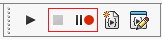
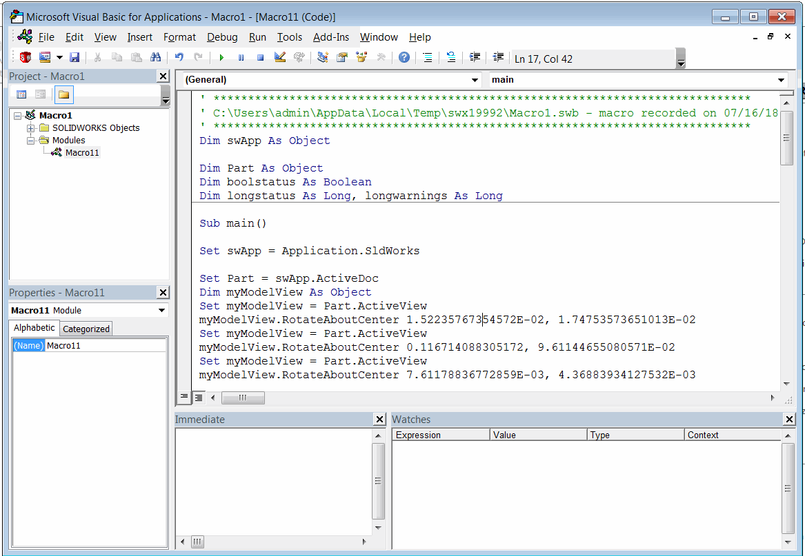
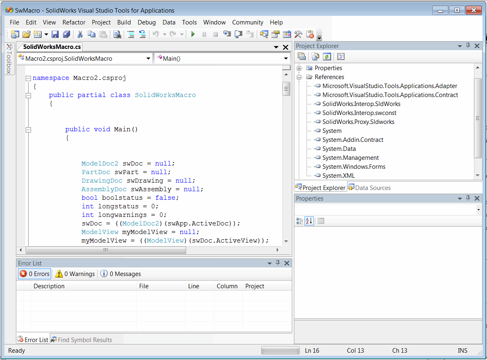
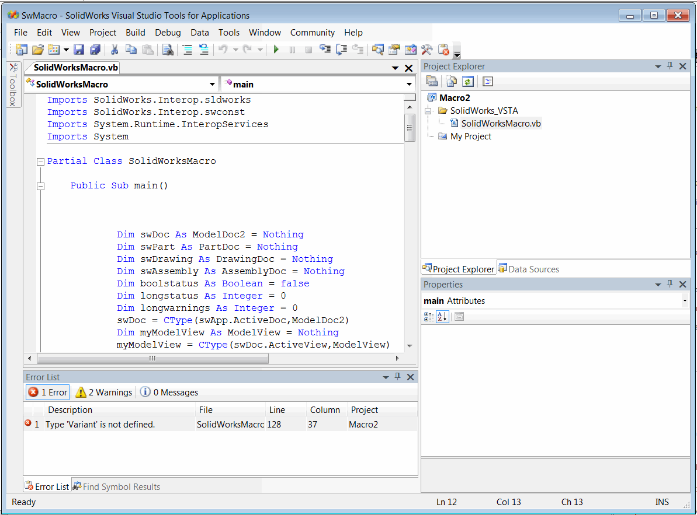

 This article explains how to record macro commands.
image: macros-save-filter.png
labels: [macros, recording]
sidebar_position: 2
---
SOLIDWORKS provides a powerful feature to record user actions and convert them into macro code.

This is a very convenient feature for learning SOLIDWORKS API and finding the desired methods.

You can start recording by clicking the **Record** button on the Macro toolbar:

In recording mode, most user actions will be recorded.

> Note: Not all commands can be recorded using the macro recorder. If a command is not recorded, it does not mean that the API for that particular command is unavailable.

To enhance the macro recording experience, try to minimize changes in the model view orientation and selection operations, as these commands will be recorded and can make the macro code difficult to read due to the large number of lines.

Use the **Pause** button to skip unnecessary action recording.

Once the recording is complete, click the **Stop** button and choose the file to save the recorded macro.

{ width=400 }

Note that macros can be saved in both VBA and VSTA formats. For an explanation of the differences between these macro types, refer to the [Macro Types](/docs/codestack/solidworks-api/getting-started/macros/types) article.

If you frequently record macros, it is recommended to enable the *Edit macro after recording* option.

{ width=350 }

This way, the editor will automatically open after the macro recording is finished, eliminating the need to explicitly call the *Tools->Macro->Edit* menu command to edit the source code.

Here are example macros recorded in VBA, C#, and VB.NET languages:

{ width=350 }

{ width=350 }

{ width=350 }