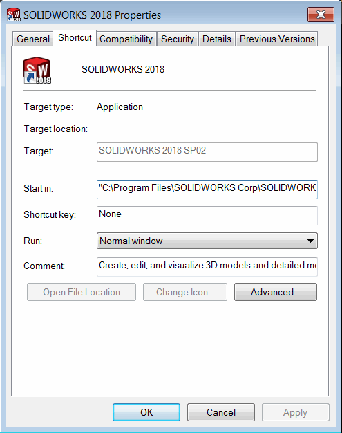
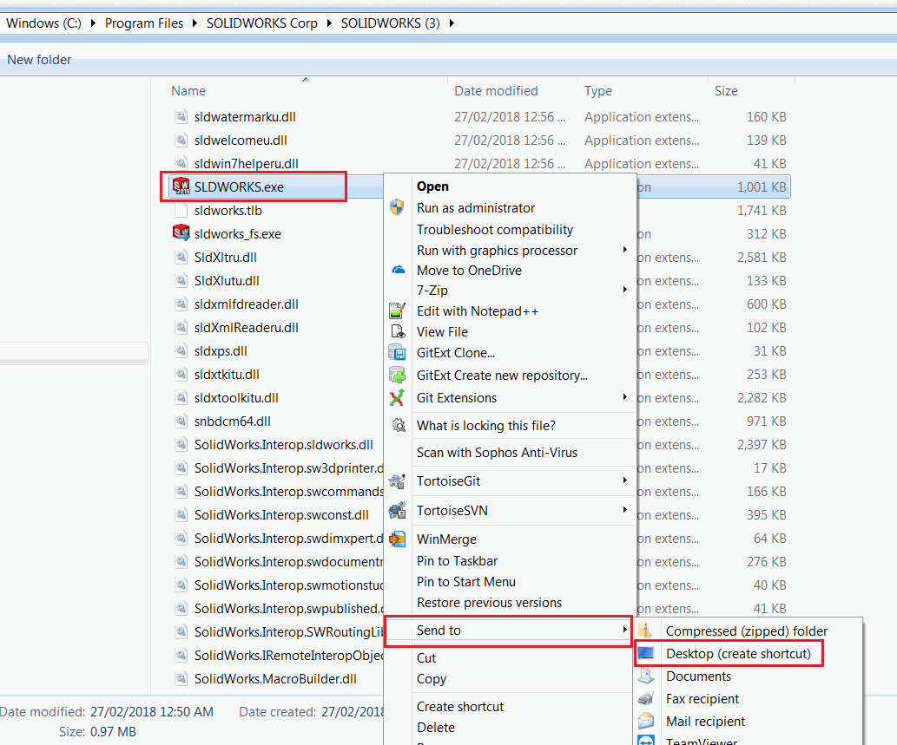
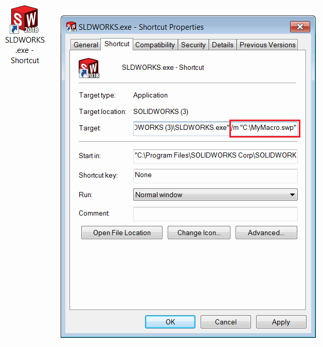

在某些情况下，可能需要在SOLIDWORKS启动时自动运行宏。例如，需要进行一些日志记录或应用设置。

幸运的是，SOLIDWORKS应用程序接受命令行参数*/m*，它将自动运行指定的宏。

~~~ cmd
"SOLIDWORKS.exe的路径" /m "宏的路径"
~~~

## 设置启动SOLIDWORKS并运行宏的快捷方式

最常见的选项是在Windows桌面上的SOLIDWORKS快捷方式中直接指定宏的路径。在这种情况下，当您点击SOLIDWORKS应用程序快捷方式图标时，宏将自动运行。按照以下步骤进行操作：

* Windows操作系统允许在快捷方式选项的*目标*字段中指定命令行参数。默认快捷方式禁用了此选项，无法更改。

{ width=350 }

* 删除默认的SOLIDWORKS快捷方式
* 导航到SOLIDWORKS安装文件夹（通常为*C:\Program Files\SOLIDWORKS Corp\SOLIDWORKS*）。
* 找到*SLDWORKS.EXE*文件。
* 选择该文件，点击鼠标右键。选择*发送到*->*桌面（创建快捷方式）*

{ width=550 }

* 快捷方式已添加到桌面。根据需要进行重命名（如果需要，将其固定到任务栏）。
* 选择快捷方式图标，点击鼠标右键，选择*选项*命令
* 在*目标*字段中的SLDWORKS.EXE路径后添加以下文本：

~~~ cmd
/m "宏的完整路径" 
~~~

如果宏路径包含空格，请将路径括在双引号中。

例如：

~~~ cmd
"C:\Program Files\SOLIDWORKS Corp\SOLIDWORKS\SLDWORKS.EXE" /m "C:\My Macros\Macro1.swb"
~~~

{ width=450 }

使用此快捷方式启动SOLIDWORKS。指定的宏将自动运行。