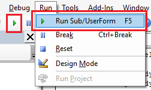

在SOLIDWORKS中运行宏的最简单方法是从*工具->宏->运行*菜单命令或工具栏调用它。

选择要运行的宏（对于VBA宏，选择.swb或.swp文件；对于VSTA宏，选择.dll文件）。除非宏明确编码为保持活动状态，或者在VSTA宏的*设置*中选中了*在宏退出时停止VSTA调试器*选项，否则宏在执行完成后会从内存中卸载。

宏也可以直接从VBA编辑器中运行，当[打开进行编辑](/docs/codestack/solidworks-api/getting-started/macros/edit/)时，可以通过菜单/工具栏或使用*F10*快捷键来运行宏。

另外，宏还可以从[宏按钮](/docs/codestack/solidworks-api/getting-started/macros/macro-buttons/)或[在SOLIDWORKS会话启动时](/docs/codestack/solidworks-api/getting-started/macros/run-macro-on-solidworks-start/)的命令行中运行。