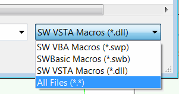

 This article introduces the different types of macros supported by SOLIDWORKS (VBA, VSTA, SWBasic)
image: macro-edit-run-filters.png
labels: [macro, VSTA, VBA, SWMacro, SWB, SWP]
sidebar_position: 1
---
{ width=200 }

Macros can be edited directly in the built-in VBA editor and can be executed using the out-of-the-box engine in SOLIDWORKS. Running macros does not require the installation of any additional software (the only exception being VSTA 3.0 macros which require a separate installation of Visual Studio).

## VBA Macros (*.swp)

This is perhaps the most popular type of macro. These macros are based on the VBA7 (for SOLIDWORKS 2015 and newer) and VBA6 (for older versions) languages. VBA6 and VBA7 are derived from the Visual Basic 6 language. Therefore, all the syntax is the same. For more documentation on the language, refer to the [Visual Basic tutorial](/docs/codestack/visual-basic).

Macros are saved in a binary format with the extension *.swb and can only be viewed and edited using the SOLIDWORKS VBA editor.

## SWBasic Macros (*.swb)

Similar to *.swp macros, these macro types are also based on the VBA6 and VBA7 languages. The only difference is that these macros are saved in plain text format with the extension *.swp.

This allows the macro code to be read and edited with any text editor (such as Notepad) outside of the SOLIDWORKS environment. This is particularly useful when maintaining macro code in version control services like SVN or GIT.

These macros cannot reference any third-party type libraries (such as Excel, FileSystemObject, etc.) and can only include references to the SOLIDWORKS type library. If the need arises to use any third-party type libraries, it can be achieved through [late binding](/docs/codestack/visual-basic/variables/declaration/#early-binding-and-late-binding).

These macros can only have one [module](/docs/codestack/visual-basic/modules/) and cannot use [classes](/docs/codestack/visual-basic/classes/) or [user forms](/docs/codestack/visual-basic/user-forms/).

## C# and VB.NET VSTA Macros

**V**isual **ST**udio for **A**pplication (VSTA) macros are based on the .NET languages (C# or VB.NET) and provide greater flexibility, leveraging the powerful features of the .NET framework, allowing macros to access various libraries, third-party components, and object-oriented programming (OOP) paradigms.

Unlike VBA macros, VSTA macros separate the project from the source code (*.csproj, *.vbproj) and output a binary file (*.dll) to run the macro. Therefore, the binary file can be used without the source code.

VSTA macros are in-process applications and can automatically release memory or continue execution after the main function is completed.

This behavior is controlled by the following option:

{ width=350 }

If this option is unchecked, the macro will remain in memory until the **Stop** button is clicked. This is useful when the macro performs any asynchronous operations, such as handling events or displaying the PropertyManager page.

VSTA macros are based on the .NET Framework 2.0 and can be edited and debugged using the built-in VSTA editor.

A new version of VSTA, VSTA 3.0, was introduced in SOLIDWORKS 2018, but support for older versions of VSTA is still available. The target version can be controlled with the following option:

{ width=350 }

VSTA 3.0 requires a separate installation of Visual Studio (Professional or Community editions). The main advantage of VSTA 3.0 is the ability to use newer versions of the .NET Framework.