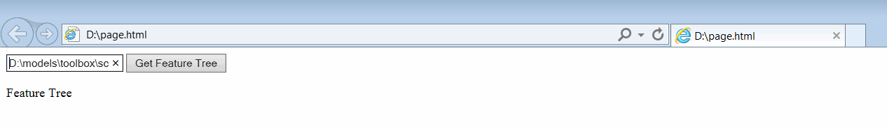
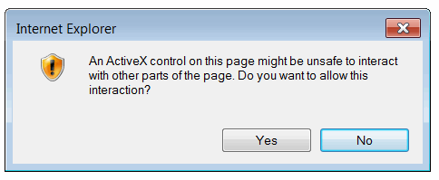
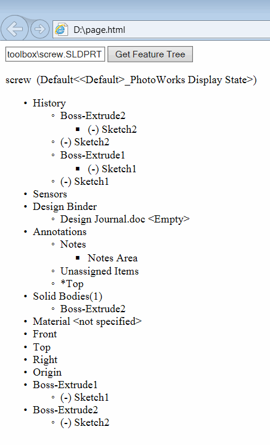

This example demonstrates how to load the feature tree of a SOLIDWORKS part file into an HTML page using SOLIDWORKS API, JavaScript, and ActiveX in Internet Explorer (this will not work in other browsers as ActiveX is not supported by default and may require installing special plugins to enable support).

* Create a new HTML file.
* Copy and paste the following code into the file.

```html
<!DOCTYPE html>
<html>
<body>

	<input type="text" placeholder="Part File Path" id="filePath"></input>
	<button type="button" onclick="RenderFeatureTree()">Get Feature Tree</button>

	<p id="featTree">Feature Tree</p>

	<script>
		function RenderFeatureTree() {

			var swApp = new ActiveXObject("SldWorks.Application");
			var filePath = document.getElementById('filePath').value;

			var docSpec = swApp.GetOpenDocSpec(filePath);
			docSpec.ReadOnly = true;
			docSpec.Silent = true;
			var swModel = swApp.OpenDoc7(docSpec);

			var swFeatMgr = swModel.FeatureManager;

			var swRootFeatNode = swFeatMgr.GetFeatureTreeRootItem2(1);

			var root = document.getElementById("featTree");

			RenderFeatureNode(swRootFeatNode, root);

			swApp.CloseDoc(swModel.GetTitle());
		}

		function RenderFeatureNode(featNode, parentElem) {

			parentElem.innerText = featNode.Text

			var ul = document.createElement("UL");
			parentElem.appendChild(ul);

			var swChildFeatNode = featNode.GetFirstChild()

			while (swChildFeatNode !== null) {
				var li = document.createElement("LI");
				ul.appendChild(li);
				RenderFeatureNode(swChildFeatNode, li);
				swChildFeatNode = swChildFeatNode.GetNext();
			}
		}
	</script>
</body>
</html>
```

* Save the file and open it in MS Internet Explorer.


You may see the following message due to the use of ActiveX:


Click on the *Allow blocked content* button.

* Enter the full path of the SOLIDWORKS part in the text input field.

* Click the *Get Feature Tree* button.

* Click *Yes* on the pop-up window.

{ width=350 }

The feature tree of the part will be rendered on the page.

{ width=250 }