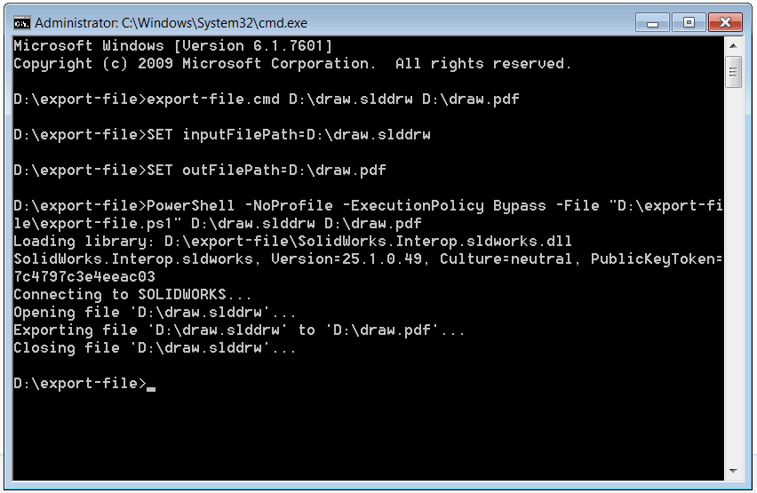

这个PowerShell脚本允许使用SOLIDWORKS API从命令行将SOLIDWORKS文件导出为指定的外部格式。

## 配置和使用说明

* 创建两个文件，并将下面的代码粘贴到这些文件中。

### export-file.ps1
~~~ ps1
$inputFilePath=$args[0]
$outFilePath=$args[1]

$ScriptDir = Split-Path $script:MyInvocation.MyCommand.Path

$Assem = ( 
    $ScriptDir + "\SolidWorks.Interop.sldworks.dll"
    ) 
    
$Source = @"
using SolidWorks.Interop.sldworks;
using System;

 namespace CodeStack
 {
    public static class Exporter
    {
        #region Libraries
        
        static Exporter()
        {
            AppDomain.CurrentDomain.AssemblyResolve += OnAssemblyResolve;
        }

        public static void LoadLibrary(params object[] libs)
        {
            foreach(string lib in libs)
            {
                Console.WriteLine(string.Format("加载库: {0}", lib));
                System.Reflection.Assembly assm = System.Reflection.Assembly.LoadFrom(lib);
                Console.WriteLine(assm.GetName().ToString());
            }
        }
        
        private static System.Reflection.Assembly OnAssemblyResolve(object sender, ResolveEventArgs args)
        {
            foreach (System.Reflection.Assembly assm in AppDomain.CurrentDomain.GetAssemblies())
            {
               if(assm.GetName().ToString() == args.Name)
               {
                   return assm;
               }
            };
            
            return null;
        }
        
        #endregion
        
        public static void ExportFile(string filePath, string outFilePath)
        {
            Console.WriteLine("连接到SOLIDWORKS...");

            ISldWorks app = Activator.CreateInstance(Type.GetTypeFromProgID("SldWorks.Application")) as ISldWorks;

            if (app != null)
            {
                Console.WriteLine(string.Format("打开文件 '{0}'...", filePath));

                IDocumentSpecification docSpec = app.GetOpenDocSpec(filePath) as IDocumentSpecification;
                docSpec.ReadOnly = true;
                docSpec.Silent = true;
                IModelDoc2 model = app.OpenDoc7(docSpec);

                if (model != null)
                {
                    const int swSaveAsCurrentVersion = 0;
                    const int swSaveAsOptions_Silent = 1;
                    int err = -1;
                    int warn = -1;

                    Console.WriteLine(string.Format("将文件 '{0}' 导出为 '{1}'...", filePath, outFilePath));

                    if (!model.Extension.SaveAs(outFilePath, swSaveAsCurrentVersion,
                        swSaveAsOptions_Silent, null, ref err, ref warn))
                    {
                        Console.WriteLine(string.Format("无法将 '{0}' 导出为 '{1}'。错误代码: {2}", filePath, outFilePath, err));
                    }

                    Console.WriteLine(string.Format("关闭文件 '{0}'...", filePath));

                    app.CloseDoc(model.GetTitle());
                }
                else
                {
                    Console.WriteLine(string.Format("无法打开文档: '{0}'。错误代码: {1}",
                        filePath, docSpec.Error));
                }
            }
            else
            {
                Console.WriteLine("无法连接到SOLIDWORKS实例");
            }
        }
    }
}
"@
 
Add-Type -TypeDefinition $Source -ReferencedAssemblies $Assem -Language CSharp
 
[CodeStack.Exporter]::LoadLibrary($Assem)
[CodeStack.Exporter]::ExportFile($inputFilePath, $outFilePath)
~~~

### export-file.cmd
~~~ cmd
SET inputFilePath=%1
SET outFilePath=%2

PowerShell -NoProfile -ExecutionPolicy Bypass -File "%~dp0export-file.ps1" %inputFilePath% %outFilePath%
~~~

* 将*SolidWorks.Interop.sldworks.dll*复制到创建上述脚本的文件夹中。PowerShell脚本基于.NET Framework 2.0，因此SOLIDWORKS interop必须针对此框架。dll文件可以在以下位置找到：**SOLIDWORKS安装文件夹**\api\redist\CLR2\SolidWorks.Interop.sldworks.dll

{ width=450 }

或者可以指定SOLIDWORKS interop的完整路径，如下所示。在这种情况下，不需要将此dll文件复制到脚本文件所在的文件夹中。

~~~ ps1
$Assem = ( 
   "SolidWorks.Interop.sldworks.dll的完整路径"
    ) 
~~~

* 打开命令行并执行以下命令：

~~~ bat
[export-file.cmd的完整路径] [输入SOLIDWORKS文件的完整路径] [输出文件的完整路径和扩展名]
~~~

结果将导出文件，并将处理日志直接显示在控制台中：

{ width=450 }