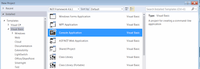
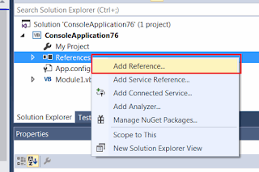
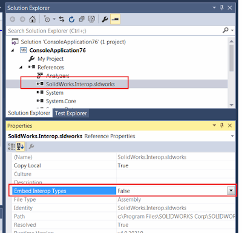

在本教程中，我将演示如何通过 VB.NET 和 Microsoft Visual Studio 从外部进程 (即独立应用程序，如 Windows Forms、Windows Console) 连接到 SOLIDWORKS 应用程序。

有关本文中讨论的方法的更详细解释，请阅读[从独立应用程序连接到 SOLIDWORKS](/docs/codestack/solidworks-api/getting-started/stand-alone/)文章。

## 创建新项目

我将使用 Microsoft Visual Studio 开发环境。您可以使用任何版本的 Visual Studio。相同的代码将适用于专业版、Express 版或社区版。请访问此链接下载[Visual Studio](https://www.visualstudio.com/vs/community/)。

* 打开 Visual Studio
* 启动新项目：

{ width=400 }

* 选择项目模板。我建议从控制台应用程序项目模板开始，因为它包含最少的预生成代码：

{ width=400 }

* 添加对 SolidWorks 互操作库的引用。互操作库位于 **SOLIDWORKS 安装文件夹**\api\redist\SolidWorks.Interop.sldworks.dll*（针对 Framework 4.0 及更高版本的项目）和 **SOLIDWORKS 安装文件夹**\api\redist\**CLR2**\**SolidWorks.Interop.sldworks.dll*（针对 Framework 2.0 和 3.5 的项目）。

{ width=320 }

对于针对 Framework 4.0 的项目，我建议将 **[嵌入互操作类型](https://docs.microsoft.com/en-us/dotnet/framework/interop/type-equivalence-and-embedded-interop-types)**选项设置为 false。
否则，在调用 SOLIDWORKS API 时，应用程序可能会出现无法预测的行为，因为存在类型转换问题。

{ width=400 height=385 }

现在，我们可以添加连接到 SOLIDWORKS 实例的代码。

## 创建或连接实例

连接到 COM 服务器最常见且最快速的方法是使用 [CreateObject](https://msdn.microsoft.com/en-us/library/microsoft.visualbasic.interaction.createobject(v=vs.110).aspx) 方法。
其他方法包括：[Activator::CreateInstance](https://msdn.microsoft.com/en-us/library/system.activator.createinstance(v=vs.110).aspx) 和 [GetObject](https://msdn.microsoft.com/en-us/library/microsoft.visualbasic.interaction.getobject(v=vs.110).aspx)。请注意，如果无法连接到活动会话，[GetObject](https://msdn.microsoft.com/en-us/library/microsoft.visualbasic.interaction.getobject(v=vs.110).aspx) 将创建新实例。

~~~ vb
Const PROG_ID As String = "SldWorks.Application"

' 使用 Interaction.CreateObject 函数
Dim app1 = TryCast(CreateObject(PROG_ID), SolidWorks.Interop.sldworks.ISldWorks)
app1.Visible = True

' 使用 Interaction.GetObject 函数
Dim app2 = TryCast(GetObject("", PROG_ID), SolidWorks.Interop.sldworks.ISldWorks)
app2.Visible = True

' 使用 Activator
Dim progType = System.Type.GetTypeFromProgID(PROG_ID)
Dim app3 = TryCast(System.Activator.CreateInstance(progType), SolidWorks.Interop.sldworks.ISldWorks)
app3.Visible = True

~~~

我建议使用 [Activator::CreateInstance](https://msdn.microsoft.com/en-us/library/system.activator.createinstance(v=vs.110).aspx)，因为它允许以 2 步连接到会话：

1. 由于 SOLIDWORKS 应用程序已注册为 COM 服务器，我们可以通过 [Type::GetTypeFromProgID](https://msdn.microsoft.com/en-us/library/system.type.gettypefromprogid(v=vs.110).aspx) 方法从其程序标识符创建类型。
1. 从类型定义构造类型的实例。

这种方法可以在出现错误时提供更好的故障排除选项：如果第一步失败，这意味着 COM 类未注册或无法从注册表访问；否则，这可能表示某些权限问题。
请阅读[从独立应用程序连接到 SOLIDWORKS](/docs/codestack/solidworks-api/getting-started/stand-alone#method-a---activator-and-progid)文章，了解此方法的限制的解释。

或者，您可以使用 [Marshal::GetActiveObject](https://msdn.microsoft.com/en-us/library/system.runtime.interopservices.marshal.getactiveobject(v=vs.110).aspx) 方法连接到活动 (已启动) 的 SOLIDWORKS 会话。与调用 [GetObject](https://msdn.microsoft.com/en-us/library/microsoft.visualbasic.interaction.getobject(v=vs.110).aspx) 不同，此方法将确保不会创建新的 SOLIDWORKS 实例，并且如果没有正在运行的 SOLIDWORKS 会话可连接，则会引发异常。

~~~ vb
Const PROG_ID As String = "SldWorks.Application"
Dim app = TryCast(System.Runtime.InteropServices.Marshal.GetActiveObject(PROG_ID),
	SolidWorks.Interop.sldworks.ISldWorks)
~~~

## 通过 ROT 获取运行实例

为了连接到已经运行的特定 SOLIDWORKS 会话或能够创建多个会话，您可以使用 Running Object Table (ROT) API。
有关此方法的更多详细信息，请阅读[从独立应用程序连接到 SOLIDWORKS](/docs/codestack/solidworks-api/getting-started/stand-alone#method-b---running-object-table-rot)文章。

~~~ vb
Imports System.Runtime.InteropServices
Imports System.Runtime.InteropServices.ComTypes
Imports SolidWorks.Interop.sldworks

Module CodeStackSample

    <DllImport("ole32.dll")>
    Private Function CreateBindCtx(ByVal reserved As UInteger, <Out> ByRef ppbc As IBindCtx) As Integer
    End Function

    Sub Main()

        Const SW_PATH As String = "C:\Program Files\SOLIDWORKS Corp\SOLIDWORKS\SLDWORKS.exe"

        Try
            Dim app = StartSwApp(SW_PATH)
            Console.WriteLine(app.RevisionNumber())
        Catch ex As Exception
            Console.WriteLine("Failed to connect to SOLIDWORKS instance: " & ex.Message)
        End Try

        Console.ReadLine()

    End Sub

    Function StartSwApp(ByVal appPath As String, _
            ByVal Optional timeoutSec As Integer = 10) As ISldWorks

        Dim timeout = TimeSpan.FromSeconds(timeoutSec)

        Dim startTime = DateTime.Now

        Dim prc = Process.Start(appPath)
        Dim app As ISldWorks = Nothing

        While app Is Nothing
            If DateTime.Now - startTime > timeout Then
                Throw New TimeoutException()
            End If

            app = GetSwAppFromProcess(prc.Id)
        End While

        Return app
    End Function

    Function GetSwAppFromProcess(ByVal processId As Integer) As ISldWorks

        Dim monikerName = "SolidWorks_PID_" & processId.ToString()

        Dim context As IBindCtx = Nothing
        Dim rot As IRunningObjectTable = Nothing
        Dim monikers As IEnumMoniker = Nothing

        Try

            CreateBindCtx(0, context)

            context.GetRunningObjectTable(rot)
            rot.EnumRunning(monikers)

            Dim moniker = New IMoniker(0) {}

            While monikers.[Next](1, moniker, IntPtr.Zero) = 0

                Dim curMoniker = moniker.First()
                Dim name As String = Nothing

                If curMoniker IsNot Nothing Then

                    Try
                        curMoniker.GetDisplayName(context, Nothing, name)
                    Catch ex As UnauthorizedAccessException
                    End Try

                End If

                If String.Equals(monikerName, name, StringComparison.CurrentCultureIgnoreCase) Then
                    Dim app As Object = Nothing
                    rot.GetObject(curMoniker, app)
                    Return TryCast(app, ISldWorks)
                End If

            End While

        Finally

            If monikers IsNot Nothing Then
                Marshal.ReleaseComObject(monikers)
            End If

            If rot IsNot Nothing Then
                Marshal.ReleaseComObject(rot)
            End If

            If context IsNot Nothing Then
                Marshal.ReleaseComObject(context)
            End If
        End Try

        Return Nothing

    End Function

End Module

~~~

在上面的示例中，通过从 SOLIDWORKS 应用程序安装路径启动新进程来启动 SOLIDWORKS 的新会话。
*StartSwApp* 函数需要 **sldworks.exe** 的完整路径作为第一个参数，并可选地指定超时时间（以秒为单位）作为第二个参数。
超时时间将确保在进程启动失败的情况下，应用程序不会被锁定。

您还可以将此调用设置为异步，并在 SOLIDWORKS 进程启动时在应用程序中显示一些进度指示：

~~~ vb
Private Async Function StartSwAppAsync(ByVal appPath As String, _
    ByVal Optional timeoutSec As Integer = 10) _
        As System.Threading.Tasks.Task(Of SolidWorks.Interop.sldworks.ISldWorks)
    Return Await System.Threading.Tasks.Task.Run(Function() StartSwApp(appPath, timeoutSec))
End Function

~~~