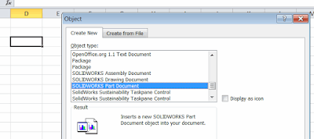

In this article, I will discuss two common methods to connect to a SOLIDWORKS instance using COM-compatible programming languages such as C#, VB.NET, C++, and Visual Basic 6, to leverage the SOLIDWORKS API.

Here are optional detailed explanations about these methods.
Please follow the links below to see articles demonstrating how to create sample projects and connect to a SOLIDWORKS instance:

* [Using C#](/docs/codestack/solidworks-api/getting-started/stand-alone/connect-csharp)
* [Using VB.NET](/docs/codestack/solidworks-api/getting-started/stand-alone/connect-vbnet)
* [Using C++](/docs/codestack/solidworks-api/getting-started/stand-alone/connect-cpp)

## Method A - Activator and ProgId
### Connect by creating an instance identified by **Prog**ram **Id**entified (progid) or globally unique COM **Cl**a**s**s **Id**entifier (CLSID)

SOLIDWORKS has two types of program identifiers: version-independent and version-specific.

Program identifiers are registered in the Windows registry:

{ width=640 }

In the example above, the program identifier for **SldWorks.Application.23** corresponds to the COM class identifier **{D66FBAAE-4150-402F-8581-75D1652D696A}**.

More information about this object, such as the type library class identifier and the COM server location (i.e., the path to **sldworks.exe**), can be found in the registry branch associated with the class identifier, i.e., **HKEY_CLASSES_ROOT\CLSID\{D66FBAAE-4150-402F-8581-75D1652D696A}**.

{ width=640 }

The version-independent program identifier is the same for all versions of SOLIDWORKS and is equal to **"SldWorks.Application"**.

If using a version-specific program identifier, the revision number needs to be specified after the program identifier, i.e., **"SldWorks.Application.RevisionNumber"**.
Refer to the table below for a list of SOLIDWORKS versions and their revision numbers:

Version|Revision Number
-------|---------------
SOLIDWORKS 2005|13
SOLIDWORKS 2006|14
SOLIDWORKS 2007|15
SOLIDWORKS 2008|16
SOLIDWORKS 2009|17
SOLIDWORKS 2010|18
SOLIDWORKS 2011|19
SOLIDWORKS 2012|20
SOLIDWORKS 2013|21
SOLIDWORKS 2014|22
SOLIDWORKS 2015|23
SOLIDWORKS 2016|24
SOLIDWORKS 2017|25
SOLIDWORKS 2018|26
SOLIDWORKS 2019|27
SOLIDWORKS 2020|28
SOLIDWORKS 2021|29
SOLIDWORKS 2022|30

The revision number of the SOLIDWORKS session can be obtained using the [ISldWorks::RevisionNumber](https://help.solidworks.com/2012/english/api/sldworksapi/solidworks.interop.sldworks~solidworks.interop.sldworks.isldworks~revisionnumber.html) method.
The returned value is a string in the format **25.1.0**, where the first number is the revision number.

There are some limitations when using this method:

* It is not possible to predict whether this method will connect to a running SOLIDWORKS instance or create a new instance.
* It is not possible to specify which running SOLIDWORKS session to connect to (e.g., when multiple SOLIDWORKS sessions are open).
* If a new session is created by running this method, the session is by default invisible and started with the */embed* flag.
This means the session starts in a lightweight manner and does not load any add-ins.
This is designed to allow embedding the OLE object in third-party applications such as Microsoft Office.

{ width=400 }

* It is not possible to create multiple active SOLIDWORKS sessions.

## Method B - Running Object Table (ROT)

### Connect by querying COM instances from the **R**unning **O**bject **T**able (ROT)

When a COM server creates an object instance, it creates an identifier for that instance and registers it in the Running Object Table (ROT).
The ROT enables inter-process communication with third-party applications by allowing objects to be looked up from running processes using the Windows API [GetRunningObjectTable](https://msdn.microsoft.com/en-us/library/windows/desktop/ms684004(v=vs.85).aspx).

Here is an example of a running object table with multiple registered COM objects:

>!{00024505-0014-0000-C000-000000000046}

>!Microsoft Visual Studio Telemetry:11004

>!{31F45B04-7198-45ED-A13F-F224A4A1686A}

>SolidWorks_PID_15212

>!VisualStudio.DTE.14.0:16144

* Using this method, it is possible to connect to any SOLIDWORKS session from its process ID.
* The desired number of sessions can be created by starting new SOLIDWORKS instances (e.g., by using the shell or start process API).

> If the SOLIDWORKS application and the stand-alone application run with different levels of privileges (e.g., one running as an administrator and the other not), it may not be possible to successfully retrieve objects from the ROT. Run them with the same user identity to enable communication.

Please follow the links at the beginning of the article for detailed guides and code examples on how to connect to a SOLIDWORKS instance.