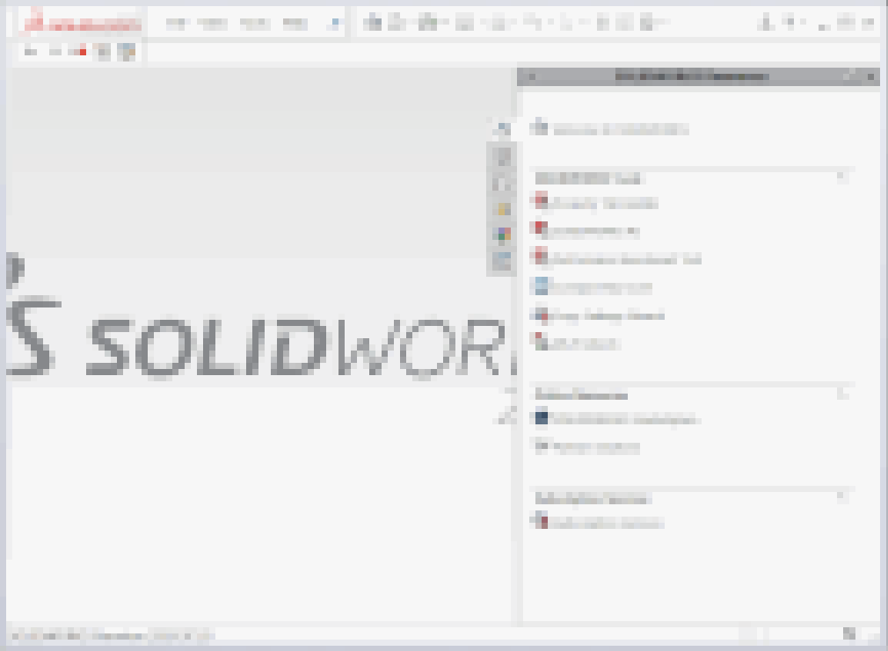

 如何在后台（隐藏）启动SOLIDWORKS应用程序以供独立自动化工具使用的说明
image: invisible-app.png
labels: [background,invisible]
---
{ width=350 }

在使用独立应用程序时，有时将应用程序在后台（不可见）启动可能更有益。这种方法提供了更好的用户体验和更好的性能。

可以使用以下[ProcessStartInfo](https://docs.microsoft.com/en-us/dotnet/api/system.diagnostics.processstartinfo)来启动任何Windows进程并隐藏其主窗口：

``` cs
var prcInfo = new ProcessStartInfo()
{
    FileName = appPath,
    CreateNoWindow = true,
    WindowStyle = ProcessWindowStyle.Hidden
};
```

然而，对于SOLIDWORKS应用程序，这段代码可能并不总是有效。隐藏窗口的另一种方法是使用[ShowWindow](https://docs.microsoft.com/en-us/windows/desktop/api/winuser/nf-winuser-showwindow) Windows32 API。在应用此方法之前，需要等待句柄创建和SOLIDWORKS完全加载。

除了上述方法，启动SOLIDWORKS实例时使用*/r*参数也是有益的。这个参数可以隐藏启动画面并加快启动速度。对于SOLIDWORKS Professional和Premium，还可以使用*/b*参数在后台启动SOLIDWORKS（仍然可见）。

> */b*标志由SOLIDWORKS任务计划程序处理，对于不包含任务计划程序的SOLIDWORKS Standard不起作用。

下面的函数考虑了上述所有要点，并在后台启动新的SOLIDWORKS会话。将此函数与[创建C#独立应用程序](/docs/codestack/solidworks-api/getting-started/stand-alone/connect-csharp/)中的代码结合使用。

> 在SOLIDWORKS应用程序不可见时，某些API方法可能无法执行或行为不正确。

``` cs
private static ISldWorks StartSwAppBackground(string appPath, int timeoutSec = 20)
{
    var timeout = TimeSpan.FromSeconds(timeoutSec);

    var startTime = DateTime.Now;

    var prcInfo = new ProcessStartInfo()
    {
        FileName = appPath,
        Arguments = "/r", //无启动画面
        CreateNoWindow = true,
        WindowStyle = ProcessWindowStyle.Hidden
    };

    var prc = Process.Start(prcInfo);
    
    ISldWorks app = null;

    var isLoaded = false;

    var onIdleFunc = new DSldWorksEvents_OnIdleNotifyEventHandler(() =>
    {
        isLoaded = true;
        return 0;
    });

    try
    {

        while (!isLoaded)
        {
            if (DateTime.Now - startTime > timeout)
            {
                throw new TimeoutException();
            }

            if (app == null)
            {
                app = GetSwAppFromProcess(prc.Id);

                if (app != null)
                {
                    (app as SldWorks).OnIdleNotify += onIdleFunc;
                }
            }

            System.Threading.Thread.Sleep(100);
        }

        if (app != null)
        {
            const int HIDE = 0;
            ShowWindow(new IntPtr(app.IFrameObject().GetHWnd()), HIDE);
        }
    }
    catch
    {
        throw;
    }
    finally
    {
        if (app != null)
        {
            (app as SldWorks).OnIdleNotify -= onIdleFunc;
        }
    }

    return app;
}
```