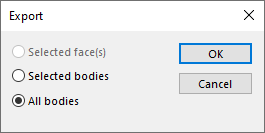

 VBA宏，仅将选定的实体导出为外部格式（例如3D xml、xaml、amf、3mf）
image: export-bodies.svg
labels: [导出, 实体]
group: 导入/导出
---

在将零件文件导出为SOLIDWORKS支持的大多数外部格式时，可以选择导出的实体范围，从而只处理选定的实体。



然而，并非所有格式都支持此功能。例如，3D xml、xaml、amf、3mf等格式将始终导出所有实体，而不考虑选择。

此VBA宏允许仅将选定的实体导出为SOLIDWORKS支持的任何格式。

选择实体、面、边或顶点，运行宏并指定导出的名称以生成结果。

``` vb
Private Declare PtrSafe Function GetSaveFileName Lib "comdlg32.dll" Alias "GetSaveFileNameA" (pOpenfilename As OPENFILENAME) As LongPtr

Private Type OPENFILENAME
  lStructSize As Long
  hwndOwner As LongPtr
  hInstance As LongPtr
  lpstrFilter As String
  lpstrCustomFilter As String
  nMaxCustFilter As Long
  nFilterIndex As Long
  lpstrFile As String
  nMaxFile As Long
  lpstrFileTitle As String
  nMaxFileTitle As Long
  lpstrInitialDir As String
  lpstrTitle As String
  Flags As LongPtr
  nFileOffset As Integer
  nFileExtension As Integer
  lpstrDefExt As String
  lCustData As Long
  lpfnHook As Long
  lpTemplateName As String
End Type

Const FILTER As String = "3D制造格式 (*.3mf)|*.3mf|3D XML (*.3dxml)|*.3dxml|增材制造文件 (*.amf)|*.amf|Microsoft XAML (*.xaml)|*.xaml|所有文件 (*.*)|*.*"
Dim swApp As SldWorks.SldWorks

Sub main()

    Set swApp = Application.SldWorks
    
try_:
    
    On Error GoTo catch_

    Dim swModel As SldWorks.ModelDoc2
    Set swModel = swApp.ActiveDoc
    
    If swModel Is Nothing Then
        Err.Raise vbError, "", "请打开模型"
    End If
    
    Dim vBodies As Variant
    vBodies = CollectSelectedBodies(swModel)
    
    If Not IsEmpty(vBodies) Then
        Dim filePath As String
        filePath = BrowseForFileSave("选择要保存的文件路径", FILTER)
        
        If filePath <> "" Then
            ExportBodies filePath, vBodies
        End If
    Else
        Err.Raise vbError, "", "请选择要导出的实体"
    End If
    
    GoTo finally_
    
catch_:
    swApp.SendMsgToUser2 Err.Description, swMessageBoxIcon_e.swMbStop, swMessageBoxBtn_e.swMbOk
finally_:

End Sub

Function BrowseForFileSave(title As String, filters As String) As String
    
    Dim of As OPENFILENAME
    Const FILE_PATH_BUFFER_SIZE As Integer = 260
    
    of.lpstrFilter = Replace(filters, "|", Chr(0)) & Chr(0)
    of.lpstrTitle = title
    of.nMaxFile = FILE_PATH_BUFFER_SIZE
    of.nMaxFileTitle = FILE_PATH_BUFFER_SIZE
    of.lpstrFile = String(FILE_PATH_BUFFER_SIZE, Chr(0))
    of.Flags = &H200000
    of.lStructSize = LenB(of)
    
    If GetSaveFileName(of) Then
        
        Dim filePath As String
        filePath = Left(of.lpstrFile, InStr(of.lpstrFile, vbNullChar) - 1)
        
        Dim vFilters As Variant
        vFilters = Split(FILTER, "|")
        Dim ext As String
        ext = vFilters((of.nFilterIndex - 1) * 2 + 1)
        ext = Right(ext, Len(ext) - InStrRev(ext, ".") + 1)
        
        If LCase(Right(filePath, Len(ext))) <> LCase(ext) Then
            filePath = filePath & ext
        End If
        
        BrowseForFileSave = filePath
        
    Else
        BrowseForFileSave = ""
    End If
    
End Function

Function CollectSelectedBodies(model As SldWorks.ModelDoc2) As Variant
    
    Dim swSelMgr As SldWorks.SelectionMgr
    
    Dim swBodies() As SldWorks.Body2
    
    Set swSelMgr = model.SelectionManager
    
    Dim i As Integer
    
    For i = 1 To swSelMgr.GetSelectedObjectCount2(-1)
        
        Dim swSelObj As Object
        Set swSelObj = swSelMgr.GetSelectedObject6(i, -1)
        
        Dim swBody As SldWorks.Body2
        
        If TypeOf swSelObj Is SldWorks.Body2 Then
            Set swBody = swSelObj
        ElseIf TypeOf swSelObj Is SldWorks.Feature Then
            Dim swFeat As SldWorks.Feature
            Set swFeat = swSelObj
            Dim swFeatFace As SldWorks.Face2
            Set swFeatFace = swFeat.GetFaces()(0)
            Set swBody = swFeatFace.GetBody
        ElseIf TypeOf swSelObj Is SldWorks.Face2 Then
            Dim swFace As SldWorks.Face2
            Set swFace = swSelObj
            Set swBody = swFace.GetBody
        ElseIf TypeOf swSelObj Is SldWorks.Edge Then
            Dim swEdge As SldWorks.Edge
            Set swEdge = swSelObj
            Set swBody = swEdge.GetBody
        ElseIf TypeOf swSelObj Is SldWorks.Vertex Then
            Dim swVertex As SldWorks.Vertex
            Set swVertex = swSelObj
            Dim swVertEdge As SldWorks.Edge
            Set swVertEdge = swVertex.GetEdges()(0)
            Set swBody = swVertEdge.GetBody
        Else
            Err.Raise vbError, "", "无法找到所选对象的实体 " & i
        End If
        
        If Not Contains(swBodies, swBody) Then
            If (Not swBodies) = -1 Then
                ReDim swBodies(0)
            Else
                ReDim Preserve swBodies(UBound(swBodies) + 1)
            End If
            Set swBodies(UBound(swBodies)) = swBody
        End If
        
    Next
    
    CollectSelectedBodies = swBodies
    
End Function

Sub ExportBodies(filePath As String, vBodies As Variant)

    Dim swTempPart As SldWorks.ModelDoc2
    
    Dim swPartTemplate As String
    swPartTemplate = swApp.GetUserPreferenceStringValue(swUserPreferenceStringValue_e.swDefaultTemplatePart)
    
    If swPartTemplate = "" Then
        Err.Raise vbError, "", "未找到默认零件模板"
    End If
    
    Dim curErr As ErrObject
    
try_:
    
    On Error GoTo catch_
    
    Set swTempPart = swApp.NewDocument(swPartTemplate, swDwgPaperSizes_e.swDwgPapersUserDefined, 0, 0)
    
    Dim i As Integer
    
    For i = 0 To UBound(vBodies)
        
        Dim swBody As SldWorks.Body2
        Set swBody = vBodies(i)
        Set swBody = swBody.Copy
        
        Dim swBodyFeat As SldWorks.Feature
        Set swFeat = swTempPart.CreateFeatureFromBody3(swBody, False, swCreateFeatureBodyOpts_e.swCreateFeatureBodySimplify)
        
        If swFeat Is Nothing Then
            Err.Raise vbError, "", "无法从实体创建特征"
        End If
        
    Next
    
    Dim errs As Long
    Dim warns As Long
    
    If False = swTempPart.Extension.SaveAs(filePath, swSaveAsVersion_e.swSaveAsCurrentVersion, swSaveAsOptions_e.swSaveAsOptions_Silent, Nothing, errs, warns) Then
        Err.Raise vbError, "", "导出文件失败。错误代码：" & errs
    End If
    
    GoTo finally_
    
catch_:
    Set curErr = Err
finally_:
    
    If Not swTempPart Is Nothing Then
        swApp.CloseDoc swTempPart.GetTitle
    End If
    
    If Not curErr Is Nothing Then
        Err.Raise curErr.Number, curErr.Source, curErr.Description
    End If

End Sub

Function Contains(vArr As Variant, item As Object) As Boolean
    
    Dim i As Integer
        
    If Not IsEmpty(vArr) Then
        
        For i = 0 To UBound(vArr)
            If vArr(i) Is item Then
                Contains = True
                Exit Function
            End If
        Next
    
    End If
    
    Contains = False
    
End Function
```