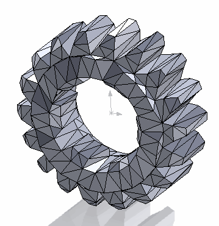

{ width=250 }

这个C# VSTA宏使用SOLIDWORKS API将活动零件或选定的组件导出为STL格式。该宏还适用于加载轻量级组件。

该宏不使用默认的导出器，并克服了模型需要在自己的窗口中加载的限制，即不使用[IModelDocExtension::SaveAs](https://help.solidworks.com/2017/english/api/sldworksapi/solidworks.interop.sldworks~solidworks.interop.sldworks.imodeldocextension~saveas.html) SOLIDWORKS API函数。该宏将从模型的镶嵌三角形创建STL。

该宏可以选择应用变换来旋转或移动STL文件。不需要为此创建坐标系。

有关STL规范的更多信息，请参阅[此链接](https://en.wikipedia.org/wiki/STL_(file_format))。

## 配置方向

为了配置输出文件的方向，需要在宏的开头更改*m_Transform*中定义的4x4方向矩阵的值。

使用[获取坐标系变换](/docs/codestack/solidworks-api/geometry/transformation/get-coordinate-system-transform/)宏从任何选定的坐标系中检索变换。

例如，要设置绕X轴顺时针方向旋转90度，需要将*m_Transform*数组的值更改为以下值：

~~~ cs
private double[] m_Transform = new double[]
{
    1,-0,0,0,
    0,-1,0,1,
    0,0,0,0,
    1,0,0,0
};
~~~

## 运行说明

* 打开零件

或者

* 打开装配体（可以以轻量级方式打开）
* 选择零件组件
* 浏览输出STL文件的位置
* 文件被导出

~~~ cs
using SolidWorks.Interop.sldworks;
using SolidWorks.Interop.swconst;
using System.Runtime.InteropServices;
using System;
using System.Collections.Generic;
using System.Diagnostics;
using System.IO;
using System.Text;
using System.Windows.Forms;

namespace ExportToStl.csproj
{
    public partial class SolidWorksMacro
    {
        private double[] m_Transform = new double[]
        {
            1, 0, 0, 0,
            1, 0, 0, 0,
            1, 0, 0, 0,
            1, 0, 0, 0
        };

        public void Main()
        {
            try
            {
                IModelDoc2 model = swApp.IActiveDoc2;

                if (model != null)
                {
                    string fileNameBase = "";

                    float[] tessTriangs;
                    float[] tessNorms;

                    if (model is IPartDoc)
                    {
                        fileNameBase = model.GetTitle();
                        GetTesselationDataFromPart(model as IPartDoc, out tessTriangs, out tessNorms);
                    }
                    else if (model is IAssemblyDoc)
                    {
                        IComponent2 comp = model.ISelectionManager.GetSelectedObjectsComponent3(1, -1) as IComponent2;

                        if (comp != null)
                        {
                            GetTesselationData(comp, out tessTriangs, out tessNorms);

                            fileNameBase = comp.GetPathName();
                        }
                        else
                        {
                            throw new NullReferenceException("Please select component");
                        }
                    }
                    else 
                    {
                        throw new NotSupportedException("Document type is not support, parts or assembly components are supported");
                    }

                    string filePath = BrowseFile(Path.GetFileNameWithoutExtension(fileNameBase));

                    if (!string.IsNullOrEmpty(filePath))
                    {
                        ExportToStl(filePath, tessTriangs, tessNorms, m_Transform);
                    }

                }
                else
                {
                    throw new NullReferenceException("Please open part or assembly");
                }
            }
            catch (Exception ex)
            {
                swApp.SendMsgToUser2(ex.Message, (int)swMessageBoxIcon_e.swMbStop, (int)swMessageBoxBtn_e.swMbOk);
            }
        }

        private void GetTesselationData(IComponent2 comp, out float[] tessTriangs, out float[] tessNorms)
        {
            IModelDoc2 compModel = comp.IGetModelDoc();

            if (compModel == null)
            {
                if (Path.GetExtension(comp.GetPathName()).Equals(".sldprt", StringComparison.CurrentCultureIgnoreCase))
                {
                    tessTriangs = comp.GetTessTriangles(true) as float[];
                    tessNorms = comp.GetTessNorms() as float[];
                }
                else
                {
                    throw new NotSupportedException("Only parts are supported");
                }
            }
            else
            {
                if (compModel is IPartDoc)
                {
                    GetTesselationDataFromPart(compModel as IPartDoc, out tessTriangs, out tessNorms);
                }
                else
                {
                    throw new NotSupportedException("Only parts are supported");
                }
            }
        }

        private void GetTesselationDataFromPart(IPartDoc part, out float[] tessTriangs, out float[] tessNorms) 
        {
            tessTriangs = part.GetTessTriangles(true) as float[];
            tessNorms = part.GetTessNorms() as float[];
        }

        private void ExportToStl(string filePath, float[] tessTriangs, float[] tessNorms, double[] transformMatrix)
        {
            IMathUtility mathUtils = swApp.IGetMathUtility();
            IMathTransform transform = (mathUtils.CreateTransform(transformMatrix) as IMathTransform).IInverse();

            using (FileStream fileStream = File.Create(filePath))
            {
                using (BinaryWriter writer = new BinaryWriter(fileStream))
                {
                    byte[] header = new byte[80];

                    writer.Write(header);

                    uint triangsCount = (uint)tessTriangs.Length / 9;
                    writer.Write(triangsCount);

                    for (uint i = 0; i < triangsCount; i++)
                    {
                        float normalX = tessNorms[i * 9];
                        float normalY = tessNorms[i * 9 + 1];
                        float normalZ = tessNorms[i * 9 + 2];

                        IMathVector mathVec = mathUtils.CreateVector(
                            new double[] { normalX, normalY, normalZ }) as IMathVector;

                        mathVec = mathVec.MultiplyTransform(transform) as IMathVector;

                        double[] vec = mathVec.ArrayData as double[];

                        writer.Write((float)vec[0]);
                        writer.Write((float)vec[1]);
                        writer.Write((float)vec[2]);

                        for (uint j = 0; j < 3; j++)
                        {
                            float vertX = tessTriangs[i * 9 + j * 3];
                            float vertY = tessTriangs[i * 9 + j * 3 + 1];
                            float vertZ = tessTriangs[i * 9 + j * 3 + 2];

                            IMathPoint mathPt = mathUtils.CreatePoint(
                                new double[] { vertX, vertY, vertZ }) as IMathPoint;

                            mathPt = mathPt.MultiplyTransform(transform) as IMathPoint;

                            double[] pt = mathPt.ArrayData as double[];

                            writer.Write((float)pt[0]);
                            writer.Write((float)pt[1]);
                            writer.Write((float)pt[2]);
                        }

                        ushort atts = 0;
                        writer.Write(atts);
                    }
                }
            }
        }

        private string BrowseFile(string defName)
        {
            SaveFileDialog dlg = new SaveFileDialog();
            dlg.Filter = "STL Files (*.stl)|*.stl";
            dlg.FileName = defName + ".stl";

            if (dlg.ShowDialog() == DialogResult.OK)
            {
                return dlg.FileName;
            }
            else
            {
                return "";
            }
        }

        public SldWorks swApp;
    }
}
~~~