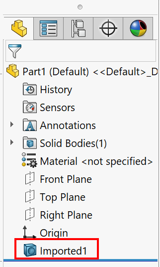

{ width=250 }

这个VBA宏会缩放活动SOLIDWORKS零件文件中导入特征的所有实体。如果从STEP、IGES、Parasolid等中性格式加载文件，将会生成导入特征，除非使用了3D互连选项。

在**SCALE_FACTOR**常量中设置缩放因子。

~~~ vb
Const SCALE_FACTOR As Double = 2.5

Dim swApp As SldWorks.SldWorks

Sub main()

    Set swApp = Application.SldWorks
    
    Dim swModel As SldWorks.ModelDoc2
    
    Dim errs As Long
    Set swModel = swApp.ActiveDoc
    
    If Not swModel Is Nothing Then
        
        Dim swFeat As SldWorks.Feature
        
        Dim i As Integer
        i = -1
        
        Do
            i = i + 1
            Set swFeat = swModel.FeatureByPositionReverse(i)
            
            If swFeat.GetTypeName2() = "BaseBody" Then
                
                Dim swBody As SldWorks.Body2
                
                Set swBody = swFeat.GetFaces()(0).GetBody
                Set swBody = swBody.Copy
                
                ApplyScale swBody, SCALE_FACTOR
                
                swFeat.SetBody swBody
                
            End If
            
            If swFeat.GetTypeName2() = "OriginProfileFeature" Then
                Exit Do
            End If
            
        Loop While Not swFeat Is Nothing
        
    Else
        Err.Raise vbError, "", "加载模型失败: " & errs
    End If
    
End Sub

Sub ApplyScale(body As SldWorks.Body2, scaleFactor As Double)

    Dim dMatrix(15) As Double
    dMatrix(0) = 1: dMatrix(1) = 0: dMatrix(2) = 0: dMatrix(3) = 0
    dMatrix(4) = 1: dMatrix(5) = 0: dMatrix(6) = 0: dMatrix(7) = 0
    dMatrix(8) = 1: dMatrix(9) = 0: dMatrix(10) = 0: dMatrix(11) = 0
    dMatrix(12) = scaleFactor: dMatrix(13) = 0: dMatrix(14) = 0: dMatrix(15) = 0

    Dim swMathUtils As SldWorks.MathUtility
    Set swMathUtils = swApp.GetMathUtility
    
    Dim swMathTransform As SldWorks.MathTransform
    Set swMathTransform = swMathUtils.CreateTransform(dMatrix)

    body.ApplyTransform swMathTransform
    
End Sub
~~~