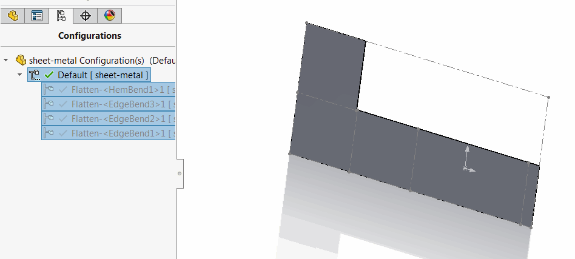
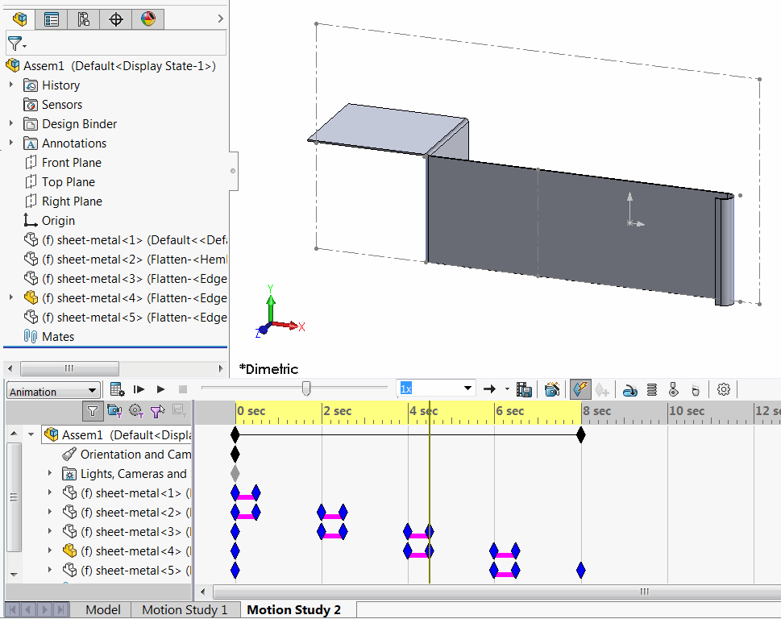



Macro demonstrates how to create an animation from configurations using SOLIDWORKS API.

This could be useful when it is required to create an animation to represents model history or sheet metal folding.

* Open part or assembly
* Select configurations in the order they should be animated

{ width=350 }

* Run the macro. New assembly created with configurations set as animation steps.

{ width=450 }

Macro parameters (time of the bend transition and pause between folding operations) can be changed by modifying the constants at the top of the macro

~~~ vb
Const TRANSITION_TIME As Double = 0.5
Const PAUSE_TIME As Double = 2
~~~

Refer the [Suppress Features In New Configurations](/docs/codestack/solidworks-api/document/features-manager/create-feature-configurations/) for a macro to create configurations from features.

~~~ vb
Const TRANSITION_TIME As Double = 0.5
Const PAUSE_TIME As Double = 2

Dim swApp As SldWorks.SldWorks

Sub main()
    
    Set swApp = Application.SldWorks

    Dim swModel As SldWorks.ModelDoc2
    
    Set swModel = swApp.ActiveDoc
    
    If Not swModel Is Nothing Then
                
        If swModel.GetPathName() <> "" Then
                
            Dim vConfs As Variant
            vConfs = GetSelectedConfigurations(swModel)
            
            If Not IsEmpty(vConfs) Then
                
                Dim swAssy As SldWorks.AssemblyDoc
                 
                Set swAssy = NewAssembly
                
                    If Not swAssy Is Nothing Then
                    Dim vComps As Variant
                    vComps = CreateComponents(swAssy, swModel, vConfs)
                    Dim swMotionStudyMgr As Object
                    Set swMotionStudyMgr = swAssy.Extension.GetMotionStudyManager()
                
                    Dim swMotionStudy As Object
                    Set swMotionStudy = swMotionStudyMgr.CreateMotionStudy()
                
                    CreateFrames swMotionStudy, vComps, TRANSITION_TIME, PAUSE_TIME
                Else
                
                    MsgBox "Failed to create new assembly"
                End If
            Else
                MsgBox "Please select configurations"
            End If
            
        Else
            MsgBox "Please save document"
        End If
        
    Else
        MsgBox "Please open part or assembly"
    End If

End Sub

Sub CreateFrames(motionStudy As Object, vComps As Variant, transitionTime As Double, pauseTime As Double)
    
    Dim i As Integer
    Dim swCompToHide As SldWorks.Component2
    Dim swCompToShow As SldWorks.Component2
        
    motionStudy.SetTime 0
    
    Set swCompToShow = vComps(0)
    swCompToShow.Visible = True
    
    For i = 1 To UBound(vComps)
        Set swCompToHide = vComps(i)
        swCompToHide.Visible = False
    Next
    
    Dim curTime As Double
    curTime = 0
    
    For i = 1 To UBound(vComps)
                
        Set swCompToHide = vComps(i - 1)
        Set swCompToShow = vComps(i)
        
        motionStudy.SetTime curTime + transitionTime
        swCompToHide.Visible = False
        
        motionStudy.SetTime curTime + transitionTime
        swCompToShow.Visible = True
        
        curTime = i * showTime + i * pauseTime
        motionStudy.SetTime curTime
        
        swCompToShow.Visible = False
        swCompToShow.Visible = True
            
        If i <> UBound(vComps) Then
        
            Dim swCompToLock As SldWorks.Component2
            Set swCompToLock = vComps(i + 1)
            
            swCompToLock.Visible = True
            swCompToLock.Visible = False
            
        End If
        
    Next
    
End Sub

Function CreateComponents(assy As SldWorks.AssemblyDoc, model As SldWorks.ModelDoc2, confs As Variant) As Variant
    
    Dim i As Integer

    Dim swComps() As SldWorks.Component2
    ReDim swComps(UBound(confs))
    
    Dim dMatrix(15) As Double
    dMatrix(0) = 1: dMatrix(1) = 0: dMatrix(2) = 0: dMatrix(3) = 0
    dMatrix(4) = 1: dMatrix(5) = 0: dMatrix(6) = 0: dMatrix(7) = 0
    dMatrix(8) = 1: dMatrix(9) = 0: dMatrix(10) = 0: dMatrix(11) = 0
    dMatrix(12) = 1: dMatrix(13) = 0: dMatrix(14) = 0: dMatrix(15) = 0
    
    Dim swMathUtils As SldWorks.MathUtility
    Set swMathUtils = swApp.GetMathUtility
    Dim swTransform As SldWorks.MathTransform
    Set swTransform = swMathUtils.CreateTransform(dMatrix)
    
    For i = 0 To UBound(confs)

        Dim swComp As SldWorks.Component2
        Set swComp = assy.AddComponent5(model.GetPathName(), swAddComponentConfigOptions_e.swAddComponentConfigOptions_CurrentSelectedConfig, "", True, confs(i), 0, 0, 0)
        swComp.Select4 False, Nothing, False
        assy.UnfixComponent
        swComp.Transform2 = swTransform
        swComp.ReferencedConfiguration = confs(i)
        swComp.Select4 False, Nothing, False
        assy.FixComponent
        Set swComps(i) = swComp
    Next

    CreateComponents = swComps
    
End Function

Function NewAssembly() As SldWorks.AssemblyDoc
    
    Dim swAssy As SldWorks.AssemblyDoc
    
    Dim assyTemplate As String
    assyTemplate = swApp.GetUserPreferenceStringValue(swUserPreferenceStringValue_e.swDefaultTemplateAssembly)
    
    If assyTemplate <> "" Then
        Set swAssy = swApp.NewDocument(assyTemplate, 0, 0, 0)
    Else
        Err.Raise vbObjectError, , "Assembly default template is not specified"
    End If
    
    Set NewAssembly = swAssy
    
End Function

Function GetSelectedConfigurations(model As SldWorks.ModelDoc2) As Variant
    
    Dim confNames() As String
    Dim isInit As Boolean
    
    Dim swSelMgr As SldWorks.SelectionMgr
    Set swSelMgr = model.SelectionManager
    
    Dim i As Integer
    
    For i = 1 To swSelMgr.GetSelectedObjectCount2(-1)
        
        Dim swConf As SldWorks.Configuration
        On Error Resume Next
        
        Set swConf = swSelMgr.GetSelectedObject6(i, -1)
        
        If Not swConf Is Nothing Then
            If True = isInit Then
                ReDim Preserve confNames(UBound(confNames) + 1)
            Else
                isInit = True
                ReDim confNames(0)
            End If
            
            confNames(UBound(confNames)) = swConf.Name
            
        End If
        
    Next
    
    GetSelectedConfigurations = confNames
    
End Function
~~~

