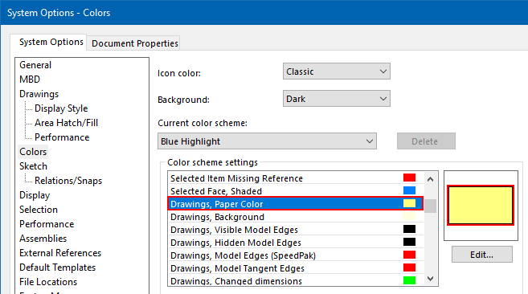

 使用系统设置，在绘图中切换白色背景和其他颜色的VBA宏
image: ToggleWhiteBackground-icon.svg
labels: [绘图, 选项, 背景, 截图]
group: 选项 
---
作者：[Eddy Alleman](https://www.linkedin.com/in/eddyalleman/) ([EDAL Solutions](https://www.edalsolutions.be/index.php/en/))

{ width=450 }

介绍
在SolidWorks论坛上，有人问如何制作一个可以在默认绘图背景颜色和白色之间切换的宏。
目标是使在需要白色背景的图像中更容易进行截图。

这是一个简单的宏，可以实现这个目标。我还会解释你需要的基本按钮/快捷键/菜单。

如果你想在其他颜色之间切换，可以在下面的Color1和Color2常量中进行更改。

## 但是我们如何得到与我们想要的颜色对应的数字呢？
只需在SolidWorks选项中手动更改为你喜欢的颜色（在上面的图像中，我选择了一个更鲜明的黄色）
然后使用宏编辑器打开宏（菜单栏工具 > 宏 > 编辑或使用宏工具栏）。 
如果立即窗口尚未可见，请打开它（CTRL + G）
运行宏（F5或绿色箭头按钮），在立即窗口中，你应该看到你选择的颜色用一个数字表示：

在代码中调整数字（Color2），当你运行宏时，背景颜色将在白色和你喜欢的颜色之间切换。

~~~ vb
'这个宏在绘图的背景颜色之间切换两种颜色。
'它使用了一个系统选项，所以你打开的每个绘图都会得到你选择的颜色
'如果你想在白色背景上进行屏幕截图，这将非常有用。

'在这里，你可以设置你想要切换的两种颜色
Const Color1 As Variant = 16777215 '白色
Const Color2 As Variant = 14411494 '灰色（绘图背景的默认颜色）

Sub main()

try_:

    On Error GoTo catch_

    Dim swApp As Object
    Set swApp = Application.SldWorks
    
    Dim swModel As ModelDoc2
    Set swModel = swApp.ActiveDoc
    
    '在第一次使用时获取颜色（在立即窗口中查看 CTRL + G）
    Dim Color As Variant
    Color = swApp.GetUserPreferenceIntegerValue(swUserPreferenceIntegerValue_e.swSystemColorsDrawingsPaper)
    Debug.Print "Color : " + CStr(Color)
    
     
    If Color <> Color1 Then
       Color = swApp.SetUserPreferenceIntegerValue(swUserPreferenceIntegerValue_e.swSystemColorsDrawingsPaper, Color1)
    Else
       Color = swApp.SetUserPreferenceIntegerValue(swUserPreferenceIntegerValue_e.swSystemColorsDrawingsPaper, Color2)
    End If
    
    swModel.ForceRebuild
 
GoTo finally_:
    
catch_:

    Debug.Print "错误：" & Err.Number & "：" & Err.Source & "：" & Err.Description
    
finally_:

    Debug.Print "完成 切换绘图背景"
    
End Sub

~~~