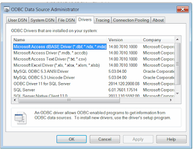

## Symptoms

SOLIDWORKS macro should connect to database (e.g. SQL, MySql, Oracle, MS Access etc.) or any other data source (e.g. MS Excel).
Macro doesn't read/write values or displays error.

## Cause

The most common way to connect to database or Excel in VBA macros would be via abstraction layer such as ADODB, ODBC, OLEDB.
In order to connect to database the corresponding driver must be installed into the system and the valid connection string must be provided.
The drivers are also OS-architecture specific (x32/x64)

## Resolution

* Find what abstraction layer is used. Usually there will be lines of code similar to the following.

~~~ vb
Set conn = CreateObject("ADODB.Connection")
Set records = CreateObject("ADODB.Recordset")
    
Dim xlsFilePath As String
xlsFilePath = swApp.GetCurrentMacroPathFolder() & "\" & EXCEL_FILE_NAME
    
conn.Open "Provider=Microsoft.ACE.OLEDB.12.0;" & _
        "Data Source=" & xlsFilePath & _
            ";Extended Properties=""Excel 8.0;HDR=Yes;"";"
~~~

* Make sure that the appropriate driver is installed. For SOLIDWORKS 2013 onwards (check the drivers for x64 system).
For older SOLIDWORKS version check x32 versions). Usually the drivers can be downloaded for free from the database supplier web-site or database installation package.

{ width=320 height=245 }

* Modify the connection string as required
