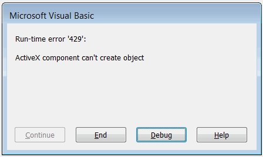

 如何修复VBA宏中的运行时错误429
image: runtime-error-429.png
labels: [宏, 故障排除]
---

## 症状

运行宏时显示“运行时错误'429'：无法创建对象的ActiveX组件”错误。通常会突出显示*CreateObject*函数：

```vb
Dim obj as Object
Set obj = CreateObject("ComComponentProgId")
```

{ width=350 }

## 原因

目标机器上未注册所需的COM组件（ActiveX）。这通常是因为目标应用程序未安装（例如Excel、MS Access等）或组件在x32系统中注册，而宏在x64环境中运行（自SOLIDWORKS 2012起）。

## 解决方法

将所需的COM组件安装到正确的环境中。可能需要联系组件的供应商或宏的开发人员以获取有关所使用的ActiveX组件的更多信息。